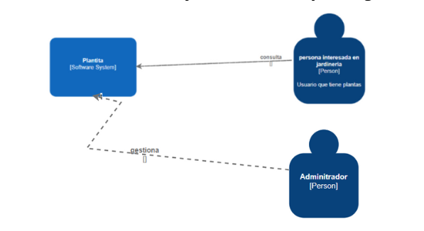
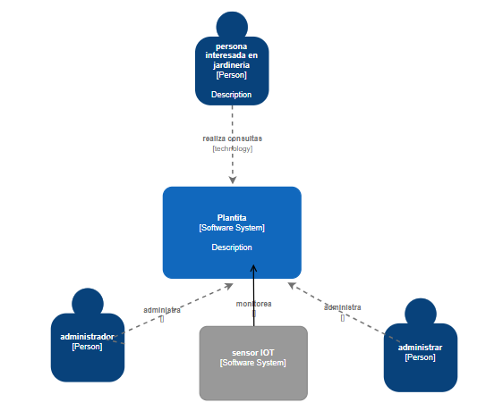
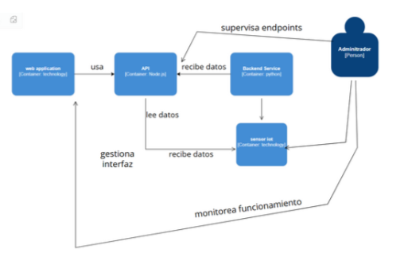
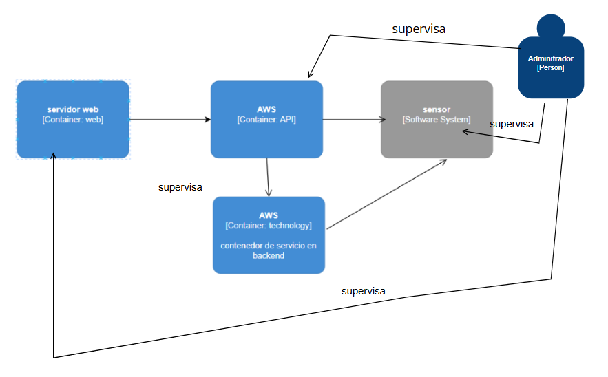
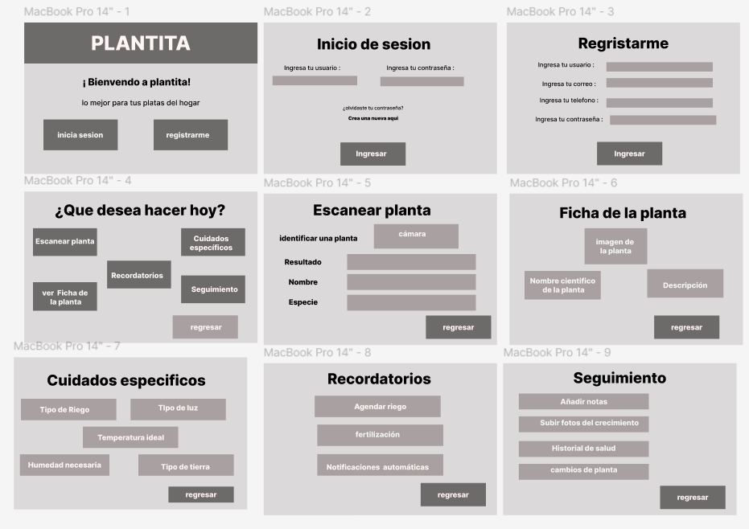
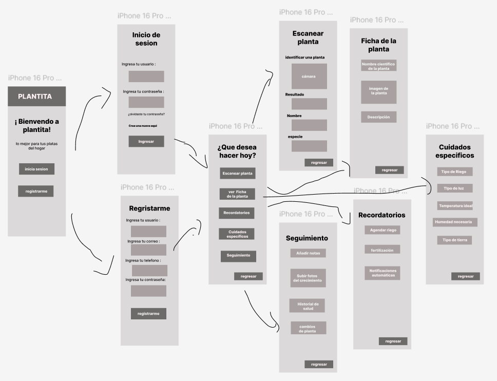

  <h1> Informe del Trabajo Final </h1>
  <h3> Universidad Peruana de Ciencias Aplicadas </h3>

  <h5> Ingeniería de Software </h5>

  <h5> Desarrollo de Soluciones IOT - 15185 </h5>

  <h5> Docente: Marco Antonio Leon Baca </h5>

  <h5> Startup: LlanterosTech </h5>

  <h5> Producto: Plantita </h5>

    <h3>Team Members:</h3>

     <table align="center">
        <tr>
            <th style="text-align:center;">Member</th>
            <th style="text-align:center;">Code</th>
        </tr>
        <tr>
            <td>Boronda Heidinger, Astrid Jimena</td>
            <td>U202215823</td>
        </tr>
        <tr>
            <td>Cabanillas Gora, Andrea Milagros</td>
            <td>U202211711</td>
        </tr>
        <tr>
            <td>Mallma Espiritu, Franky Oswald</td>
            <td>U20211c250</td>
        </tr>
        <tr>
            <td>Montes Figueroa. Juan Eduardo</td>
            <td>U202210775</td>
        </tr>
        <tr>
            <td>Palomino Santa Cruz, Erick Joaquin</td>
            <td>U202214843</td>
        </tr>
    </table>

<h5> Ciclo 2025-01 </h5>

## Registro de versiones del informe

|**Versión**|**Fecha**|**Autor**|**Descripción de modificación**|
| :-: | :-: | :-: | :-: |
|     |     |     |     |

## Project Report Collaboration Insights

## Contenido

1. [**Capítulo I: Introducción.**](#1.)  
   1.1. [Startup Profile.](#1.1.)  
   1.1.1. [Descripción del startup.](#1.1.1.) 
   1.1.2.[Perfiles de los integrantes del equipo.](#1.1.2.) 
   1.2. [Solution Profile.](#1.2.) 
   1.2.1. [Antecedentes y Problemática.](#1.2.1.) 
   1.2.2. [Lean UX Process.](#1.2.2.) 
   1.2.2.1. [Lean UX Problem Statements.](#1.2.2.1.) 
   1.2.2.2. [Lean UX Assumptions.](#1.2.2.2.) 
   1.2.2.3. [Lean UX Hypothesis Statements.](#1.2.2.3.) 
   1.2.2.4. [Lean UX Canvas.](#1.2.2.4.) 
   1.3. [Segmentos objetivo.](#1.3.) 
2. [**Capítulo II: Requirements Elicitation & Analysis.**](#2.) 
   2.1. [Competidores.](#2.1.) 
   2.1.1. [Análisis competitivo.](#2.1.1.) 
   2.1.2. [Estrategias y tácticas frente a competidores.](#2.1.2.) 
   2.2. [Entrevistas.](#2.2.) 
   2.2.1. [Diseño de entrevistas.](#2.2.1.) 
   2.2.2. [Registro de entrevistas.](#2.2.2.) 
   2.2.3. [Análisis de entrevistas.](#2.2.3.) 
   2.3. [Needfinding.](#2.3.) 
   2.3.1. [User Personas.](#2.3.1.) 
   2.3.2. [User Task Matrix.](#2.3.2.) 
   2.3.3. [User Journey Mapping.](#2.3.3.) 
   2.3.4. [Empathy Mapping.](#2.3.4.) 
   2.3.5. [As-is Scenario Mapping.](#2.3.5.) 
3. [**Capítulo III: Requirements Specification.**](#3.) 
   3.1. [To-Be Scenario Mapping.](#3.1.) 
   3.2. [User Stories.](#3.2.) 
   3.3. [Impact Mapping.](#3.3.) 
   3.4. [Product Backlog.](#3.4.) 
4. [**Capítulo IV: Product Design.**](#4.) 
   4.1. [Style Guidelines.](#4.1.) 
   4.1.1. [General Style Guidelines.](#4.1.1.) 
   4.1.2. [Web Style Guidelines.](#4.1.2.) 
   4.2. [Information Architecture.](#4.2.) 
   4.2.1. [Organization Systems.](#4.2.1.) 
   4.2.2. [Labeling Systems.](#4.2.2.) 
   4.2.3. [SEO Tags and Meta Tags](#4.2.3.) 
   4.2.4. [Searching Systems.](#4.2.4.) 
   4.2.5. [Navigation Systems.](#4.2.5.) 
   4.3. [Landing Page UI Design.](#4.3.) 
   4.3.1. [Landing Page Wireframe.](#4.3.1.) 
   4.3.2. [Landing Page Mock-up.](#4.3.2.) 
   4.4. [Web Applications UX/UI Design.](#4.4.) 
   4.4.1. [Web Applications Wireframes.](#4.4.1.) 
   4.4.2. [Web Applications Wireflow Diagrams.](#4.4.2.) 
   4.4.3. [Web Applications Mock-ups.](#4.4.3.) 
   4.4.4. [Web Applications User Flow Diagrams.](#4.4.4.) 
   4.5. [Web Applications Prototyping.](#4.5.) 
   4.6. [Domain-Driven Software Architecture.](#4.6.) 
   4.6.1. [Software Architecture Context Diagram.](#4.6.1.) 
   4.6.2. [Software Architecture Container Diagrams.](#4.6.2.) 
   4.6.3. [Software Architecture Components Diagrams.](#4.6.3.) 
   4.7. [Software Object-Oriented Design.](#4.7.) 
   4.7.1. [Class Diagrams.](#4.7.1.) 
   4.7.2. [Class Dictionary.](#4.7.2.) 
   4.8. [Database Design.](#4.8.) 
   4.8.1. [Database Diagram.](#4.8.1.) 
5. [**Capítulo V: Product Implementation, Validation & Deployment.**](#5.) 
   5.1. [Software Configuration Management.](#5.1.) 
   5.1.1. [Software Development Environment Configuration.](#5.1.1.) 
   5.1.2. [Source Code Management.](#5.1.2.) 
   5.1.3. [Source Code Style Guide & Conventions.](#5.1.3.) 
   5.1.4. [Software Deployment Configuration.](#5.1.4.) 
   5.2. [Landing Page, Services & Applications Implementation.](#5.2.) 
   5.2.1. [Sprint 1.](#5.2.1.) 
   5.2.1.1. [Sprint Planning 1.](#5.2.1.1.) 
   5.2.1.2. [Sprint Backlog 1.](#5.2.1.2.) 
   5.2.1.3. [Development Evidence for Sprint Review.](#5.2.1.3.) 
   5.2.1.4. [Testing Suite Evidence for Sprint Review.](#5.2.1.4.) 
   5.2.1.5. [Execution Evidence for Sprint Review.](#5.2.1.5.) 
   5.2.1.6. [Services Documentation Evidence for Sprint Review.](#5.2.1.6.) 
   5.2.1.7. [Software Deployment Evidence for Sprint Review.](#5.2.1.7.) 
   5.2.1.8. [Team Collaboration Insights during Sprint.](#5.2.1.8.) 
   5.2.2. [Sprint 2.](#5.2.2) 
   5.2.2.1. [Sprint Planning 2.](#5.2.2.1.) 
   5.2.2.2. [Sprint Backlog 2.](#5.2.2.2.) 
   5.2.2.3. [Development Evidence for Sprint Review.](#5.2.2.3.) 
   5.2.2.4. [Testing Suite Evidence for Sprint Review.](#5.2.2.4.) 
   5.2.2.5. [Execution Evidence for Sprint Review.](#5.2.2.5.) 
   5.2.2.6. [Services Documentation Evidence for Sprint Review.](#5.2.2.6.) 
   5.2.2.7. [Software Deployment Evidence for Sprint Review.](#5.2.2.7.) 
   5.2.2.8. [Team Collaboration Insights during Sprint.](#5.2.2.8.) 
   5.2.3. [Sprint 3.](#5.2.3) 
   5.2.3.1. [Sprint Planning 3.](#5.2.3.1.) 
   5.2.3.2. [Sprint Backlog 3.](#5.2.3.2.) 
   5.2.3.3. [Development Evidence for Sprint Review.](#5.2.3.3.) 
   5.2.3.4. [Testing Suite Evidence for Sprint Review.](#5.2.3.4.) 
   5.2.3.5. [Execution Evidence for Sprint Review.](#5.2.3.5.) 
   5.2.3.6. [Services Documentation Evidence for Sprint Review.](#5.2.3.6.) 
   5.2.3.7. [Software Deployment Evidence for Sprint Review.](#5.2.3.7.) 
   5.2.3.8. [Team Collaboration Insights during Sprint.](#5.2.3.8.) 
   5.2.4. [Sprint 4.](#5.2.4) 
   5.2.4.1. [Sprint Planning 4.](#5.2.4.1.) 
   5.2.4.2. [Sprint Backlog 4.](#5.2.4.2.) 
   5.2.4.3. [Development Evidence for Sprint Review.](#5.2.4.3.) 
   5.2.4.4. [Testing Suite Evidence for Sprint Review.](#5.2.4.4.) 
   5.2.4.5. [Execution Evidence for Sprint Review.](#5.2.4.5.) 
   5.2.4.6. [Services Documentation Evidence for Sprint Review.](#5.2.4.6.) 
   5.2.4.7. [Software Deployment Evidence for Sprint Review.](#5.2.4.7.) 
   5.2.4.8. [Team Collaboration Insights during Sprint.](#5.2.4.8.) 
   5.3. [Validation Interviews.](#5.3.) 
   5.3.1. [Diseño de Entrevistas.](#5.3.1) 
   5.3.2. [Registro de Entrevistas.](#5.3.2) 
   5.3.3. [Evaluaciones según heurísticas.](#5.3.3) 
   5.4. [Video About-the-Product.](#5.4.) 
6. [**Conclusiones.**](#6.) 
7. [**Bibliografía.**](#7.) 
8. [**Anexos.**](#8.) 

## Student Outcome

| **Criterio específico** | **Acciones realizadas** | **Conclusiones** |
|:--:|:--|:--:|
| Trabaja en equipo para proporcionar liderazgo en forma conjunta | 
<strong>Astrid Boronda:</strong>

<strong>TB1</strong> En el TB1, participé activamente en el análisis profundo de la problemática central del proyecto. Esto implicó, en colaboración con el equipo, la definición clara y concisa del problema principal, la identificación exhaustiva de los diversos segmentos de clientes a los que se dirige la solución, y la formulación de hipótesis y estrategias iniciales para abordar la problemática. Como resultado de este proceso, contribuí a la definición precisa de los segmentos objetivo específicos del proyecto, asegurando que el desarrollo se enfoque en las necesidades reales de los usuarios.

<strong>Franky Mallma:</strong>

Durante el TB1, participé activamente en la organización del equipo para la definición del proyecto 'Plantita'. Apoyé en la estructuración de las tareas técnicas necesarias para el diseño del sistema basado en sensores IoT, asegurando que todos los integrantes comprendieran la importancia de los datos ambientales en nuestra solución.

<strong>Juan Montes:</strong>

Durante el TB1, participé activamente en la organización y análisis de las necesidades del segmento inicial para el proyecto. Colaboré en la definición de los pain points principales y en el planteamiento de las hipótesis de solución, asegurándome de integrar las ideas de todos los miembros para llegar a un enfoque sólido.

<strong>Andrea Cabanillas:</strong>

<strong>TB1</strong> En el TB1 participé en el Strategic-Level Domain-Driven Design, lideré la identificación de flujos de mensajes de dominio, la definición de Bounded Contexts y la elaboración de Context Map, asegurando que cada modelo reflejara una visión, promoviendo la colaboración entre los miembros del equipo y lograran comprender cómo funciona cada diagrama.

<strong>Erick Palomino:</strong>

Durante el desarrollo del proyecto, lideré la estructuración del escenario futuro del usuario (To-Be Scenario Map), alineando funcionalidades con etapas clave del journey. Además, organicé y prioricé las épicas y user stories del backlog, vinculándolas con objetivos del negocio. También diseñé visualmente el customer journey estratégico, asegurando la trazabilidad entre entregables, impactos y funcionalidades. Estos aportes facilitaron el entendimiento compartido del producto dentro del equipo, promoviendo la colaboración y visión sistémica del proyecto.
 | **TB1:** Fue fundamental la capacidad del equipo para colaborar de forma eficaz para ejercer un liderazgo compartido. Cada miembro, al aportar sus habilidades y conocimientos únicos, contribuye al avance del proyecto. La toma de decisiones conjuntas, la comunicación abierta y el apoyo mutuo son esenciales para superar los desafíos y alcanzar los objetivos establecidos. |
| Crea un entorno colaborativo e inclusivo, establece metas, planifica tareas y cumple objetivos. | 
<strong>Astrid Boronda:</strong>

<strong>TB1</strong> Para el TB1 de este proyecto, me propuse comprender en profundidad la problemática central del cuidado de plantas y los diferentes segmentos de usuarios a los que nos dirigimos. Realicé una investigación exhaustiva para identificar las necesidades y desafíos de los aficionados a la jardinería. Como resultado de este proceso, pude conocer mejor al segmento objetivo y sus necesidades, lo que me permitió colaborar en la definición inicial de la aplicación 'Plantita' y sus funcionalidades, tales como el monitoreo de condiciones ambientales y la identificación de problemas en las plantas.

<strong>Franky Mallma:</strong>

Trabajé en promover un entorno de respeto y escucha activa en las reuniones de equipo. Propuse y ayudé a construir el capítulo 4 utilizando el contenido de capítulos anteriores definidos. Coordiné la planificación de pequeñas entregas semanales para alcanzar las metas establecidas, revisando los avances y adaptando las tareas cuando fue necesario.

<strong>Juan Montes:</strong>

Promoví la participación activa de todos los integrantes en las reuniones de trabajo, fomentando un ambiente de respeto y apertura para compartir ideas. Propuse un esquema de tareas semanales para asegurar el avance del proyecto, y ayudé a establecer las metas para la definición de las funcionalidades prioritarias de la aplicación.

<strong>Andrea Cabanillas:</strong>

Trabajé en la identificación de los Domain Message Flows y la elaboración de los Bounded Context Canvases, estableciendo metas claras para cada etapa del modelado. Además, organicé la planificación de tareas para construir los Context Maps y asegurar que se cumpliera con los objetivos de diseñar una arquitectura de software coherente y alineada al proyecto 'Plantita'.

<strong>Erick Palomino:</strong>

Contribuí activamente a la planificación estratégica del proyecto 'Plantita' mediante la organización del backlog priorizado y la definición visual de funcionalidades clave. Propuse un enfoque centrado en el valor para el usuario, estructurando los entregables en función de los objetivos del negocio. Además, presenté los mapas y artefactos de forma clara para facilitar la comprensión y toma de decisiones en equipo, promoviendo la integración entre diseño, desarrollo y objetivos de producto.
 | Se demostró una fuerte capacidad para crear un entorno de trabajo colaborativo e inclusivo, tal como se evidencia en la organización de sus roles, la definición de objetivos claros y la planificación detallada de tareas. Esta estructura ha permitido cumplir con los objetivos propuestos en el desarrollo del proyecto. La colaboración, el respeto a las ideas de cada miembro y la eficiencia en la ejecución de tareas han sido pilares fundamentales para alcanzar el éxito. Este enfoque de trabajo en equipo no solo ha facilitado el desarrollo técnico del proyecto, sino que también ha fomentado un ambiente positivo y productivo, esencial para la innovación y la resolución de problemas.|

<h1>CAPÍTULO I: INTRODUCCIÓN</h1>

<h2> 1.1 Startup Profile.</h2>

<h3> 1.1.1. Descripción de la Startup.</h3>

LlanterosTech es una startup conformada por estudiantes de la carrera de Ingeniería de Software de la Universidad Peruana de Ciencias Aplicadas. Juntos, somos un equipo comprometido con las necesidades y problemáticas que enfrentan los entusiastas del cuidado de plantas, quienes a menudo se ven afectados por la falta de información clara y herramientas eficientes para la gestión del bienestar de sus plantas. Es así como identificamos una oportunidad para proponer una solución innovadora que mejore la eficiencia y calidad en el cuidado de las plantas.

<h3> 1.1.2. Perfiles de integrantes del equipo. </h3>

|**Integrante**|**Perfil**|
| :-: | :-: |
| 
**Astrid Jimena Boronda Heidinger - U202215823**
  | Mi nombre es Astrid Jimena Boronda Heidinger, soy estudiante de la carrera de Ingeniería de Software, tengo 19 años y me considero una persona dispuesta a ayudar en los trabajos de grupos y atenta a los detalles de los trabajos. Tengo conocimiento en C++, Java y Python. Además, tengo conocimientos en HTML, CSS, JavaScript y frameworks como Angular y Vue. Me adapto muy bien a los trabajos en equipo. |
| 
**Andrea Milagros Cabanillas Gora-U202211711**
  | Me   llamo   Andrea   Cabanillas,   tengo   18   años,   estudio ingeniería   de   software,   soy   una persona sociable y siempre estoy dispuesta a escuchar nuevas ideas , además me gusta trabajar en grupo ya que siempre aprendo de  otros.  Soy buena en  lo  que es el  ámbito de diseño de  videojuegos  y siempre  estoy  al  tanto  para dar nuevas ideas para la app de algún proyecto. |
| 
**Franky Oswald Mallma Espiritu- U20211c250**
  |Soy estudiante de ingeniería de software, actualmente en el octavo ciclo , tengo principales conocimientos en backend como lo son Golang y Nest.js y de mobile con Flutter , a nivel equipo soy una persona comprometida y buscador de soluciones emergentes en los proyectos. |
| 
**Juan Eduardo Montes Figueroa- U202210775**
  |Mi nombre es Juan Montes, tengo 20 años, tengo conocimientos en C++, IntelliJ IDEA Ultimate, Rider, Webstorm, Android Studio, Flutter y también en diseño de imágenes tanto en aplicaciones complicadas como Photoshop hasta páginas webs que te dan funciones similares. Puedo aportar en el equipo con ideas, confianza y atención a los detalles. |
| 
**Erick Joaquin Palomino Santa Cruz- U2022148434**
  |Mi nombre es Erick Palomino, tengo 19 años, tengo conocimientos en C# Android Studio, Flutter y también en diseño de imágenes y páginas web. Puedo aportar en el equipo con ideas y confianza. |

<h2> 1.2. Solution Profile</h2>

En esta sección se describe el problema que el proyecto tiene como objetivo resolver. Se detalla el enunciado del problema, descripción de los puntos importantes a resolver y considerar de la solución, objetivos, restricción y aplicación del Lean UX Process describiendo el cómo se resolverá el problema mediante el uso de modelo de negocio.

<h3> 1.2.1. Antecedentes y Problemática</h3>

<h5><b>Antecedentes:</b></h5>

El mundo de la jardinería y el cuidado de plantas presenta actualmente desafíos que requieren soluciones creativas. Uno de los principales retos es la creciente popularidad de tener plantas en casa, impulsada por el deseo de conectar con la naturaleza y mejorar nuestros espacios. Esta tendencia exige que aprendamos más sobre cómo cultivar y mantener nuestras plantas saludables, lo que a su vez nos enfrenta a desafíos como entender sus necesidades específicas y adaptarnos a diferentes entornos. Además, quienes cuidan plantas a menudo se encuentran con la dificultad de monitorear y optimizar el crecimiento de sus plantas, así como la necesidad de asegurar que estén libres de plagas y enfermedades. Estos factores combinados resaltan la importancia de desarrollar conocimientos y métodos que nos ayuden a cuidar nuestras plantas de manera eficiente y exitosa.

<h5><b>Problemática** (5Ws y 2Hs):</b></h5>

##### WHAT/QUÉ 
  
En este proyecto, el problema central que abordamos es la dificultad que enfrentan las personas al cuidar plantas, especialmente aquellas que recién comienzan. Esta dificultad se manifiesta en la falta de información clara, el desconocimiento de las necesidades específicas de cada planta y la gestión ineficiente de los recursos necesarios para su cuidado, lo que puede llevar a la frustración y al abandono de esta actividad. 

##### WHERE/DÓNDE 
  
Este problema se da en los hogares de las personas aficionadas al jardín. Cualquier lugar donde las personas intentan cultivar y cuidar plantas, especialmente principiantes, pueden enfrentar estas dificultades. 

##### WHY/POR QUÉ 

Este problema surge porque cada vez más personas quieren tener plantas en casa, pero no siempre saben cómo cuidarlas correctamente. Esto puede deberse a la falta de información clara y accesible, o a que las necesidades de cada planta son diferentes y pueden ser difíciles de entender al principio. Además, a veces no contamos con el tiempo o los recursos necesarios para darles a nuestras plantas la atención que requieren 

##### WHEN/CUANDO

Este problema se manifiesta desde el momento en que decidimos traer una planta a nuestro hogar. Al inicio, no estamos seguros de cómo cuidarla y pueden surgir dificultades. También ocurre cuando las plantas experimentan cambios en su entorno, como trasplantes o cambios de estación, y no sabemos cómo adaptarnos a sus nuevas necesidades.

##### WHO/QUIÉN

Personas interesadas en el mundo de las plantas con poco conocimiento acerca del cuidado adecuado.

##### HOW/CÓMO

Las personas podrán acceder a nuestra aplicación a través de sus teléfonos móviles o computadoras. Encontrarán información clara y fácil de entender sobre el cuidado de plantas, consejos, recordatorios de riego y fertilización, e incluso la posibilidad de identificar plantas y problemas comunes.

##### HOW MUCH/CUÁNTO

“El nivel de dificultad para cuidar una planta depende de factores como humedad, iluminación, riego y control de plagas. Las exigencias pueden variar según las condiciones del hogar y las tendencias del cuidador.” (Infobae, 2024)

El problema de no saber cómo cuidar correctamente las plantas se manifiesta en la cantidad de plantas que mueren o se enferman en hogares y espacios de cultivo. Esto puede significar una pérdida económica, pero también una frustración emocional para quienes intentan mantenerlas con vida. A menudo, las personas gastan dinero en plantas y suministros sin obtener los resultados deseados, lo que lleva a un ciclo de compra y pérdida.

<h3> 1.2.2. Lean UX Process.</h3>

<h4> 1.2.2.1. Lean UX Problem Statements.</h4>

<h5><strong>Domain:</strong></h5>

Plantita se sitúa en la intersección del cuidado de plantas, enfocándose específicamente en el nicho de los aficionados a la jardinería que buscan soluciones prácticas. Este segmento combina el deseo de tener plantas saludables con la necesidad de información clara y herramientas de monitoreo.

<h5><strong>Customer Segments:</strong></h5>

**Aficionados a la jardinería:** Cuidadores novatos que luchan por optimizar el cuidado de sus plantas debido a la falta de herramientas y conocimientos.

<h5><strong>Paint Points:</strong></h5>

**Aficionados a la jardinería:**  
* Dificultad para identificar las necesidades de las plantas al carecer de la información necesaria para mantener sus plantas saludables y prósperas.
* Carencia de herramientas adecuadas, es decir, no disponen de los instrumentos o recursos necesarios para monitorear y gestionar eficazmente el cuidado de sus plantas.

<h5><strong>Gap:</strong></h5>

Existe una brecha entre el deseo de los aficionados a la jardinería de tener plantas saludables y la disponibilidad de herramientas y conocimientos prácticos para lograrlo. Las soluciones existentes a menudo son demasiado genéricas o carecen de la personalización y el seguimiento detallado que necesitan los cuidadores novatos.

<h5><strong>Visión/Estrategia:</strong></h5>

* Crear una aplicación con funcionalidades enfocadas en proporcionar el conocimiento y las herramientas necesarias para cultivar plantas prósperas y saludables.
* Proporcionar una solución integral que combine tecnología IoT, información personalizada y una comunidad de apoyo.
* Transformar la jardinería de una actividad intimidante a una experiencia gratificante y accesible para todos.

<h5><strong>Initial Segment:</strong></h5>

Nuestro segmento inicial se compone de aficionados a la jardinería que son relativamente nuevos en el cuidado de plantas y que han experimentado dificultades para mantenerlas con vida. Este grupo incluye personas que viven en apartamentos o espacios pequeños, aquellos que tienen poco tiempo o experiencia previa en jardinería, y quienes desean utilizar la tecnología para mejorar su experiencia de cuidado de plantas.

<h4> 1.2.2.2. Lean UX Assumptions.</h4>

**Features**
- Herramientas de monitorización del crecimiento de plantas: Sensores para recopilar datos sobre condiciones ambientales, humedad del suelo, y salud de los cultivos.
- Plataforma integrada de gestión: Suite de herramientas que abarca la planificación de cultivos, gestión de la mano de obra, programación de riego, y funcionalidades de análisis de datos para identificar áreas de mejora y optimizar la eficiencia operativa en todas las etapas de crecimiento de las plantas.

**Business Outcomes**

* **Mejora de la eficiencia operativa:** Reducción de los tiempos de inactividad y los costos asociados con la gestión de cuidado y la resolución de problemas mediante la automatización y la aplicación de datos en tiempo real para la toma de decisiones.

* **Aumento de la rentabilidad:** Reducción de las pérdidas debido a enfermedades que no son detectadas, mejora de la productividad y la calidad de las plantas, lo que puede traducirse en mayores márgenes de beneficio para los cuidadores.

* **Reducción de riesgos y cumplimiento normativo:** Mayor capacidad para responder rápidamente a problemas emergentes, como brotes de enfermedades o eventos climáticos extremos, minimizando el impacto en la producción y la distribución.

**Users**

Los usuarios son personas interesadas en el cuidado de plantas.

**User Outcomes & Benefits**

* **Aficionados al jardín:** Personas que empezaron a cultivar plantas y están aprendiendo a cuidarlos.

**User assumptions**

* **¿Quién es el usuario?**
El usuario es típicamente un aficionado a la jardinería busca mejorar la eficiencia y calidad de sus plantas.

* **¿Dónde encaja nuestro producto en sus trabajos o vidas?**
Nuestra aplicación encaja perfectamente en su día a día al facilitar el cuidado de sus plantas, desde entender sus necesidades básicas hasta identificar problemas y recibir consejos personalizados, optimizando así su experiencia como amantes de las plantas.

* **¿Qué problema resuelve nuestro producto?*
Nuestro producto resuelve problemas como dificultad para monitorear el crecimiento de cultivos, mejorando la eficiencia operativa y mejorar de la calidad de la plantas

* **¿Cuándo y cómo es usado nuestro producto?**
Nuestro producto es utilizado a lo largo de todo el ciclo de vida de las plantas, desde su plantación y crecimiento, a través de una plataforma digital accesible desde dispositivos móviles o computadoras.

* **¿Qué características son importantes?**
Las características de seguimiento de la cadena de suministro en tiempo real, gestión automatizada de las necesidades de la plantas, herramientas de monitorización de cultivos y análisis de datos para la toma de decisiones informadas.

* **¿Cómo debería verse y comportarse nuestro producto?**
Nuestro producto debe ser una interfaz intuitiva y fácil de usar, con visualizaciones claras de datos y esto de las plantas. Debería ser confiable, escalable y adaptable a las necesidades específicas de cada usuario.

**Business Assumptions**
1. Creemos que nuestros clientes necesitan una solución que les permita gestionar eficientemente el cuidado de las plantas, mejorando la eficiencia y la calidad.
2. Estas necesidades pueden ser satisfechas por una plataforma digital que integre sensores. Estos sensores proporcionarían información sobre el clima, la humedad, el monitoreo de cultivos y el análisis de datos. Esto proporcionaría herramientas poderosas para la toma de decisiones informadas.
3. El valor #1 que mi cliente quiere de mi servicio es la mejora en la eficiencia y la calidad de sus plantas, lo que les permite maximizar los rendimientos.
4. El cliente obtiene beneficios al tener un mejor manejo de sus plantas ya que se detectara el estado del clima y plagas y el propio sistema sabrán cómo tratarlas.
5. Voy a adquirir la mayoría de mis clientes a través de campañas de marketing y redes sociales.
6. Haré dinero a través de modelos de suscripción mensual por el acceso a mejor información de nuestra plataforma.
7. Mi competencia principal en el mercado son otras soluciones de cuidado de plantas, tanto tradicionales como digitales.
8. Los venceremos debido a la simplicidad y facilidad de uso de nuestra plataforma, así como a su capacidad para ofrecer una solución integral y altamente personalizable que se adapte a las necesidades específicas de cada cliente.
9. El mayor riesgo es que los clientes no adopten nuestra solución debido a la resistencia al cambio o a la falta de conocimiento tecnológico.
10. Resolveremos esto a través de demostraciones y pruebas gratuitas de nuestra plataforma, y proporcionando un sólido soporte al cliente para garantizar una implementación exitosa y una experiencia positiva del usuario.

<h4> 1.2.2.3. Lean UX Hypothesis Statements.</h4>

**Hipótesis 1:**
**Creemos que** al implementar un sistema que muestre las condiciones en las que se encuentran las plantas optimizará su cuidado y permitirá tomar medidas preventivas. **Sabremos que** hemos tenido éxito cuando se detecten problemas significativos que afecten a la planta y se pueda brindar un mejor cuidado.

**Hipótesis 2:**
**Creemos que** el uso de sensores en el sistema brindará información sobre las condiciones de las plantas. **Sabremos que** hemos tenido éxito cuando observemos un aumento significativo en la salud y vitalidad general de las plantas, obteniendo un mayor crecimiento.

<h4> 1.2.2.4. Lean UX Canvas</h4>

<table style="width: 100%; border-collapse: collapse; font-family: Arial, sans-serif;">
  <tbody>
    <tr>
      <td colspan="2" rowspan="2" style="font-weight: bold; text-align: justify;">Lean UX Canvas</td>
      <td style="text-align: right; font-weight: bold;">Fecha: 19/04/2025</td>
    </tr>
    <tr>
      <td style="text-align: right; font-weight: bold;">Iteración 1</td>
    </tr>
    <tr>
      <td style="text-align: justify;"><strong>1. Problema de negocios:</strong> Los usuarios enfrentan dificultades para mantener sus plantas saludables y prósperas debido a la falta de información y herramientas adecuadas para su cuidado.</td>
      <td rowspan="2" style="text-align: justify;"><strong>5. Ideas de solución:</strong> Desarrollar una aplicación que integre sensores que informe sobre el estado de la planta y proporcione recomendaciones o acciones personalizadas para el cuidado óptimo de la planta.</td>
      <td rowspan="2" style="text-align: justify;"><strong>2. Resultados comerciales:</strong> - Mejora en la calidad de crecimiento de las plantas. - Reducción de pérdidas. - Aumento de la satisfacción del cliente.</td>
    </tr>
    <tr>
      <td style="text-align: justify;"><strong>3. Usuarios y Clientes:</strong> Personas interesadas en el cuidado de plantas.</td>
    </tr>
    <tr>
      <td rowspan="2" style="text-align: justify;"><strong>6. Hipótesis</strong> - Creemos que al implementar un sistema que muestre las condiciones en las que se encuentran las plantas optimizará su cuidado y permitirá tomar medidas preventivas. Sabremos que hemos tenido éxito cuando se detecten problemas significativos que afecten a la planta y se pueda brindar un mejor cuidado.  - Creemos que el uso de sensores en el sistema brindará información sobre las condiciones de las plantas. Sabremos que hemos tenido éxito cuando observemos un aumento significativo en la salud y vitalidad general de las plantas, obteniendo un mayor crecimiento.</td>
      <td rowspan="2" style="text-align: justify;"><strong>7. ¿Qué es lo más importante que debemos aprender primero?</strong> Lo más importante que debemos aprender primero es comprender a fondo las necesidades y desafíos específicos de nuestros usuarios y clientes. Esto incluye entender sus procesos operativos, identificar los problemas más urgentes que enfrentan en el cuidado de plantas y conocer sus expectativas y prioridades en cuanto a soluciones tecnológicas.</td>
      <td style="text-align: justify;"><strong>4. Beneficios del usuario:</strong> - Optimización del cuidado de las plantas a través del monitoreo y recomendaciones personalizadas. - Disminución de la pérdida de plantas debido a un cuidado inadecuado y a la falta de información.</td>
    </tr>
    <tr>
      <td style="text-align: justify;"><strong>8. ¿Cuál es la menor cantidad de trabajo que necesitamos para resolver las dudas y para hacer lo siguiente más importante?</strong> La menor cantidad de trabajo que necesitamos para resolver las dudas y avanzar en lo siguiente es realizar una investigación inicial centrada en los usuarios y clientes potenciales. Esto puede incluir entrevistas, encuestas u otros métodos de investigación para comprender mejor sus necesidades, desafíos y expectativas.  Una vez que tengamos una comprensión sólida de las necesidades de los usuarios, podemos priorizar el desarrollo de características y funcionalidades de nuestra solución que aborden directamente esos problemas identificados. Esto nos permitirá enfocarnos en lo más importante para nuestros usuarios y garantizar que nuestra solución sea relevante y útil desde el principio.</td>
    </tr>
  </tbody>
</table>

<h2> 1.3. Segmentos objetivo.</h2>

* **Aficionados a la jardinería que buscan mejorar sus habilidades y el éxito de sus plantas:** Los usuarios utilizarán "Plantita" para acceder a información personalizada, herramientas de monitoreo y una comunidad de apoyo, con el fin de mejorar la salud y el crecimiento de sus plantas.

* **Características Demográficas:** Personas entre 20 y 50 años, que viven en áreas urbanas y suburbanas, con un interés en la jardinería y el cuidado de plantas pero con conocimientos limitados.  Posiblemente con un nivel educativo medio o superior y con acceso a dispositivos móviles y tecnología.

* **Características Geográficas:** Inicialmente enfocado en áreas urbanas y suburbanas en Perú, con potencial de expansión a otras regiones y países con un interés similar en la jardinería doméstica y el cuidado de plantas.

<h1><b>2. CAPÍTULO II: Needfinding</b></h1>

<h2> 2.1. Competidores</h2>

 En el mercado al que buscamos ofrecer nuestra solución, identificamos diversos competidores que presentan propuestas similares orientadas a la gestión agrícola. A continuación, se detalla un resumen de sus soluciones de software: 

 **Agrobit** : Es una plataforma enfocada en la gestión agrícola y ganadera, orientada a grandes empresas. Su objetivo es promover formas sustentables y rentables de producción de alimentos. Entre sus funcionalidades destacan el control de actividades, el seguimiento del desarrollo de cultivos, el monitoreo predictivo, la trazabilidad y el cálculo de la huella de carbono.

 **Efemis** : Esta herramienta digital para la gestión agrícola utiliza imágenes satelitales, pronósticos meteorológicos y sensores para optimizar las operaciones y reducir costos. Desarrollada por Hispatec, Efemis es su solución principal dentro de una serie de herramientas especializadas para diferentes áreas del sector agrícola. 

 **Agri** : Es un software diseñado específicamente para el sector agrícola, que facilita la gestión de órdenes de aplicación, labores agrícolas, cosechas y sistemas de riego, entre otros. Para utilizar sus servicios, es necesario realizar una evaluación del terreno agrícola, la cual determina su clasificación por tamaño. En base a ello, se establece una tarifa mensual que varía entre 320 dólares para pequeñas empresas y 715 dólares para grandes explotaciones agrícolas. 

<h3> 2.1.1. Análisis Competitivo</h3>

¿Por qué realizar este análisis?

Es fundamental realizar este análisis para comprender las áreas en las que se enfocan nuestros competidores directos. Esto nos permitirá identificar oportunidades para diferenciarnos y destacar en aspectos que capten el interés de nuestro público objetivo.

|Nombre|Plantita|Agrobit|Efemis|Agri|

| Nombre | Plantita                         | Agrobit                                    | Afemis | Agri |
|--------|------------------------------|------------------------------------------------|--------|------|
| Overview   | Software de gestión agrícola centrado en la capacitación del usuario que puede adaptarse a sus necesidades | Software enfocado en la gestión de procesos agrícolas y ganaderos con ayuda de herramientas de alta gama | Software de hispatec que gestiona procesos agrícolas utilizando herramientas de alta gama | Agri es una solución de software latina que permite gestionar campos de cultivo de forma centralizada |
| Ventaja Competitiva   | Esta aplicación está entrada en el usuario y su adaptabilidad, brindándole a este una opción cómoda al alcance de sus manos | Uso de herramientas de alta gama como imágenes satelitales que son una alternativa que brinda una seguridad total | Este software modular, está diseñado para que el usuario quiera añadir más funcionalidades que se acoplen a sus necesidades | Empresa latinoamericana con la que los usuarios se sienten más cómodos |
| Mercado Objetivo   | Nos enfocaremos en los pequeños y grandes agricultores que no hayan implementado tecnología para aligerar su carga laboral | Se centra en el sector ganadero y agrícola que buscan implementar una solución tecnológica con herramientas de gama alta, como imágenes satelitales | Sector agrícola grande que busca una solución de software para agilizar procesos | Está centrado en pequeñas, medianas y grandes empresas agrícolas |
| Estrategias de Marketing   | Nos acercaremos a los empresarios agrícolas que no confían en la tecnología para que podamos demostrar la eficacia de esta | Se promociona mediante publicidad como google ads, correos,etc. | Utiliza publicidad y estrategias de marketing | Agri usa sus redes sociales como Instagram y Linkedin para poder difundir sus propuestas de valor |
| Productos y Servicios   | Ofrecemos una amplia variedad de recursos para el usuario como, control de inventario, predicciones del clima, sensores de humedad y temperatura, monitoreo de ventas, predicciones para las cosechas y un control de ventas | Cuenta con dos versiones, la ECO, una versión dedicada para una producción netamente sostenible, y la Enterprise, dedicada a conseguir el mayor beneficio económico para la empresa. Ambas opciones cuentan con planes de pago diferentes que varían, dando a las grandes empresas agrícolas más ventajas que a las más pequeñas | Efemis cuenta con un control de costos de operaciones, monitoreos de cumplimiento de normativas,gestión de actividades, tratamientos y riegos,entre otras | Agri cuenta con controles de faenas, compras y bodegaje, control de riego, entre otros. |
| Precios y Costos   | Planeamos cobrar una comisión por venta de productos, los usuarios podrán acceder a nuestros servicios sin mayor problema | Agrobit cuenta con planes mensuales que rondan los 250 hasta los 1100 dólares | Cuenta con planes principalmente desde los 300 hasta los 900 euros mensuales | Cuenta con 3 planes para los pequeños, medianos y grandes agricultores cuyos costos van desde los 320 hasta los 750 dólares |
| Fortalezas   | Contamos con un software ágil, que se verá sujetos a cambios rápidos para acomodarnos a las necesidades del usuario | Cuenta con una reputación y una clientela fiel | Es parte de una corporación grande que facilita acceso a herramientas de gama alta | Cuenta con clientes en todo latinoamérica sobre todo Chile y Perú |
| Debilidades   | Sujeta a pruebas | Está cerrada a sus clientes habituales y los clientes nuevos no parecen interesados en su producto  |No cuenta con una gran cantidad de clientes, las reseñas no son buenas y está siendo dejada de lado|No parece querer modernizarse más allá de su estado actual|
| Oportunidades   | Muchas de las gestiones agrícolas en nuestro país son deficientes y gran parte de las cosechas son desperdiciadas, por ello el Perú es un país ideal para implementar agroges  | Dadas sus herramientas presenta una estabilidad que les permitiría desarrollarse más  |Cuenta con acceso a herramientas de gama alta que permiten el recopilado de información detallada para beneficio del usuario|Cuenta con el apoyo de clientes de más de un país por ello pueden expandirse por todo latinoamérica|
| Amenazas   | La implementación de herramientas costosas por parte de la competencia | Dado que el proceso de cotización es lento, muchos clientes prefieren buscar otras opciones | Sus ventas se han visto reducidas |La creciente tecnología y el uso de la inteligencia artificial puede desplazar a muchas soluciones de software|

<h3> 2.1.2. Estrategias y tácticas frente a competidores </h3>

Nos dirigiremos al segmento del sector agrícola que aún no ha incorporado tecnología, ofreciendo una solución accesible y fácil de usar. El objetivo es que incluso quienes no tienen experiencia con herramientas tecnológicas puedan utilizarlas de forma eficaz para optimizar sus recursos. 
 
<b>Estrategia general:</b> Diferenciación 
 
<b>Objetivo principal:</b> Sobresalir frente a la competencia mediante un producto que responda a necesidades específicas de nuestros segmentos de mercado. 
 
<b>Estrategias clave:</b> 
<ul>
  <li><strong>Enfoque en el usuario</strong>: Priorizar mejoras basadas en las necesidades y sugerencias de los clientes.</li>
  <li><strong>Gestión de usuarios</strong>: La aplicación contará con una red interconectada que permitirá al usuario administrador supervisar y gestionar a los trabajadores bajo su responsabilidad.</li>
</ul>

 

<h2> 2.2. Entrevistas</h2>

<h3> 2.2.1. Diseño de entrevistas</h3>

<strong>Segmento 1:</strong> Agricultores

<strong>Pregunta general:</strong>

<ul>
  <li>¿Cuál es tu nombre, cuántos años tienes y a qué te dedicas?</li>
  <li>¿Cómo consideras que es tu personalidad (extrovertido, introvertido, racional, idealista, etc.)?</li>
</ul>

<strong>Preguntas:</strong>

<ul>
  <li>¿Qué te motivó a empezar a cuidar plantas?</li>
  <li>¿Cuáles son los mayores desafíos que enfrentas al cuidar tus plantas?</li>
  <li>¿Tienes algún problema recurrente con tus plantas, como saber cuándo regarlas o qué cantidad de luz necesitan?</li>
  <li>¿Actualmente usas alguna aplicación o herramienta para ayudarte a cuidar tus plantas? Si sí, ¿cuál?</li>
  <li>¿Qué información te gustaría tener más clara o accesible sobre el cuidado de tus plantas?</li>
  <li>¿Te gustaría recibir notificaciones o recordatorios sobre el cuidado de tus plantas (por ejemplo, cuándo regarlas, cuándo podarlas)?</li>
  <li>Si pudieras tener una herramienta que te ayude a monitorear el estado de tus plantas, como la humedad del suelo o la luz que reciben, ¿te interesaría?</li>
  <li>¿Qué tan importante es para ti recibir consejos prácticos y fáciles de seguir sobre el cuidado de tus plantas?</li>
  <li>¿Qué funcionalidades te gustaría que tuviera una aplicación para facilitar el cuidado de tus plantas?</li>
  <li>¿Te sentirías cómodo utilizando sensores para monitorear las condiciones de tus plantas (por ejemplo, humedad, temperatura, luz)?</li>
  <li>¿Qué tipo de apoyo o comunidad te gustaría encontrar dentro de una app para jardineros novatos?</li>
  <li>¿Qué tan importante es para ti que la aplicación sea fácil de usar y no requiera mucho tiempo para aprender?</li>
</ul>

<h3> 2.2.2. Registro de entrevistas</h3>

### Segmento objetivo - Agricultor

### Entrevista 1:

Entrevistador: Astrid Boronda

Entrevistado: Norma Heidinger Casimiro

Datos del entrevistado:

- Edad: 55 años
- Sexo: Femenino

Link de la Entrevista: <a href="[https://upcedupe-my.sharepoint.com/:v:/g/personal/u201611430_upc_edu_pe/EbjLpEbXB19DpCYb3IeGsgIBKh-fjJKv9hqqiDE3P6u70A?e=AuM7GN&nav=eyJyZWZlcnJhbEluZm8iOnsicmVmZXJyYWxBcHAiOiJTdHJlYW1XZWJBcHAiLCJyZWZlcnJhbFZpZXciOiJTaGFyZURpYWxvZy1MaW5rIiwicmVmZXJyYWxBcHBQbGF0Zm9ybSI6IldlYiIsInJlZmVycmFsTW9kZSI6InZpZXcifX0%3D](https://drive.google.com/file/d/1QPmypxm86Kk_iFu7pJxvQDSTnDv1nRg9/view?usp=sharing)" Target="_blank">Link</a>

- Minuto de Inicio: 0:00 
- Minuto de Fin: 7:19

Resumen de la entrevista:

Norma comenzó a cuidar plantas debido al estrés y la ansiedad, buscando un beneficio para su salud y estilo de vida, siguiendo recomendaciones sobre los efectos positivos de la jardinería. Sin embargo, se considera inexperta en el cultivo de flores y plantas frutales, lo que dificulta el proceso. Actualmente, riega y cuida las plantas basándose en su propio criterio, observando si están secas o enmontadas, y depende de consejos y opiniones de amigas y vecinas para el cuidado de sus plantas.
Ella expresa su deseo de contar con la guía de un profesional o alguien con experiencia que pueda enseñarle directamente en su jardín. Le gustaría recibir notificaciones y recordatorios sobre el cuidado de sus plantas, así como una herramienta que monitoree el estado de sus plantas, como la humedad del suelo y la luz recibida. También le interesaría que una aplicación le indique qué enfermedad tiene una planta, por qué no crece, y cómo tratar las plagas. Aunque inicialmente no entendió el concepto de sensores, se mostró abierta a la idea de usarlos para monitorear las plantas.
Para ella, es crucial que cualquier aplicación sea fácil de usar y no requiera mucho tiempo para aprender, especialmente para personas mayores de 50 años como ella. Le gustaría encontrar apoyo o una comunidad dentro de una aplicación para jardineros novatos, donde pueda aprender sobre por qué las flores tardan en florecer y los árboles frutales en dar frutos. Valora la simplicidad, la facilidad de uso y el apoyo personalizado. Está abierta a la tecnología, siempre y cuando sea accesible y le proporcione la información y el soporte que necesita para tener éxito en su jardín.

### Entrevista 1:

Entrevistador: Juan Montes

Entrevistado: Jorge Rivas

Datos del entrevistado:

- Edad: 42 años
- Sexo: Masculino

Link de la Entrevista: <a href="" Target="_blank">Link</a>

- Minuto de Inicio: 0:00 
- Minuto de Fin: 

Resumen de la entrevista:

Jorge Rivas, agricultor de 42 años, se considera práctico y racional. Comenzó a cuidar plantas por necesidad laboral y ahora siente pasión por su crecimiento. Sus principales desafíos son el clima cambiante, la dificultad para identificar problemas en las plantas y saber cuándo y cuánto regarlas. Actualmente no utiliza aplicaciones debido a barreras de idioma y falta de personalización, pero está interesado en herramientas que ofrezcan recordatorios, monitoreo con sensores y consejos prácticos. Valora especialmente que la aplicación sea fácil de usar, esté en español y cuente con una comunidad de apoyo para resolver dudas y compartir experiencias.

<h3> 2.2.3. Análisis de entrevistas</h3>

<h2> 2.3. Needfinding</h2>

<h3> 2.3.1. User Personas</h3>

Los user persona que se muestran a continuación, fueron realizados a partir de la información recopilada de la sección de entrevistas. Estos nos ayudarán a describir de forma general nuestro segmento objetivo.
 
 
Agricultor:
 
 

<h3> 2.3.2. User Task Matrix</h3>

| User Task | Frecuencia | Importancia |
|:---|:---|:---|
| Monitorear la humedad del suelo | Alta | Alta |
| Verificar condiciones de luz y temperatura | Alta | Alta |
| Recibir alertas sobre posibles plagas o enfermedades | Media | Alta |
| Consultar recomendaciones personalizadas de cuidado | Alta | Alta |
| Planificar calendario de riego y fertilización | Media | Alta |
| Revisar la evolución y crecimiento de las plantas | Alta | Alta |
| Interactuar con la comunidad de usuarios (foros, tips) | Media | Media |
| Configurar o revisar sensores IoT | Baja | Alta |

<h3> 2.3.3. User Journey Mapping</h3>
 

<h3> 2.3.4. Empathy Maping</h3>
 

 

 <h3> 2.3.5. As-is Scenario Mapping</h3>

# Capítulo III: Requirements Specification

## 3.1 To-Be Scenario Mapping

En esta sección se presenta el mapeo de los escenarios, realizando una tabla con la situación a mejorar del segmento objetivo, analizando que pasos se realizarán y cómo se siente.

<b>Para el segmento de aficionados a la jardinería que buscan mejorar sus habilidades y el éxito de sus plantas.:</b>

## 3.2 User Stories

| Epic ID | Título                             | Descripción                                                                 | Criterios de Aceptación | Relacionado con (Epic ID) |
|--------|-------------------------------------|-----------------------------------------------------------------------------|-------------------------|---------------------------|
| EP01   | Registro y Configuración de Plantas | Como usuario quiero registrar mis plantas y configurarlas en la app para recibir ayuda personalizada sobre su cuidado. | No corresponde          | No corresponde            |
| EP02   | Monitoreo de Condiciones Ambientales| Como usuario quiero monitorear la humedad, temperatura y luz para saber si mi planta está en condiciones óptimas. | No corresponde          | No corresponde            |
| EP03   | Diagnóstico y Prevención de Problemas| Como usuario quiero identificar problemas en mis plantas (hojas, color, plagas) para solucionarlos a tiempo. | No corresponde          | No corresponde            |
| EP04   | Guías y Recomendaciones de Cuidado  | Como usuario quiero acceder a contenido educativo adaptado a mi tipo de planta para aprender a cuidarla mejor. | No corresponde          | No corresponde            |
| EP05   | Recordatorios y Notificaciones      | Como usuario quiero recibir recordatorios para regar o fertilizar mis plantas para no olvidarme de su cuidado. | No corresponde          | No corresponde            |

| User Story ID | Título                             | Descripción                                                                                   | Criterios de Aceptación                                           | Epic Relacionado |
|---------------|-------------------------------------|-----------------------------------------------------------------------------------------------|-------------------------------------------------------------------|------------------|
| US01          | Registro de Planta                 | Como usuario quiero registrar una planta indicando su especie y nombre para seguimiento.      | Buscar especie, asignar nombre, guardar en perfil.                | EP01             |
| US02          | Edición de Datos de Planta          | Como usuario quiero editar los datos de una planta registrada.                               | Modificar datos y actualizar correctamente.                      | EP01             |
| US03          | Integración de Sensor de Humedad    | Como usuario quiero conectar un sensor para saber cuándo regar.                              | Conexión vía Bluetooth/WiFi y ver nivel en tiempo real.            | EP02             |
| US04          | Alertas por Condiciones Críticas    | Como usuario quiero recibir alertas si humedad, luz o temperatura no son adecuadas.           | Notificación y recomendaciones básicas.                          | EP02             |
| US05          | Escaneo de Hojas                    | Como usuario quiero escanear hojas dañadas para diagnóstico.                                 | Subir foto y recibir diagnóstico preliminar.                     | EP03             |
| US06          | Historial de Salud de Planta        | Como usuario quiero ver el historial de problemas y tratamientos.                            | Almacena diagnósticos, permite revisión de fechas y acciones.     | EP03             |
| US07          | Recomendaciones Personalizadas     | Como usuario quiero recibir consejos personalizados.                                         | Generar sugerencias, marcar como leído o hecho.                   | EP04             |
| US08          | Biblioteca de Guías                 | Como usuario quiero consultar guías de jardinería.                                            | Organizadas por tipo, búsqueda por palabra clave.                 | EP04             |
| US09          | Recordatorios de Riego              | Como usuario quiero recibir recordatorios de riego según planta y clima.                      | Notificaciones y posibilidad de posponer o marcar como hecho.     | EP05             |
| US10          | Notificaciones de Fertilización     | Como usuario quiero saber cuándo fertilizar mis plantas.                                      | Notificaciones programadas según fase de crecimiento.             | EP05             |
| US11          | Sugerencias ante Problemas Comunes  | Como usuario quiero recibir sugerencias para plagas y enfermedades comunes.                   | Identificación de problema y soluciones propuestas.               | EP03             |
| US12          | Videos Educativos                   | Como usuario quiero ver videos educativos sobre jardinería.                                  | Clasificación por tema y guardar como favoritos.                  | EP04             |
| US13          | Guardar Plantas Favoritas           | Como usuario quiero guardar especies favoritas.                                               | Añadir a lista personal.                                           | EP04             |
| US14          | Buscar por Tipos de Planta          | Como usuario quiero buscar información por categorías.                                        | Filtrado por tipo de planta.                                       | EP04             |
| US15          | Personalización de Notificaciones   | Como usuario quiero ajustar qué notificaciones recibo.                                        | Activar/desactivar notificaciones, ajustar frecuencia.             | EP05             |
| US16          | Notificaciones por Temporada        | Como usuario quiero recibir tareas según la estación.                                          | Uso de calendario y ubicación.                                     | EP05             |
| US17          | Modo Sin Conexión                   | Como usuario quiero usar la app sin conexión.                                                  | Guarda datos localmente, sincroniza después.                      | EP06             |
| US18          | Modo Oscuro                         | Como usuario quiero activar modo oscuro.                                                       | Activable en ajustes, cambio completo de interfaz.                 | EP06             |
| US19          | Idioma de la App                    | Como usuario quiero elegir el idioma de la app.                                                 | Opción de cambiar idioma.                                          | EP06             |
| US20          | Soporte por Chat                    | Como usuario quiero chatear con soporte si tengo problemas.                                   | Acceso a chat de ayuda, horarios visibles.                        | EP06             |
| US21          | Comparar el Estado entre Plantas    | Como usuario quiero comparar la salud de mis plantas.                                          | Comparar humedad, luz y progreso.                                  | EP02             |
| US22          | Descargar Reportes Mensuales        | Como usuario quiero obtener reportes mensuales de mis plantas.                                 | Generar PDF y opción de compartir.                                 | EP06             |
| US23          | Reconocimiento Automático de Planta | Como usuario quiero identificar plantas con una foto.                                          | IA que muestra nombre, cuidados y origen.                         | EP01             |
| US24          | Progreso con Fotos                  | Como usuario quiero subir fotos para ver el progreso de mis plantas.                           | Agrupar fotos por fecha, generar animaciones.                      | EP03             |
| US25          | Añadir Comentarios por Planta       | Como usuario quiero agregar notas personales a cada planta.                                   | Campo de texto por planta.                                         | EP01             |
| US26          | Recordatorio de Poda                | Como usuario quiero recordatorios de poda.                                                     | Calendario de fechas por especie.                                  | EP05             |
| US27          | Calendario de Actividades           | Como usuario quiero ver calendario con mis tareas.                                             | Visualizar tareas, agregar eventos propios.                        | EP05             |
| US28          | Compatibilidad de Plantas           | Como usuario quiero saber si dos plantas son compatibles.                                      | Comparar necesidades y dar recomendación.                         | EP04             |
| US29          | Modo Vacaciones                     | Como usuario quiero programar cuidados en vacaciones.                                          | Activar modo vacaciones, alertas y cuidados delegados.             | EP06             |
| US30          | Sugerencias de Nuevas Plantas       | Como usuario quiero sugerencias de nuevas plantas según mi historial.                         | Mostrar recomendaciones basadas en cuidados exitosos.              | EP04             |

## 3.3 Impact Mapping

En esta sección se muestra un gráfico que incluye los business goals del negocio así como tiene un impacto en nuestras user personas.

#### Segmeto de aficionados a la jardinería que buscan mejorar sus habilidades y el éxito de sus plantas:

## 3.4 Product Backlog

Para elaborar nuestro Product Backlog hemos utilizado la secuencia de Fibonacci (1,2,3,5,8). Aplicamos esto con el objetivo de evaluar la complejidad de las tareas.

<table border="1"> <tr> <th>#Orden</th> <th>User Story ID</th> <th>Título</th> <th>Descripción</th> <th>Story Points (1/2/3/5/8)</th> </tr> <tr> <td>1</td> <td>EP01</td> <td>Registro y Configuración de Plantas</td> <td>Como usuario, quiero un sistema que registre y configure las plantas iniciales para comenzar a gestionar su cuidado y estado.</td> <td>8</td> </tr> <tr> <td>2</td> <td>US01</td> <td>Registro de Planta</td> <td>Como usuario, quiero poder registrar nuevas plantas en el sistema para realizar un seguimiento adecuado de su cuidado.</td> <td>5</td> </tr> <tr> <td>3</td> <td>US23</td> <td>Reconocimiento Automático de Planta</td> <td>Como usuario, quiero que el sistema identifique automáticamente las plantas mediante fotos para agilizar su registro y seguimiento.</td> <td>13</td> </tr> <tr> <td>4</td> <td>US02</td> <td>Edición de Datos de Planta</td> <td>Como usuario, quiero editar los datos de las plantas registradas para mantener la información actualizada.</td> <td>3</td> </tr> <tr> <td>5</td> <td>US25</td> <td>Añadir Comentarios por Planta</td> <td>Como usuario, quiero agregar comentarios y notas personales en cada planta para hacer un seguimiento detallado de su cuidado.</td> <td>2</td> </tr> <tr> <td>6</td> <td>EP02</td> <td>Monitoreo de Condiciones Ambientales</td> <td>Como usuario, quiero monitorear las condiciones ambientales (humedad, luz, temperatura) de las plantas para asegurarme de que se encuentren en condiciones óptimas.</td> <td>8</td> </tr> <tr> <td>7</td> <td>US03</td> <td>Integración de Sensor de Humedad</td> <td>Como usuario, quiero conectar sensores para medir la humedad de las plantas y recibir alertas si se desvían de los valores recomendados.</td> <td>8</td> </tr> <tr> <td>8</td> <td>US04</td> <td>Alertas por Condiciones Críticas</td> <td>Como usuario, quiero recibir alertas cuando las condiciones ambientales sean críticas para poder tomar acción inmediata.</td> <td>5</td> </tr> <tr> <td>9</td> <td>US21</td> <td>Comparar el Estado entre Plantas</td> <td>Como usuario, quiero comparar el estado ambiental entre diferentes plantas para tomar decisiones informadas sobre su cuidado.</td> <td>5</td> </tr> <tr> <td>10</td> <td>EP03</td> <td>Diagnóstico y Prevención de Problemas</td> <td>Como usuario, quiero que el sistema diagnostique problemas tempranos en las plantas y sugiera acciones preventivas para mantener su salud.</td> <td>8</td> </tr> <tr> <td>11</td> <td>US05</td> <td>Escaneo de Hojas</td> <td>Como usuario, quiero escanear las hojas de las plantas para identificar daños o plagas y recibir recomendaciones para su tratamiento.</td> <td>8</td> </tr> <tr> <td>12</td> <td>US11</td> <td>Sugerencias ante Problemas Comunes</td> <td>Como usuario, quiero recibir sugerencias sobre cómo tratar problemas comunes como plagas o enfermedades en las plantas.</td> <td>5</td> </tr> <tr> <td>13</td> <td>US06</td> <td>Historial de Salud de Planta</td> <td>Como usuario, quiero tener un historial de salud para cada planta, con información sobre su evolución, tratamientos y problemas previos.</td> <td>5</td> </tr> <tr> <td>14</td> <td>US24</td> <td>Progreso con Fotos</td> <td>Como usuario, quiero seguir el progreso de mis plantas mediante fotos para ver su evolución a lo largo del tiempo.</td> <td>5</td> </tr> <tr> <td>15</td> <td>EP04</td> <td>Guías y Recomendaciones de Cuidado</td> <td>Como usuario, quiero acceder a contenido educativo sobre el cuidado de las plantas, adaptado a cada especie, para mejorar su bienestar.</td> <td>8</td> </tr> <tr> <td>16</td> <td>US07</td> <td>Recomendaciones Personalizadas</td> <td>Como usuario, quiero recibir recomendaciones personalizadas de cuidado para cada planta según sus necesidades específicas.</td> <td>5</td> </tr> <tr> <td>17</td> <td>US08</td> <td>Biblioteca de Guías</td> <td>Como usuario, quiero una biblioteca con guías categorizadas sobre cuidado de plantas, para acceder fácilmente a la información que necesito.</td> <td>3</td> </tr> <tr> <td>18</td> <td>US12</td> <td>Videos Educativos</td> <td>Como usuario, quiero ver videos educativos sobre jardinería y cuidado de plantas para mejorar mis habilidades.</td> <td>3</td> </tr> <tr> <td>19</td> <td>US13</td> <td>Guardar Plantas Favoritas</td> <td>Como usuario, quiero guardar mis plantas favoritas en una lista para poder acceder a ellas fácilmente cuando las necesite.</td> <td>2</td> </tr> <tr> <td>20</td> <td>US14</td> <td>Buscar por Tipos de Planta</td> <td>Como usuario, quiero buscar plantas por tipos para encontrar fácilmente las que mejor se adapten a mi espacio o necesidades.</td> <td>3</td> </tr> <tr> <td>21</td> <td>US28</td> <td>Compatibilidad de Plantas</td> <td>Como usuario, quiero recibir recomendaciones de plantas compatibles para poder crear un entorno armonioso.</td> <td>5</td> </tr> <tr> <td>22</td> <td>US30</td> <td>Sugerencias de Nuevas Plantas</td> <td>Como usuario, quiero que el sistema me sugiera nuevas plantas basadas en mis preferencias y el historial de plantas que he registrado.</td> <td>5</td> </tr> <tr> <td>23</td> <td>EP05</td> <td>Recordatorios y Notificaciones</td> <td>Como usuario, quiero recibir recordatorios y notificaciones para cuidar mis plantas de acuerdo a sus necesidades.</td> <td>8</td> </tr> <tr> <td>24</td> <td>US09</td> <td>Recordatorios de Riego</td> <td>Como usuario, quiero recibir recordatorios automáticos de riego para asegurarme de que mis plantas siempre reciban la cantidad de agua adecuada.</td> <td>3</td> </tr> <tr> <td>25</td> <td>US10</td> <td>Notificaciones de Fertilización</td> <td>Como usuario, quiero recibir alertas cuando sea el momento adecuado para fertilizar mis plantas.</td> <td>3</td> </tr> <tr> <td>26</td> <td>US26</td> <td>Recordatorio de Poda</td> <td>Como usuario, quiero recibir recordatorios para realizar tareas de poda a tiempo y mantener mis plantas saludables.</td> <td>3</td> </tr> </table>

---

 

<h1> 4. Capítulo IV: Solution Software Design </h1>

<h1>  4.1 Strategic-Level Domain-Driven Design </h1>

<h5> 4.1.1. EventStorming </h5>

<h5> 4.1.1.1. Candidate Context Discovery </h5>

https://miro.com/app/board/uXjVI7BgK1w=/

<h1> 4.1.1.2 Domain Message Flows Modeling </h1>

#	Escenarios

| #  | Escenario                                                 | Actor             | Comando                     | Evento(s) Generado(s)                                          | Contexto Afectado                    |
|----|-----------------------------------------------------------|-------------------|-----------------------------|----------------------------------------------------------------|--------------------------------------|
| 1  | El sensor mide baja humedad en una planta                | Sensor            | TransmitirMedición          | MediciónRegistrada HumedadBajaDetectada                    | SensorGateway, Monitoring            |
| 2  | El sistema recomienda regar la planta                    | Sistema (PlantCare)| CrearSugerenciaDeCuidado    | SugerenciaGenerada                                             | PlantCare, Notification              |
| 3  | Usuario agrega una nueva planta a su jardín              | Usuario           | AgregarPlantaAJardín        | PlantaAgregada                                                 | UserManagement, PlantCare            |
| 4  | Usuario escanea código del sensor y lo vincula a una planta | Usuario         | AsignarSensorAPlanta        | SensorAsignadoAPlanta                                          | SensorGateway, Monitoring            |
| 5  | El sensor deja de enviar datos durante una hora          | Sistema (Watchdog)| DesconectarSensor           | SensorDesconectado AlertaCríticaEmitida                    | SensorGateway, Notification          |

<h1> 4.1.1.3. Bounded Context Canvases </h1>

| Bounded Context   | Descripción                                                                                                                   | Ubiquitous Language                        | Strategic Classification | Domain Role         |
|-------------------|-------------------------------------------------------------------------------------------------------------------------------|--------------------------------------------|---------------------------|----------------------|
| Monitoring        | Sensor gateway para recolección y enrutamiento de datos desde sensores IoT hacia los servicios internos                       | sensor, medición, humedad, temperatura     | Supporting Subdomain      | Input Layer          |
| PlantCare         | Entidades: Planta, Recordatorio Servicios: Generador de alertas, recomendaciones según especie Infraestructura: motor de reglas basado en condiciones ambientales y preferencias del usuario | planta, recordatorio, especie, cuidado     | Core Domain               | Decision Engine       |
| Notification      | Envío de alertas por email, notificación push o en la app Registro de eventos críticos                                     | alerta, evento, notificación               | Generic Subdomain         | Delivery Mechanism   |
| UserManagement    | Registro e inicio de sesión Asignación de sensores y plantas a usuarios                                                     | usuario, login, sesión, asignación         | Supporting Subdomain      | Access Control       |

<h1> 4.1.2. Context Mapping </h1>

https://miro.com/app/board/uXjVI_R99-E=/

<h1> 4.1.3. Software Architecture </h1>

<h5> 4.1.3.1. Software Architecture System Landscape Diagram. </h5>

  
<h5> 4.1.3.2. Software Architecture Context Level Diagrams. </h5>

<h5> 4.1.3.2. Software Architecture Container Level Diagrams. </h5> 

<h5> 4.1.3.3. Software Architecture Deployment Diagrams. </h5>

<h1 4.2. Tactical-Level Domain-Driven Design /h1>

<h5> 4.2.1. Bounded Context: PlantCare </h5>

<h5> 4.2.1.1. Domain Layer </h5>

La capa de dominio contiene los conceptos centrales del sistema relacionados con el cuidado de plantas. Aquí se modela la entidad "Plant" como agregado raíz, encapsulando atributos clave y comportamientos relevantes para su monitoreo y mantenimiento.

| Atributo       | Tipo    | Descripción                                     |
|----------------|---------|-------------------------------------------------|
| id             | Long    | Identificador único de la planta                |
| name           | String  | Nombre asignado por el usuario                  |
| species        | String  | Especie de la planta                            |
| humidityLevel  | Double  | Nivel actual de humedad                         |
| temperature    | Double  | Temperatura ambiente                            |
| lightExposure  | Double  | Nivel de luz recibida                           |
| careTips       | String  | Consejos de cuidado relacionados a la especie   |
| userId         | Long    | ID del usuario que gestiona esta planta         |

Métodos:

updateEnvironmentData(humidity, temperature, light): actualiza datos ambientales

getStatus(): devuelve un resumen del estado de la planta

needsWatering(): determina si la planta requiere riego

<h5> 4.2.1.2. Interface Layer </h5>

Esta capa define los puntos de interacción entre el sistema y los usuarios o sistemas externos. Incluye controladores REST que permiten registrar, actualizar y consultar información sobre las plantas.

| Método | Ruta                         | Descripción                                    |
|--------|------------------------------|------------------------------------------------|
| POST   | /api/v1/plants               | Registra una nueva planta                      |
| GET    | /api/v1/plants/{id}          | Obtiene una planta por su ID                   |
| PUT    | /api/v1/plants/{id}/data     | Actualiza datos de sensores de una planta      |
| GET    | /api/v1/plants               | Lista todas las plantas del usuario            |

Controlador: PlantController

| Método | Ruta                         | Descripción                                    |
|--------|------------------------------|------------------------------------------------|
| POST   | /api/v1/plants               | Registra una nueva planta                      |
| GET    | /api/v1/plants/{id}          | Obtiene una planta por su ID                   |
| PUT    | /api/v1/plants/{id}/data     | Actualiza datos de sensores de una planta      |
| GET    | /api/v1/plants               | Lista todas las plantas del usuario            |

**Dependencias:**

- PlantCommandService
- PlantQueryService
- CreatePlantResource
- UpdateSensorDataResource

4\.2.1.3. Application Layer

Esta capa orquesta los casos de uso del sistema. Aquí se encuentran servicios que encapsulan la lógica para crear y mantener plantas, validando datos y coordinando interacciones con el dominio y la infraestructura.

Servicios:

PlantCommandServiceImpl

handle(CreatePlantCommand): valida datos y crea una planta

handle(UpdateSensorDataCommand): actualiza humedad, temperatura y luz

PlantQueryServiceImpl

handle(GetPlantByIdQuery): devuelve la planta con un ID específico

handle(GetAllPlantsByUserQuery): lista todas las plantas de un usuario

Dependencias:

PlantRepository

CreatePlantCommand, UpdateSensorDataCommand

Plant

4\.2.1.4. Infrastructure Layer

Se encarga de la persistencia de datos. La implementación del repositorio utiliza una base de datos relacional y mapea la entidad "Plant" a una tabla en la base de datos.

Repositorio: PlantRepository

|Método|Descripción|
| :- | :- |
|save(Plant plant)|Guarda o actualiza una planta|
|findById(Long id)|Busca una planta por ID|
|findAllByUserId(Long userId)|Lista plantas por usuario|

4\.2.1.5. Bounded Context Software Architecture Component Level Diagram

Este diagrama ilustra la arquitectura de componentes del contexto "PlantCare".

.png)

4\.2.1.6. Bounded Context Software Architecture Code Level Diagrams

4\.2.1.6.1. Bounded Context Domain Layer Class Diagram

4\.2.1.6.2. Bounded Context Database Design Diagram

`  `

<h1> 4.4. Web Applications UX/UI Design </h1>

  4.4.1. Web Applications Wireframes  

  4.4.3. Web Applications Mock-ups  

**Conclusiones**

Nos enfocándose en las necesidades de los entusiastas y aficionados a la jardinería. A lo largo del proyecto, enfrentamos desafíos significativos al integrar tecnología en un área que a menudo se maneja de manera tradicional. No obstante, a través de la dedicación y el compromiso, hemos logrado identificar la problemática y las necesidades principales, como proporcionar información valiosa y personalizada sobre el cuidado de las plantas, también facilitar el seguimiento y monitoreo de su salud. Nuestra plataforma busca mejorar la experiencia de los cuidadores, especialmente aquellos con menos experiencia, brindándoles las herramientas y el conocimiento necesarios para tener éxito en su jardinería. Al superar los obstáculos técnicos y adaptar nuestra solución a las necesidades específicas de los usuarios, hemos dado un paso importante hacia un futuro donde el cuidado de las plantas es más accesible y gratificante para todos.

**Referencias:**

- Martignoni, D. (2024, noviembre 19). *Las plantas de interior más difíciles de cuidar*. Infobae. <https://www.infobae.com/tendencias/2024/11/19/las-plantas-de-interior-mas-dificiles-de-cuidar/>
