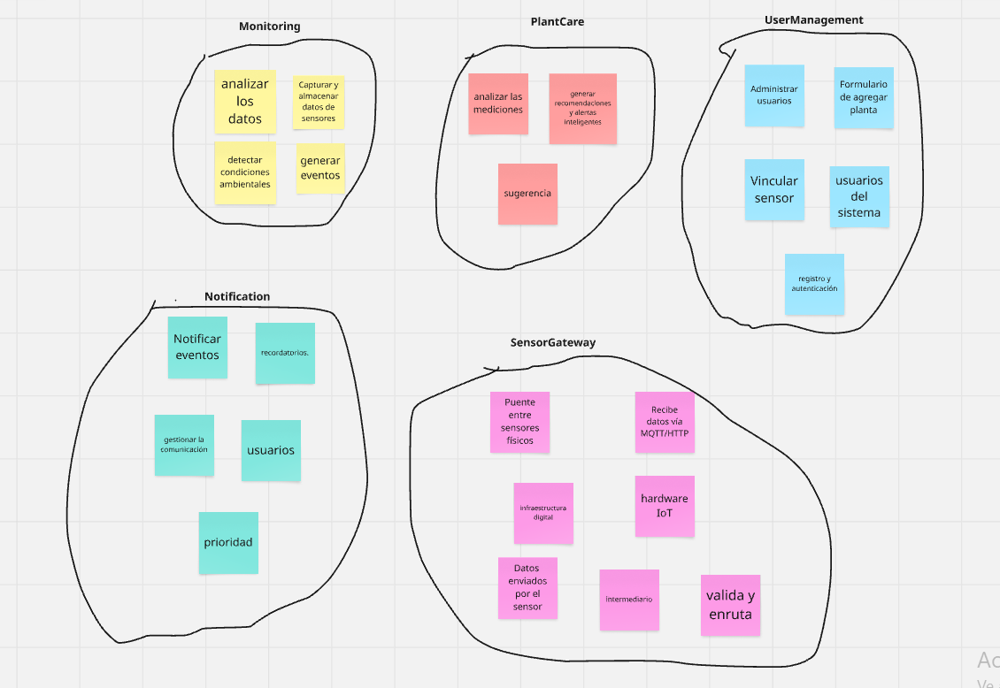
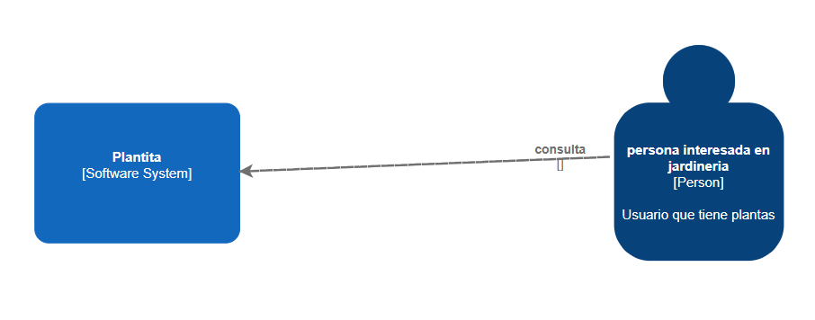
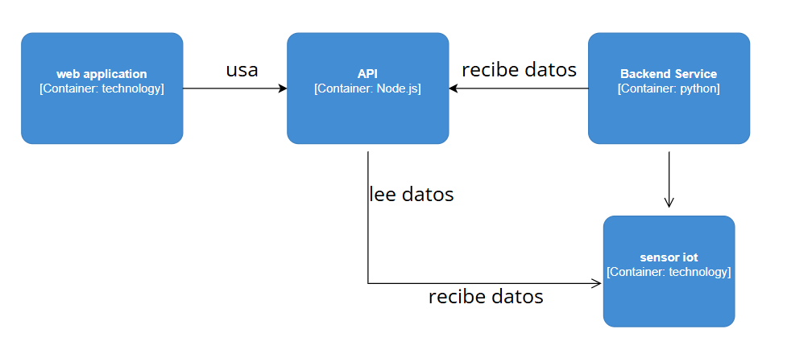
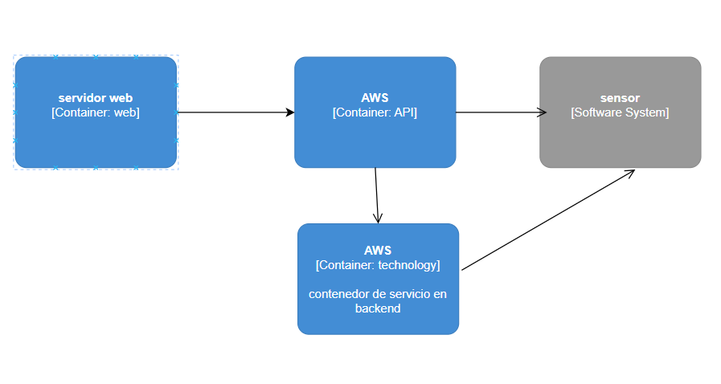
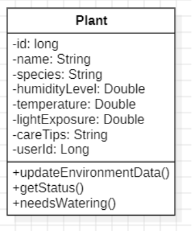
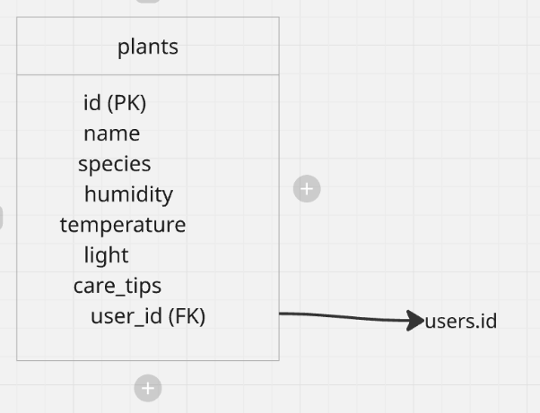

  <h1> Informe del Trabajo Final </h1>
  <h3> Universidad Peruana de Ciencias Aplicadas </h3>

  <h5> Ingeniería de Software </h5>

  <h5> Desarrollo de Soluciones IOT - 15185 </h5>

  <h5> Docente: Marco Antonio Leon Baca </h5>

  <h5> Startup: LlanterosTech </h5>

  <h5> Producto: Plantita </h5>

    <h3>Team Members:</h3>

     <table align="center">
        <tr>
            <th style="text-align:center;">Member</th>
            <th style="text-align:center;">Code</th>
        </tr>
        <tr>
            <td>Boronda Heidinger, Astrid Jimena</td>
            <td>U202215823</td>
        </tr>
        <tr>
            <td>Cabanillas Gora, Andrea Milagros</td>
            <td>U202211711</td>
        </tr>
        <tr>
            <td>Mallma Espiritu, Franky Oswald</td>
            <td>U20211c250</td>
        </tr>
        <tr>
            <td>Montes Figueroa. Juan Eduardo</td>
            <td>U202210775</td>
        </tr>
        <tr>
            <td>Palomino Santa Cruz, Erick Joaquin</td>
            <td>U202214843</td>
        </tr>
    </table>

<h5> Ciclo 2025-01 </h5>

## Registro de versiones del informe

|**Versión**|**Fecha**|**Autor**|**Descripción de modificación**|
| :-: | :-: | :-: | :-: |
|     |     |     |     |

## Project Report Collaboration Insights

## Contenido

1. [**Capítulo I: Introducción.**](#1.)  
   1.1. [Startup Profile.](#1.1.)  
   1.1.1. [Descripción del startup.](#1.1.1.) 
   1.1.2.[Perfiles de los integrantes del equipo.](#1.1.2.) 
   1.2. [Solution Profile.](#1.2.) 
   1.2.1. [Antecedentes y Problemática.](#1.2.1.) 
   1.2.2. [Lean UX Process.](#1.2.2.) 
   1.2.2.1. [Lean UX Problem Statements.](#1.2.2.1.) 
   1.2.2.2. [Lean UX Assumptions.](#1.2.2.2.) 
   1.2.2.3. [Lean UX Hypothesis Statements.](#1.2.2.3.) 
   1.2.2.4. [Lean UX Canvas.](#1.2.2.4.) 
   1.3. [Segmentos objetivo.](#1.3.) 
2. [**Capítulo II: Requirements Elicitation & Analysis.**](#2.) 
   2.1. [Competidores.](#2.1.) 
   2.1.1. [Análisis competitivo.](#2.1.1.) 
   2.1.2. [Estrategias y tácticas frente a competidores.](#2.1.2.) 
   2.2. [Entrevistas.](#2.2.) 
   2.2.1. [Diseño de entrevistas.](#2.2.1.) 
   2.2.2. [Registro de entrevistas.](#2.2.2.) 
   2.2.3. [Análisis de entrevistas.](#2.2.3.) 
   2.3. [Needfinding.](#2.3.) 
   2.3.1. [User Personas.](#2.3.1.) 
   2.3.2. [User Task Matrix.](#2.3.2.) 
   2.3.3. [User Journey Mapping.](#2.3.3.) 
   2.3.4. [Empathy Mapping.](#2.3.4.) 
   2.3.5. [As-is Scenario Mapping.](#2.3.5.) 
3. [**Capítulo III: Requirements Specification.**](#3.) 
   3.1. [To-Be Scenario Mapping.](#3.1.) 
   3.2. [User Stories.](#3.2.) 
   3.3. [Impact Mapping.](#3.3.) 
   3.4. [Product Backlog.](#3.4.) 
4. [**Capítulo IV: Product Design.**](#4.) 
   4.1. [Style Guidelines.](#4.1.) 
   4.1.1. [General Style Guidelines.](#4.1.1.) 
   4.1.2. [Web Style Guidelines.](#4.1.2.) 
   4.2. [Information Architecture.](#4.2.) 
   4.2.1. [Organization Systems.](#4.2.1.) 
   4.2.2. [Labeling Systems.](#4.2.2.) 
   4.2.3. [SEO Tags and Meta Tags](#4.2.3.) 
   4.2.4. [Searching Systems.](#4.2.4.) 
   4.2.5. [Navigation Systems.](#4.2.5.) 
   4.3. [Landing Page UI Design.](#4.3.) 
   4.3.1. [Landing Page Wireframe.](#4.3.1.) 
   4.3.2. [Landing Page Mock-up.](#4.3.2.) 
   4.4. [Web Applications UX/UI Design.](#4.4.) 
   4.4.1. [Web Applications Wireframes.](#4.4.1.) 
   4.4.2. [Web Applications Wireflow Diagrams.](#4.4.2.) 
   4.4.3. [Web Applications Mock-ups.](#4.4.3.) 
   4.4.4. [Web Applications User Flow Diagrams.](#4.4.4.) 
   4.5. [Web Applications Prototyping.](#4.5.) 
   4.6. [Domain-Driven Software Architecture.](#4.6.) 
   4.6.1. [Software Architecture Context Diagram.](#4.6.1.) 
   4.6.2. [Software Architecture Container Diagrams.](#4.6.2.) 
   4.6.3. [Software Architecture Components Diagrams.](#4.6.3.) 
   4.7. [Software Object-Oriented Design.](#4.7.) 
   4.7.1. [Class Diagrams.](#4.7.1.) 
   4.7.2. [Class Dictionary.](#4.7.2.) 
   4.8. [Database Design.](#4.8.) 
   4.8.1. [Database Diagram.](#4.8.1.) 
5. [**Capítulo V: Product Implementation, Validation & Deployment.**](#5.) 
   5.1. [Software Configuration Management.](#5.1.) 
   5.1.1. [Software Development Environment Configuration.](#5.1.1.) 
   5.1.2. [Source Code Management.](#5.1.2.) 
   5.1.3. [Source Code Style Guide & Conventions.](#5.1.3.) 
   5.1.4. [Software Deployment Configuration.](#5.1.4.) 
   5.2. [Landing Page, Services & Applications Implementation.](#5.2.) 
   5.2.1. [Sprint 1.](#5.2.1.) 
   5.2.1.1. [Sprint Planning 1.](#5.2.1.1.) 
   5.2.1.2. [Sprint Backlog 1.](#5.2.1.2.) 
   5.2.1.3. [Development Evidence for Sprint Review.](#5.2.1.3.) 
   5.2.1.4. [Testing Suite Evidence for Sprint Review.](#5.2.1.4.) 
   5.2.1.5. [Execution Evidence for Sprint Review.](#5.2.1.5.) 
   5.2.1.6. [Services Documentation Evidence for Sprint Review.](#5.2.1.6.) 
   5.2.1.7. [Software Deployment Evidence for Sprint Review.](#5.2.1.7.) 
   5.2.1.8. [Team Collaboration Insights during Sprint.](#5.2.1.8.) 
   5.2.2. [Sprint 2.](#5.2.2) 
   5.2.2.1. [Sprint Planning 2.](#5.2.2.1.) 
   5.2.2.2. [Sprint Backlog 2.](#5.2.2.2.) 
   5.2.2.3. [Development Evidence for Sprint Review.](#5.2.2.3.) 
   5.2.2.4. [Testing Suite Evidence for Sprint Review.](#5.2.2.4.) 
   5.2.2.5. [Execution Evidence for Sprint Review.](#5.2.2.5.) 
   5.2.2.6. [Services Documentation Evidence for Sprint Review.](#5.2.2.6.) 
   5.2.2.7. [Software Deployment Evidence for Sprint Review.](#5.2.2.7.) 
   5.2.2.8. [Team Collaboration Insights during Sprint.](#5.2.2.8.) 
   5.2.3. [Sprint 3.](#5.2.3) 
   5.2.3.1. [Sprint Planning 3.](#5.2.3.1.) 
   5.2.3.2. [Sprint Backlog 3.](#5.2.3.2.) 
   5.2.3.3. [Development Evidence for Sprint Review.](#5.2.3.3.) 
   5.2.3.4. [Testing Suite Evidence for Sprint Review.](#5.2.3.4.) 
   5.2.3.5. [Execution Evidence for Sprint Review.](#5.2.3.5.) 
   5.2.3.6. [Services Documentation Evidence for Sprint Review.](#5.2.3.6.) 
   5.2.3.7. [Software Deployment Evidence for Sprint Review.](#5.2.3.7.) 
   5.2.3.8. [Team Collaboration Insights during Sprint.](#5.2.3.8.) 
   5.2.4. [Sprint 4.](#5.2.4) 
   5.2.4.1. [Sprint Planning 4.](#5.2.4.1.) 
   5.2.4.2. [Sprint Backlog 4.](#5.2.4.2.) 
   5.2.4.3. [Development Evidence for Sprint Review.](#5.2.4.3.) 
   5.2.4.4. [Testing Suite Evidence for Sprint Review.](#5.2.4.4.) 
   5.2.4.5. [Execution Evidence for Sprint Review.](#5.2.4.5.) 
   5.2.4.6. [Services Documentation Evidence for Sprint Review.](#5.2.4.6.) 
   5.2.4.7. [Software Deployment Evidence for Sprint Review.](#5.2.4.7.) 
   5.2.4.8. [Team Collaboration Insights during Sprint.](#5.2.4.8.) 
   5.3. [Validation Interviews.](#5.3.) 
   5.3.1. [Diseño de Entrevistas.](#5.3.1) 
   5.3.2. [Registro de Entrevistas.](#5.3.2) 
   5.3.3. [Evaluaciones según heurísticas.](#5.3.3) 
   5.4. [Video About-the-Product.](#5.4.) 
6. [**Conclusiones.**](#6.) 
7. [**Bibliografía.**](#7.) 
8. [**Anexos.**](#8.) 

## Student Outcome

|**Criterio específico**|**Acciones realizadas**|**Conclusiones**|
| :-: | :-: | :-: |
|     |     |     |

<h2>CAPÍTULO I: INTRODUCCIÓN</h2>

<h3> 1.1 Startup Profile.</h3>

<h4> 1.1.1. Descripción de la Startup.</h4>

LlanterosTech es una startup conformada por estudiantes de la carrera de Ingeniería de Software de la Universidad Peruana de Ciencias Aplicadas. Juntos, somos un equipo comprometido con las necesidades y problemáticas que enfrentan los entusiastas del cuidado de plantas, quienes a menudo se ven afectados por la falta de información clara y herramientas eficientes para la gestión del bienestar de sus plantas. Es así como identificamos una oportunidad para proponer una solución innovadora que mejore la eficiencia y calidad en el cuidado de las plantas.

<h4> 1.1.2. Perfiles de integrantes del equipo. </h4>

|**Integrante**|**Perfil**|
| :-: | :-: |
| 
**Astrid Jimena Boronda Heidinger - U202215823**
  | Mi nombre es Astrid Jimena Boronda Heidinger, soy estudiante de la carrera de Ingeniería de Software, tengo 19 años y me considero una persona dispuesta a ayudar en los trabajos de grupos y atenta a los detalles de los trabajos. Tengo conocimiento en C++, Java y Python. Además, tengo conocimientos en HTML, CSS, JavaScript y frameworks como Angular y Vue. Me adapto muy bien a los trabajos en equipo. |
| 
**Andrea Milagros Cabanillas Gora-U202211711**
  | Me   llamo   Andrea   Cabanillas,   tengo   18   años,   estudio ingeniería   de   software,   soy   una persona sociable y siempre estoy dispuesta a escuchar nuevas ideas , además me gusta trabajar en grupo ya que siempre aprendo de  otros.  Soy buena en  lo  que es el  ámbito de diseño de  videojuegos  y siempre  estoy  al  tanto  para dar nuevas ideas para la app de algún proyecto. |
| 
**Franky Oswald Mallma Espiritu- U20211c250**
  |Soy estudiante de ingeniería de software, actualmente en el octavo ciclo , tengo principales conocimientos en backend como lo son Golang y Nest.js y de mobile con Flutter , a nivel equipo soy una persona comprometida y buscador de soluciones emergentes en los proyectos. |
| 
**Juan Eduardo Montes Figueroa- U202210775**
  |Mi nombre es Juan Montes, tengo 20 años, tengo conocimientos en C++, IntelliJ IDEA Ultimate, Rider, Webstorm, Android Studio, Flutter y también en diseño de imágenes tanto en aplicaciones complicadas como Photoshop hasta páginas webs que te dan funciones similares. Puedo aportar en el equipo con ideas, confianza y atención a los detalles. |
| 
**Erick Joaquin Palomino Santa Cruz- U2022148434**
  |erick. |

<h3> 1.2. Solution Profile</h3>

En esta sección se describe el problema que el proyecto tiene como objetivo resolver. Se detalla el enunciado del problema, descripción de los puntos importantes a resolver y considerar de la solución, objetivos, restricción y aplicación del Lean UX Process describiendo el cómo se resolverá el problema mediante el uso de modelo de negocio.

<h4> 1.2.1. Antecedentes y Problemática</h4>

<h5> **Antecedentes:** </h5>

El mundo de la jardinería y el cuidado de plantas presenta actualmente desafíos que requieren soluciones creativas. Uno de los principales retos es la creciente popularidad de tener plantas en casa, impulsada por el deseo de conectar con la naturaleza y mejorar nuestros espacios. Esta tendencia exige que aprendamos más sobre cómo cultivar y mantener nuestras plantas saludables, lo que a su vez nos enfrenta a desafíos como entender sus necesidades específicas y adaptarnos a diferentes entornos. Además, quienes cuidan plantas a menudo se encuentran con la dificultad de monitorear y optimizar el crecimiento de sus plantas, así como la necesidad de asegurar que estén libres de plagas y enfermedades. Estos factores combinados resaltan la importancia de desarrollar conocimientos y métodos que nos ayuden a cuidar nuestras plantas de manera eficiente y exitosa.

<h1> **Problemática** (5Ws y 2Hs):** </h1>

##### WHAT/QUÉ 
  
En este proyecto, el problema central que abordamos es la dificultad que enfrentan las personas al cuidar plantas, especialmente aquellas que recién comienzan. Esta dificultad se manifiesta en la falta de información clara, el desconocimiento de las necesidades específicas de cada planta y la gestión ineficiente de los recursos necesarios para su cuidado, lo que puede llevar a la frustración y al abandono de esta actividad. 

##### WHERE/DÓNDE 
  
Este problema se da en los hogares de las personas aficionadas al jardín. Cualquier lugar donde las personas intentan cultivar y cuidar plantas, especialmente principiantes, pueden enfrentar estas dificultades. 

##### WHY/POR QUÉ 

Este problema surge porque cada vez más personas quieren tener plantas en casa, pero no siempre saben cómo cuidarlas correctamente. Esto puede deberse a la falta de información clara y accesible, o a que las necesidades de cada planta son diferentes y pueden ser difíciles de entender al principio. Además, a veces no contamos con el tiempo o los recursos necesarios para darles a nuestras plantas la atención que requieren 

##### WHEN/CUANDO

Este problema se manifiesta desde el momento en que decidimos traer una planta a nuestro hogar. Al inicio, no estamos seguros de cómo cuidarla y pueden surgir dificultades. También ocurre cuando las plantas experimentan cambios en su entorno, como trasplantes o cambios de estación, y no sabemos cómo adaptarnos a sus nuevas necesidades.

##### WHO/QUIÉN

Personas interesadas en el mundo de las plantas con poco conocimiento acerca del cuidado adecuado.

##### HOW/CÓMO

Las personas podrán acceder a nuestra aplicación a través de sus teléfonos móviles o computadoras. Encontrarán información clara y fácil de entender sobre el cuidado de plantas, consejos, recordatorios de riego y fertilización, e incluso la posibilidad de identificar plantas y problemas comunes.

##### HOW MUCH/CUÁNTO

“El nivel de dificultad para cuidar una planta depende de factores como humedad, iluminación, riego y control de plagas. Las exigencias pueden variar según las condiciones del hogar y las tendencias del cuidador.” (Infobae, 2024)

El problema de no saber cómo cuidar correctamente las plantas se manifiesta en la cantidad de plantas que mueren o se enferman en hogares y espacios de cultivo. Esto puede significar una pérdida económica, pero también una frustración emocional para quienes intentan mantenerlas con vida. A menudo, las personas gastan dinero en plantas y suministros sin obtener los resultados deseados, lo que lleva a un ciclo de compra y pérdida.

<h4> 1.2.2. Lean UX Process.</h4>

<h5> 1.2.2.1. Lean UX Problem Statements.</h5>

<h5><strong>Domain:</strong></h5>

Plantita se sitúa en la intersección del cuidado de plantas, enfocándose específicamente en el nicho de los aficionados a la jardinería que buscan soluciones prácticas. Este segmento combina el deseo de tener plantas saludables con la necesidad de información clara y herramientas de monitoreo.

<h5><strong>Customer Segments:</strong></h5>

**Aficionados a la jardinería:** Cuidadores novatos que luchan por optimizar el cuidado de sus plantas debido a la falta de herramientas y conocimientos.

<h5><strong>Paint Points:</strong></h5>

**Aficionados a la jardinería:**  
* Dificultad para identificar las necesidades de las plantas al carecer de la información necesaria para mantener sus plantas saludables y prósperas.
* Carencia de herramientas adecuadas, es decir, no disponen de los instrumentos o recursos necesarios para monitorear y gestionar eficazmente el cuidado de sus plantas.

<h5><strong>Gap:</strong></h5>

Existe una brecha entre el deseo de los aficionados a la jardinería de tener plantas saludables y la disponibilidad de herramientas y conocimientos prácticos para lograrlo. Las soluciones existentes a menudo son demasiado genéricas o carecen de la personalización y el seguimiento detallado que necesitan los cuidadores novatos.

<h5><strong>Visión/Estrategia:</strong></h5>

* Crear una aplicación con funcionalidades enfocadas en proporcionar el conocimiento y las herramientas necesarias para cultivar plantas prósperas y saludables.
* Proporcionar una solución integral que combine tecnología IoT, información personalizada y una comunidad de apoyo.
* Transformar la jardinería de una actividad intimidante a una experiencia gratificante y accesible para todos.

<h5><strong>Initial Segment:</strong></h5>

Nuestro segmento inicial se compone de aficionados a la jardinería que son relativamente nuevos en el cuidado de plantas y que han experimentado dificultades para mantenerlas con vida. Este grupo incluye personas que viven en apartamentos o espacios pequeños, aquellos que tienen poco tiempo o experiencia previa en jardinería, y quienes desean utilizar la tecnología para mejorar su experiencia de cuidado de plantas.

<h5> 1.2.2.2. Lean UX Assumptions.</h5>

**Features**
- Herramientas de monitorización del crecimiento de plantas: Sensores para recopilar datos sobre condiciones ambientales, humedad del suelo, y salud de los cultivos.
- Plataforma integrada de gestión: Suite de herramientas que abarca la planificación de cultivos, gestión de la mano de obra, programación de riego, y funcionalidades de análisis de datos para identificar áreas de mejora y optimizar la eficiencia operativa en todas las etapas de crecimiento de las plantas.

**Business Outcomes**

* **Mejora de la eficiencia operativa:** Reducción de los tiempos de inactividad y los costos asociados con la gestión manual de inventario y la resolución de problemas en la cadena de suministro y optimización de los procesos mediante la automatización y la aplicación de datos en tiempo real para la toma de decisiones.
* **Aumento de la rentabilidad:** Reducción de las pérdidas debido a enfermedades en los cultivos que no son detectadas, mejora de la productividad y la calidad de las plantas, lo que puede traducirse en mayores márgenes de beneficio para los cuidadores.
* **Reducción de riesgos y cumplimiento normativo:** Mayor capacidad para responder rápidamente a problemas emergentes, como brotes de enfermedades o eventos climáticos extremos, minimizando el impacto en la producción y la distribución.

**Users**

Los usuarios son personas interesadas en el cuidado de plantas.

**User Outcomes & Benefits**

* **Aficionados al jardín:** Personas que empezaron a cultivar plantas y están aprendiendo a cuidarlos.

**User assumptions**

* **¿Quién es el usuario?**
El usuario es típicamente un aficionado a la jardinería busca mejorar la eficiencia y calidad de sus plantas.

* **¿Dónde encaja nuestro producto en sus trabajos o vidas?**
Nuestra aplicación encaja perfectamente en su día a día al facilitar el cuidado de sus plantas, desde entender sus necesidades básicas hasta identificar problemas y recibir consejos personalizados, optimizando así su experiencia como amantes de las plantas.

* **¿Qué problema resuelve nuestro producto?*
Nuestro producto resuelve problemas como dificultad para monitorear el crecimiento de cultivos, mejorando la eficiencia operativa y mejorar de la calidad de la plantas

* **¿Cuándo y cómo es usado nuestro producto?**
Nuestro producto es utilizado a lo largo de todo el ciclo de vida de las plantas, desde su plantación y crecimiento, a través de una plataforma digital accesible desde dispositivos móviles o computadoras.

* **¿Qué características son importantes?**
Las características de seguimiento de la cadena de suministro en tiempo real, gestión automatizada de las necesidades de la plantas, herramientas de monitorización de cultivos y análisis de datos para la toma de decisiones informadas.

* **¿Cómo debería verse y comportarse nuestro producto?**
Nuestro producto debe ser una interfaz intuitiva y fácil de usar, con visualizaciones claras de datos y esto de las plantas. Debería ser confiable, escalable y adaptable a las necesidades específicas de cada usuario.

**Business Assumptions**
1. Creemos que nuestros clientes necesitan una solución que les permita gestionar eficientemente el cuidado de las plantas, mejorando la eficiencia y la calidad.
2. Estas necesidades pueden ser satisfechas por una plataforma digital que integre sensores. Estos sensores proporcionarían información sobre el clima, la humedad, el monitoreo de cultivos y el análisis de datos. Esto proporcionaría herramientas poderosas para la toma de decisiones informadas.
3. El valor #1 que mi cliente quiere de mi servicio es la mejora en la eficiencia y la calidad de sus plantas, lo que les permite maximizar los rendimientos.
4. El cliente obtiene beneficios al tener un mejor manejo de sus plantas ya que se detectara el estado del clima y plagas y el propio sistema sabrán cómo tratarlas.
5. Voy a adquirir la mayoría de mis clientes a través de campañas de marketing y redes sociales.
6. Haré dinero a través de modelos de suscripción mensual por el acceso a mejor información de nuestra plataforma.
7. Mi competencia principal en el mercado son otras soluciones de cuidado de plantas, tanto tradicionales como digitales.
8. Los venceremos debido a la simplicidad y facilidad de uso de nuestra plataforma, así como a su capacidad para ofrecer una solución integral y altamente personalizable que se adapte a las necesidades específicas de cada cliente.
9. El mayor riesgo es que los clientes no adopten nuestra solución debido a la resistencia al cambio o a la falta de conocimiento tecnológico.
10. Resolveremos esto a través de demostraciones y pruebas gratuitas de nuestra plataforma, y proporcionando un sólido soporte al cliente para garantizar una implementación exitosa y una experiencia positiva del usuario.

<h5> 1.2.2.3. Lean UX Hypothesis Statements.</h5>

**Hipótesis 1:**
**Creemos que** al implementar un sistema que muestre las condiciones en las que se encuentran las plantas optimizará su cuidado y permitirá tomar medidas preventivas. **Sabremos que** hemos tenido éxito cuando se detecten problemas significativos que afecten a la planta y se pueda brindar un mejor cuidado.

**Hipótesis 2:**
**Creemos que** el uso de sensores en el sistema brindará información sobre las condiciones de las plantas. **Sabremos que** hemos tenido éxito cuando observemos un aumento significativo en la salud y vitalidad general de las plantas, obteniendo un mayor crecimiento.

<h5> 1.2.2.4. Lean UX Canvas</h5>

<table style="width: 100%; border-collapse: collapse; font-family: Arial, sans-serif;">
  <tbody>
    <tr>
      <td colspan="2" rowspan="2" style="font-weight: bold; text-align: justify;">Lean UX Canvas</td>
      <td style="text-align: right; font-weight: bold;">Fecha: 19/04/2025</td>
    </tr>
    <tr>
      <td style="text-align: right; font-weight: bold;">Iteración 1</td>
    </tr>
    <tr>
      <td style="text-align: justify;"><strong>1. Problema de negocios:</strong> Los usuarios enfrentan dificultades para mantener sus plantas saludables y prósperas debido a la falta de información y herramientas adecuadas para su cuidado.</td>
      <td rowspan="2" style="text-align: justify;"><strong>5. Ideas de solución:</strong> Desarrollar una aplicación que integre sensores que informe sobre el estado de la planta y proporcione recomendaciones o acciones personalizadas para el cuidado óptimo de la planta.</td>
      <td rowspan="2" style="text-align: justify;"><strong>2. Resultados comerciales:</strong> - Mejora en la calidad de crecimiento de las plantas. - Reducción de pérdidas. - Aumento de la satisfacción del cliente.</td>
    </tr>
    <tr>
      <td style="text-align: justify;"><strong>3. Usuarios y Clientes:</strong> Personas interesadas en el cuidado de plantas.</td>
    </tr>
    <tr>
      <td rowspan="2" style="text-align: justify;"><strong>6. Hipótesis</strong> * Creemos que al implementar un sistema que muestre las condiciones en las que se encuentran las plantas optimizará su cuidado y permitirá tomar medidas preventivas. Sabremos que hemos tenido éxito cuando se detecten problemas significativos que afecten a la planta y se pueda brindar un mejor cuidado.  * Creemos que el uso de sensores en el sistema brindará información sobre las condiciones de las plantas. Sabremos que hemos tenido éxito cuando observemos un aumento significativo en la salud y vitalidad general de las plantas, obteniendo un mayor crecimiento.</td>
      <td rowspan="2" style="text-align: justify;"><strong>7. ¿Qué es lo más importante que debemos aprender primero?</strong> Lo más importante que debemos aprender primero es comprender a fondo las necesidades y desafíos específicos de nuestros usuarios y clientes. Esto incluye entender sus procesos operativos, identificar los problemas más urgentes que enfrentan en el cuidado de plantas y conocer sus expectativas y prioridades en cuanto a soluciones tecnológicas.</td>
      <td style="text-align: justify;"><strong>4. Beneficios del usuario:</strong> * Optimización del cuidado de las plantas a través del monitoreo y recomendaciones personalizadas. * Disminución de la pérdida de plantas debido a un cuidado inadecuado y a la falta de información.</td>
    </tr>
    <tr>
      <td style="text-align: justify;"><strong>8. ¿Cuál es la menor cantidad de trabajo que necesitamos para resolver las dudas y para hacer lo siguiente más importante?</strong> La menor cantidad de trabajo que necesitamos para resolver las dudas y avanzar en lo siguiente es realizar una investigación inicial centrada en los usuarios y clientes potenciales. Esto puede incluir entrevistas, encuestas u otros métodos de investigación para comprender mejor sus necesidades, desafíos y expectativas.  Una vez que tengamos una comprensión sólida de las necesidades de los usuarios, podemos priorizar el desarrollo de características y funcionalidades de nuestra solución que aborden directamente esos problemas identificados. Esto nos permitirá enfocarnos en lo más importante para nuestros usuarios y garantizar que nuestra solución sea relevante y útil desde el principio.</td>
    </tr>
  </tbody>
</table>

<h3> 1.3. Segmentos objetivo.</h3>

* **Aficionados a la jardinería que buscan mejorar sus habilidades y el éxito de sus plantas:** Los usuarios utilizarán "Plantita" para acceder a información personalizada, herramientas de monitoreo y una comunidad de apoyo, con el fin de mejorar la salud y el crecimiento de sus plantas.

* **Características Demográficas:** Personas entre 20 y 50 años, que viven en áreas urbanas y suburbanas, con un interés en la jardinería y el cuidado de plantas pero con conocimientos limitados.  Posiblemente con un nivel educativo medio o superior y con acceso a dispositivos móviles y tecnología.

* **Características Geográficas:** Inicialmente enfocado en áreas urbanas y suburbanas en Perú, con potencial de expansión a otras regiones y países con un interés similar en la jardinería doméstica y el cuidado de plantas.

<h1> 2. CAPÍTULO II: Needfinding </h1>
<h2> 2.1. Competidores</h2>

 En el mercado al que buscamos ofrecer nuestra solución, identificamos diversos competidores que presentan propuestas similares orientadas a la gestión agrícola. A continuación, se detalla un resumen de sus soluciones de software: 

 **Agrobit** : Es una plataforma enfocada en la gestión agrícola y ganadera, orientada a grandes empresas. Su objetivo es promover formas sustentables y rentables de producción de alimentos. Entre sus funcionalidades destacan el control de actividades, el seguimiento del desarrollo de cultivos, el monitoreo predictivo, la trazabilidad y el cálculo de la huella de carbono.

 **Efemis** : Esta herramienta digital para la gestión agrícola utiliza imágenes satelitales, pronósticos meteorológicos y sensores para optimizar las operaciones y reducir costos. Desarrollada por Hispatec, Efemis es su solución principal dentro de una serie de herramientas especializadas para diferentes áreas del sector agrícola. 

 **Agri** : Es un software diseñado específicamente para el sector agrícola, que facilita la gestión de órdenes de aplicación, labores agrícolas, cosechas y sistemas de riego, entre otros. Para utilizar sus servicios, es necesario realizar una evaluación del terreno agrícola, la cual determina su clasificación por tamaño. En base a ello, se establece una tarifa mensual que varía entre 320 dólares para pequeñas empresas y 715 dólares para grandes explotaciones agrícolas. 

<h3> 2.1.1. Análisis Competitivo</h3>

¿Por qué realizar este análisis?

Es fundamental realizar este análisis para comprender las áreas en las que se enfocan nuestros competidores directos. Esto nos permitirá identificar oportunidades para diferenciarnos y destacar en aspectos que capten el interés de nuestro público objetivo.

|Nombre|Plantita|Agrobit|Efemis|Agri|

| Nombre | Plantita                         | Agrobit                                    | Afemis | Agri |
|--------|------------------------------|------------------------------------------------|--------|------|
| Overview   | Software de gestión agrícola centrado en la capacitación del usuario que puede adaptarse a sus necesidades | Software enfocado en la gestión de procesos agrícolas y ganaderos con ayuda de herramientas de alta gama | Software de hispatec que gestiona procesos agrícolas utilizando herramientas de alta gama | Agri es una solución de software latina que permite gestionar campos de cultivo de forma centralizada |
| Ventaja Competitiva   | Esta aplicación está entrada en el usuario y su adaptabilidad, brindándole a este una opción cómoda al alcance de sus manos | Uso de herramientas de alta gama como imágenes satelitales que son una alternativa que brinda una seguridad total | Este software modular, está diseñado para que el usuario quiera añadir más funcionalidades que se acoplen a sus necesidades | Empresa latinoamericana con la que los usuarios se sienten más cómodos |
| Mercado Objetivo   | Nos enfocaremos en los pequeños y grandes agricultores que no hayan implementado tecnología para aligerar su carga laboral | Se centra en el sector ganadero y agrícola que buscan implementar una solución tecnológica con herramientas de gama alta, como imágenes satelitales | Sector agrícola grande que busca una solución de software para agilizar procesos | Está centrado en pequeñas, medianas y grandes empresas agrícolas |
| Estrategias de Marketing   | Nos acercaremos a los empresarios agrícolas que no confían en la tecnología para que podamos demostrar la eficacia de esta | Se promociona mediante publicidad como google ads, correos,etc. | Utiliza publicidad y estrategias de marketing | Agri usa sus redes sociales como Instagram y Linkedin para poder difundir sus propuestas de valor |
| Productos y Servicios   | Ofrecemos una amplia variedad de recursos para el usuario como, control de inventario, predicciones del clima, sensores de humedad y temperatura, monitoreo de ventas, predicciones para las cosechas y un control de ventas | Cuenta con dos versiones, la ECO, una versión dedicada para una producción netamente sostenible, y la Enterprise, dedicada a conseguir el mayor beneficio económico para la empresa. Ambas opciones cuentan con planes de pago diferentes que varían, dando a las grandes empresas agrícolas más ventajas que a las más pequeñas | Efemis cuenta con un control de costos de operaciones, monitoreos de cumplimiento de normativas,gestión de actividades, tratamientos y riegos,entre otras | Agri cuenta con controles de faenas, compras y bodegaje, control de riego, entre otros. |
| Precios y Costos   | Planeamos cobrar una comisión por venta de productos, los usuarios podrán acceder a nuestros servicios sin mayor problema | Agrobit cuenta con planes mensuales que rondan los 250 hasta los 1100 dólares | Cuenta con planes principalmente desde los 300 hasta los 900 euros mensuales | Cuenta con 3 planes para los pequeños, medianos y grandes agricultores cuyos costos van desde los 320 hasta los 750 dólares |
| Fortalezas   | Contamos con un software ágil, que se verá sujetos a cambios rápidos para acomodarnos a las necesidades del usuario | Cuenta con una reputación y una clientela fiel | Es parte de una corporación grande que facilita acceso a herramientas de gama alta | Cuenta con clientes en todo latinoamérica sobre todo Chile y Perú |
| Debilidades   | Sujeta a pruebas | Está cerrada a sus clientes habituales y los clientes nuevos no parecen interesados en su producto  |No cuenta con una gran cantidad de clientes, las reseñas no son buenas y está siendo dejada de lado|No parece querer modernizarse más allá de su estado actual|
| Oportunidades   | Muchas de las gestiones agrícolas en nuestro país son deficientes y gran parte de las cosechas son desperdiciadas, por ello el Perú es un país ideal para implementar agroges  | Dadas sus herramientas presenta una estabilidad que les permitiría desarrollarse más  |Cuenta con acceso a herramientas de gama alta que permiten el recopilado de información detallada para beneficio del usuario|Cuenta con el apoyo de clientes de más de un país por ello pueden expandirse por todo latinoamérica|
| Amenazas   | La implementación de herramientas costosas por parte de la competencia | Dado que el proceso de cotización es lento, muchos clientes prefieren buscar otras opciones | Sus ventas se han visto reducidas |La creciente tecnología y el uso de la inteligencia artificial puede desplazar a muchas soluciones de software|

<h3> 2.1.2. Estrategias y tácticas frente a competidores </h3>

Nos dirigiremos al segmento del sector agrícola que aún no ha incorporado tecnología, ofreciendo una solución accesible y fácil de usar. El objetivo es que incluso quienes no tienen experiencia con herramientas tecnológicas puedan utilizarlas de forma eficaz para optimizar sus recursos. 
 
<b>Estrategia general:</b> Diferenciación 
 
<b>Objetivo principal:</b> Sobresalir frente a la competencia mediante un producto que responda a necesidades específicas de nuestros segmentos de mercado. 
 
<b>Estrategias clave:</b> 
<ul>
  <li><strong>Enfoque en el usuario</strong>: Priorizar mejoras basadas en las necesidades y sugerencias de los clientes.</li>
  <li><strong>Gestión de usuarios</strong>: La aplicación contará con una red interconectada que permitirá al usuario administrador supervisar y gestionar a los trabajadores bajo su responsabilidad.</li>
</ul>

 
<h2> 2.2. Entrevistas</h2>
<h3> 2.2.1. Diseño de entrevistas</h3>

<strong>Segmento 1:</strong> Agricultores

<strong>Pregunta general:</strong>

<ul>
  <li>¿Cuál es tu nombre, cuántos años tienes y a qué te dedicas?</li>
  <li>¿Cómo consideras que es tu personalidad (extrovertido, introvertido, racional, idealista, etc.)?</li>
</ul>

<strong>Preguntas:</strong>

<ul>
  <li>¿Qué te motivó a empezar a cuidar plantas?</li>
  <li>¿Cuáles son los mayores desafíos que enfrentas al cuidar tus plantas?</li>
  <li>¿Tienes algún problema recurrente con tus plantas, como saber cuándo regarlas o qué cantidad de luz necesitan?</li>
  <li>¿Actualmente usas alguna aplicación o herramienta para ayudarte a cuidar tus plantas? Si sí, ¿cuál?</li>
  <li>¿Qué información te gustaría tener más clara o accesible sobre el cuidado de tus plantas?</li>
  <li>¿Te gustaría recibir notificaciones o recordatorios sobre el cuidado de tus plantas (por ejemplo, cuándo regarlas, cuándo podarlas)?</li>
  <li>Si pudieras tener una herramienta que te ayude a monitorear el estado de tus plantas, como la humedad del suelo o la luz que reciben, ¿te interesaría?</li>
  <li>¿Qué tan importante es para ti recibir consejos prácticos y fáciles de seguir sobre el cuidado de tus plantas?</li>
  <li>¿Qué funcionalidades te gustaría que tuviera una aplicación para facilitar el cuidado de tus plantas?</li>
  <li>¿Te sentirías cómodo utilizando sensores para monitorear las condiciones de tus plantas (por ejemplo, humedad, temperatura, luz)?</li>
  <li>¿Qué tipo de apoyo o comunidad te gustaría encontrar dentro de una app para jardineros novatos?</li>
  <li>¿Qué tan importante es para ti que la aplicación sea fácil de usar y no requiera mucho tiempo para aprender?</li>
</ul>

<h3> 2.2.2. Registro de entrevistas</h3>

### Segmento objetivo - Agricultor

### Entrevista 1:

Entrevistador: Astrid Boronda

Entrevistado: Norma Heidinger Casimiro

Datos del entrevistado:

- Edad: 55 años
- Sexo: Femenino

Link de la Entrevista: <a href="[https://upcedupe-my.sharepoint.com/:v:/g/personal/u201611430_upc_edu_pe/EbjLpEbXB19DpCYb3IeGsgIBKh-fjJKv9hqqiDE3P6u70A?e=AuM7GN&nav=eyJyZWZlcnJhbEluZm8iOnsicmVmZXJyYWxBcHAiOiJTdHJlYW1XZWJBcHAiLCJyZWZlcnJhbFZpZXciOiJTaGFyZURpYWxvZy1MaW5rIiwicmVmZXJyYWxBcHBQbGF0Zm9ybSI6IldlYiIsInJlZmVycmFsTW9kZSI6InZpZXcifX0%3D](https://drive.google.com/file/d/1QPmypxm86Kk_iFu7pJxvQDSTnDv1nRg9/view?usp=sharing)" Target="_blank">Link</a>

- Minuto de Inicio: 0:00 
- Minuto de Fin: 7:19

Resumen de la entrevista:

Norma comenzó a cuidar plantas debido al estrés y la ansiedad, buscando un beneficio para su salud y estilo de vida, siguiendo recomendaciones sobre los efectos positivos de la jardinería. Sin embargo, se considera inexperta en el cultivo de flores y plantas frutales, lo que dificulta el proceso. Actualmente, riega y cuida las plantas basándose en su propio criterio, observando si están secas o enmontadas, y depende de consejos y opiniones de amigas y vecinas para el cuidado de sus plantas.
Ella expresa su deseo de contar con la guía de un profesional o alguien con experiencia que pueda enseñarle directamente en su jardín. Le gustaría recibir notificaciones y recordatorios sobre el cuidado de sus plantas, así como una herramienta que monitoree el estado de sus plantas, como la humedad del suelo y la luz recibida. También le interesaría que una aplicación le indique qué enfermedad tiene una planta, por qué no crece, y cómo tratar las plagas. Aunque inicialmente no entendió el concepto de sensores, se mostró abierta a la idea de usarlos para monitorear las plantas.
Para ella, es crucial que cualquier aplicación sea fácil de usar y no requiera mucho tiempo para aprender, especialmente para personas mayores de 50 años como ella. Le gustaría encontrar apoyo o una comunidad dentro de una aplicación para jardineros novatos, donde pueda aprender sobre por qué las flores tardan en florecer y los árboles frutales en dar frutos. Valora la simplicidad, la facilidad de uso y el apoyo personalizado. Está abierta a la tecnología, siempre y cuando sea accesible y le proporcione la información y el soporte que necesita para tener éxito en su jardín.

### Entrevista 1:

Entrevistador: Juan Montes

Entrevistado: Jorge Rivas

Datos del entrevistado:

- Edad: 42 años
- Sexo: Masculino

Link de la Entrevista: <a href="" Target="_blank">Link</a>

- Minuto de Inicio: 0:00 
- Minuto de Fin: 

Resumen de la entrevista:

Jorge Rivas, agricultor de 42 años, se considera práctico y racional. Comenzó a cuidar plantas por necesidad laboral y ahora siente pasión por su crecimiento. Sus principales desafíos son el clima cambiante, la dificultad para identificar problemas en las plantas y saber cuándo y cuánto regarlas. Actualmente no utiliza aplicaciones debido a barreras de idioma y falta de personalización, pero está interesado en herramientas que ofrezcan recordatorios, monitoreo con sensores y consejos prácticos. Valora especialmente que la aplicación sea fácil de usar, esté en español y cuente con una comunidad de apoyo para resolver dudas y compartir experiencias.

<h3> 2.2.3. Análisis de entrevistas</h3>
<h2> 2.3. Needfinding</h2>
<h3> 2.3.1. User Personas</h3>
<h3> 2.3.2. User Task Matrix</h3>
<h3> 2.3.3. User Journey Mapping</h3>
<h3> 2.3.4. As-is Scenario Mapping</h3>

# Capítulo III: Requirements Specification

## 3.1 To-Be Scenario Mapping

En esta sección se presenta el mapeo de los escenarios, realizando una tabla con la situación a mejorar del segmento objetivo, analizando que pasos se realizarán y cómo se siente.

<b>Para el segmento de aficionados a la jardinería que buscan mejorar sus habilidades y el éxito de sus plantas.:</b>

## 3.2 User Stories

| Epic / Story ID |                 Título                  |                                                                                                                                              Descripción                                                                                                                                               | Criterios de Aceptación | Relacionado con (Epic ID) |
|:---------------:|:----------------------------------------:|:-------------------------------------------------------------------------------------------------------------------------------------------------------------------------------------------------------------------------:|:------------------------:|:--------------------------:|
|       E01       | Gestión de Inventario de Laboratorio    | Como técnico de laboratorio, deseo una plataforma tecnológica que me permita gestionar eficientemente el inventario de suministros y equipos, para garantizar la disponibilidad de materiales necesarios y optimizar el flujo de trabajo en el laboratorio. |           -            |             -             |
|       E02       | Gestión de citas médicas                | Como paciente, deseo tener acceso a una plataforma tecnológica que facilite la gestión de mis citas médicas, para poder organizar mi agenda de manera eficiente y recibir una atención médica oportuna y de calidad.         |           -            |             -             |
|       E03       | Plataforma tecnológica para tratamientos ortopédicos | Como médico traumatológico, quiero tener una plataforma tecnológica que me permita gestionar eficientemente los tratamientos de mis pacientes, para poder proporcionar una atención médica de alta calidad y personalizada. |           -            |             -             |
|       E04       | Acceso a historial médico del paciente  | Como médico traumatológico, deseo poder acceder al historial médico completo de mis pacientes, para tomar decisiones informadas y brindarles la mejor atención posible.                                                  |           -            |             -             |
|       E05       | Gestión de muestras y resultados de laboratorio | Como técnico de laboratorio, deseo contar con una aplicación web que me permita optimizar la gestión de muestras y resultados de los pacientes.                                                                            |           -            |             -             |
|       E06       | Acceso a página informativa sobre la aplicación | Como paciente quiero poder entrar una landing page donde esté la información esencial sobre la aplicación web.                                         | Epic / Story ID |            Título             |                                                                                             Descripción                                                                                             |                                                                                                                                                                                                                                                                                                                                                      Criterios de Aceptación                                                                                                                                                                                                                                                                                                                                                      | Relacionado con (Epic ID) |
| US01 | Registro de Muestras | Como técnico de laboratorio, quiero poder registrar nuevas muestras en el sistema, incluyendo detalles como el código de la muestra, tipo de muestra y fecha de recepción. | **Escenario 1: Registro Exitoso** - Dado que el técnico está en la página de registro, - Cuando ingresa todos los campos correctamente, - Entonces el sistema guarda la muestra y muestra confirmación.  **Escenario 2: Validación** - Cuando falta algún campo obligatorio, - Entonces se muestra un mensaje de error. | E01 |
| US02 | Asignación de Análisis | Como técnico de laboratorio, quiero poder asignar análisis específicos a las muestras registradas. | **Escenario 1: Asignación Exitosa** - Dado que el técnico accede a la asignación, - Cuando completa todos los campos, - Entonces se confirma la asignación.  **Escenario 2: Error por campos faltantes** - Cuando falta algún dato obligatorio, - Entonces se muestra un error. | E01 |
| US03 | Registro de Resultados de Análisis | Como técnico de laboratorio, quiero registrar los resultados de análisis en las muestras. | **Escenario 1: Registro Exitoso** - Dado que el técnico está en la sección de resultados, - Cuando ingresa los resultados, - Entonces se confirman y se almacenan.  **Escenario 2: Campos obligatorios faltantes** - Cuando faltan datos, - Entonces se muestra un error. | E01 |
| US04 | Consulta de Muestras | Como técnico de laboratorio, quiero consultar muestras registradas mediante filtros. | **Escenario 1: Búsqueda Exitosa** - Dado que el técnico usa filtros válidos, - Cuando busca, - Entonces se listan las muestras.  **Escenario 2: Sin resultados** - Cuando no hay coincidencias, - Entonces se muestra mensaje de no resultados. | E01 |
| US05 | Generación de Reportes de Análisis | Como técnico de laboratorio, quiero generar reportes de análisis con toda la información necesaria. | **Escenario 1: Reporte generado** - Cuando selecciona parámetros, - Entonces el reporte es generado correctamente.  **Escenario 2: Parámetros faltantes** - Cuando omite algún parámetro, - Entonces el sistema muestra un error. | E01 |
| US06 | Adjuntar PDF con Resultados | Como técnico de laboratorio, quiero adjuntar archivos PDF con resultados. | **Escenario 1: Adjuntar exitosamente** - Cuando sube un PDF válido, - Entonces queda asociado a la muestra.  **Escenario 2: Tamaño excedido** - Cuando el PDF excede el tamaño, - Entonces el sistema lanza error. | E01 |
| US07 | Registro de Nueva Cita | Como paciente, quiero programar una nueva cita médica en línea. | **Escenario 1: Paciente registrado** - Cuando el paciente elige fecha y motivo, - Entonces se confirma la cita.  **Escenario 2: Nuevo paciente** - Cuando se registra como nuevo usuario, - Entonces puede agendar la cita. | E02 |
| US08 | Selección de Especialista y Ubicación | Como paciente, quiero seleccionar especialista y ubicación preferida. | **Escenario 1: Lista de especialistas** - Cuando selecciona especialidad, - Entonces ve opciones por ubicación.  **Escenario 2: Selección de centro médico** - Cuando elige ubicación, - Entonces se actualiza lista de especialistas. | E02 |
| US09 | Disponibilidad de Horarios | Como paciente, quiero ver los horarios disponibles de los especialistas. | **Escenario 1: Ver horarios** - Cuando accede al calendario, - Entonces puede elegir fecha y hora.  **Escenario 2: Horarios urgentes destacados** - Cuando necesita cita urgente, - Entonces se resaltan los horarios más próximos. | E02 |
| US10 | Recordatorios de Cita | Como paciente, quiero recibir recordatorios automáticos de mis citas. | **Escenario 1: Por correo** - Antes de la cita, - Entonces se envía un recordatorio por email.  **Escenario 2: Por SMS** - Cuando se aproxima una cita, - Entonces se notifica por mensaje de texto. | E02 |
| US11 | Cancelación de Citas | Como paciente, quiero poder cancelar mis citas médicas en caso de imprevistos. | **Escenario 1: Cancelación por conflicto** - Cuando el usuario selecciona una cita y elige cancelarla, - Entonces el sistema solicita confirmación y libera el horario.  **Escenario 2: Confirmación de cancelación** - Después de cancelar, - Entonces se muestra una notificación y correo de confirmación. | E02|
| US12 | Re-agendamiento de Citas | Como paciente, quiero poder reagendar mis citas si no puedo asistir en la fecha original. | **Escenario 1: Selección de nueva fecha** - Cuando el paciente elige reagendar, - Entonces el sistema muestra opciones y permite nueva selección.  **Escenario 2: Confirmación** - Después de seleccionar nueva fecha, - Entonces se confirma la reprogramación. | E02 |
| US13 | Confirmación de Cita | Como paciente, quiero recibir una confirmación clara después de agendar una cita. | **Escenario 1: Confirmación instantánea** - Cuando finaliza el agendamiento, - Entonces se muestra número de referencia y resumen.  **Escenario 2: Correo de confirmación** - Después de agendar, - Entonces se recibe un email con detalles. | E02 |
| US14 | Acceso Eficiente al Historial Médico Completo | Como médico, quiero acceder rápidamente al historial completo del paciente. | **Escenario 1: Carga del historial** - Al hacer clic en el paciente, - Entonces el historial se muestra en menos de 3 segundos.  **Escenario 2: Sección de tratamientos pasados** - Al acceder a esta sección, - Entonces se listan los tratamientos con fechas y detalles. | E03 |
| US15 | Notificaciones de Citas de Seguimiento | Como médico, quiero recibir notificaciones sobre citas de seguimiento programadas. | **Escenario 1: Alerta previa** - Cuando falta menos de 24 horas, - Entonces se envía recordatorio por correo.  **Escenario 2: Detalle desde notificación** - Al hacer clic en la alerta, - Entonces se abre la ficha del paciente. | E03 |
| US16 | Actualización de Planes de Tratamiento | Como médico, quiero actualizar los planes de tratamiento de mis pacientes desde el sistema. | **Escenario 1: Edición de plan** - Al editar el plan, - Entonces se puede guardar cambios y se registra el historial de ediciones.  **Escenario 2: Guardado automático** - Cuando se guarda el nuevo plan, - Entonces se actualiza automáticamente en la ficha del paciente. | E03 |
| US17 | Alertas de Cambios en Resultados | Como médico, quiero recibir alertas si hay cambios significativos en los resultados. | **Escenario 1: Notificación automática** - Al detectarse un cambio, - Entonces se envía una alerta al médico.  **Escenario 2: Detalle del cambio** - Al abrir la notificación, - Entonces se muestra información detallada. | E03 |
| US18 | Comunicación Segura con los Pacientes | Como médico, quiero comunicarme con mis pacientes de forma segura. | **Escenario 1: Envío de mensajes** - Desde la ficha del paciente, - Entonces se puede abrir una ventana de chat cifrada.  **Escenario 2: Recepción y respuesta** - Al recibir mensajes, - Entonces el médico puede responder desde la bandeja de entrada. | E03 |
| US19 | Análisis y Evaluación de Eficacia del Tratamiento | Como médico, quiero evaluar la eficacia de los tratamientos a través de informes. | **Escenario 1: Generación de informe** - Al seleccionar parámetros de análisis, - Entonces se genera un informe con métricas.  **Escenario 2: Detalle por métrica** - Al hacer clic en una métrica, - Entonces se ve un desglose por paciente. | E03 |
| US20 | Acceso rápido al historial médico del paciente | Como doctor, quiero acceder rápidamente al historial médico antes de la consulta. | **Escenario 1: Búsqueda por nombre o ID** - Al buscar el paciente, - Entonces se muestra todo su historial.  **Escenario 2: Visualización por categorías** - Al seleccionar categoría (diagnósticos, tratamientos, etc), - Entonces se muestran los datos correspondientes. | E04 |
| US21 | Visualización detallada del historial médico | Como doctor, quiero ver detalladamente diagnósticos, exámenes y notas del historial médico. | **Escenario 1: Visualización por secciones** - Al seleccionar "resultados de exámenes", - Entonces se muestran en orden cronológico.  **Escenario 2: Expansión de entradas** - Al hacer clic sobre una entrada, - Entonces se muestran detalles y notas asociadas. | E04 |
| US22 | Actualización en tiempo real del historial médico | Como doctor, quiero que el historial médico se actualice instantáneamente tras cambios. | **Escenario 1: Acceso concurrente** - Cuando otro médico actualiza, - Entonces los cambios se reflejan sin recargar.  **Escenario 2: Notificaciones de cambios** - Cuando hay actualización, - Entonces se notifica automáticamente a médicos asignados. | E04 |
| US23 | Registro de nuevas entradas en el historial | Como doctor, quiero poder registrar nuevos diagnósticos, notas y tratamientos fácilmente. | **Escenario 1: Registro exitoso** - Al guardar una entrada nueva, - Entonces esta se agrega al historial médico.  **Escenario 2: Confirmación de ingreso** - Después de guardar, - Entonces se muestra confirmación y la nueva entrada aparece listada. | E04 |
| US24 | Seguridad y privacidad del historial médico | Como doctor, quiero que el acceso al historial esté protegido y encriptado. | **Escenario 1: Autenticación adicional** - Si se accede desde nuevo dispositivo, - Entonces se requiere autenticación de doble factor.  **Escenario 2: Encriptación de datos** - Cuando se transmite información médica, - Entonces se usa cifrado seguro. | E04 |
| US25 | Registro de eventos importantes del paciente | Como doctor, quiero registrar eventos como cirugías, hospitalizaciones o antecedentes familiares. | **Escenario 1: Registro de eventos clínicos** - Cuando se completa el formulario de evento, - Entonces este se agrega al historial.  **Escenario 2: Visualización por categoría** - Al consultar eventos importantes, - Entonces se muestra una lista filtrada por tipo. | E04 |
| US26 | Interfaz personalizable para análisis médicos | Como técnico, necesito personalizar la interfaz del sistema según el tipo de análisis. | **Escenario 1: Personalización exitosa** - Al mover herramientas y paneles, - Entonces el sistema guarda la nueva configuración.  **Escenario 2: Aplicación de interfaz personalizada** - En futuros análisis, - Entonces se carga la configuración guardada automáticamente. | E05 |
| US27 | Acceso a protocolos actualizados | Como técnico, quiero consultar protocolos actualizados desde la app web. | **Escenario 1: Acceso a protocolo actualizado** - Cuando accede a la sección, - Entonces ve la lista clara y actualizada.  **Escenario 2: Confirmación de revisión** - Al leer un protocolo, - Entonces puede marcarlo como leído y aplicar procedimientos. | E05 |
| US28 | Sistema de comunicación y registro de resultados | Como técnico, quiero que los resultados se comuniquen automáticamente al médico. | **Escenario 1: Registro automático** - Al completar el análisis, - Entonces se guarda automáticamente.  **Escenario 2: Envío al médico** - Después del registro, - Entonces se notifica al médico responsable. | E05 |
| US29 | Protocolo de integridad de muestras | Como técnico, quiero un protocolo para asegurar la integridad de muestras. | **Escenario 1: Aplicación del protocolo** - Al iniciar el análisis, - Entonces se aplican los pasos del protocolo.  **Escenario 2: Identificación de muestra comprometida** - Si se detecta un problema, - Entonces se notifica y se documenta la acción tomada. | E05 |
| US30 | Resultados con consideraciones clínicas automatizadas | Como técnico, quiero que los resultados incluyan implicaciones clínicas automáticamente. | **Escenario 1: Evaluación clínica automática** - Después de registrar los resultados, - Entonces el sistema analiza implicaciones clínicas.  **Escenario 2: Visualización para el médico** - Cuando el médico recibe el resultado, - Entonces ve sugerencias clínicas junto al resultado. | E05 |

### Technical Stories

| Epic / Story ID |                    Título                     |                                                                                                                                            Descripción                                                                                                                                             |                                                                                                                                                                                                                                                                                                                                                                                                                                          Criterios de Aceptación                                                                                                                                                                                                                                                                                                                                                                                                                                           | Relacionado con (Epic ID) |
|:---------------:|:---------------------------------------------:|:--------------------------------------------------------------------------------------------------------------------------------------------------------------------------------------------------------------------------------------------------------------------------------------------------:|:----------------------------------------------------------------------------------------------------------------------------------------------------------------------------------------------------------------------------------------------------------------------------------------------------------------------------------------------------------------------------------------------------------------------------------------------------------------------------------------------------------------------------------------------------------------------------------------------------------------------------------------------------------------------------------------------------------------------------------------------------------------------------------------------------------------------------------------------------------------------------------------------------------:|:-------------------------:|
|      US40       |     Consulta de las citas de los medicos      |                                                                                     Como desarrollador quiero obtener las citas programadas para cada doctor para que se puedan mostrar y modificar las notas                                                                                      |                                                                        
**Escenario 1: Obtener las citas por el id del doctor**

- Dado que el endpoint "doctor/:id/appointments" esta disponible

- Cuando se envia una solicitud GET con el id del doctor

- Entonces se recibe una respuesta con el estado 200

- Y una lista con las informacion de cada appointments de ese doctor estara incluida en el cuerpo de la respuesta

**Escenario 2: Obtener citas con id de doctor no valido**

- Dado que el endpoint "doctor/:id/appointments" esta disponible

- Cuando se envia una solicitud GET con el id del doctor

- Entonces se recibe una respuesta con el estado 404

- Y se muestra un error en el cuerpo de la respuesta indicando que el doctor no esta registrado
                                                                        |            E01            |
|      US41       |           Gestión de citas médicas            |                                                                Como desarrollador quiero crear y actualizar una cita médica a través de la API, para que puedan gestionar y actualizar las reservas los pacientes en la aplicación.                                                                |                                                          
**Escenario1: Crear una cita médica**

- Dado que el endpoint "/api/v1/appointments" está disponible,

- Cuando se envía una solicitud POST con valores para patient_id, doctor_id, appointment_date y description,

- Entonces se recibe una respuesta con el estado 201

- Y un recurso de cita está incluido en el cuerpo de la respuesta con un nuevo id y los valores registrados.

**Escenario2: Actualizar una cita existente**

- Dado que el endpoint "/appointments/{appointment_id}" está disponible

- Cuando se envía una solicitud PUT con valores actualizados para appointment_date y description

Entonces se recibe una respuesta con el estado 200

Y el recurso de cita está actualizado con los nuevos valores
                                                           |            E01            |                                                                                                                                                                                                                                                                                                              
|      US42       |   Consulta de tratamientos de los pacientes   |                                                                                                           Como desarrollador, quiero obtener los tratamientos asignados a cada paciente.                                                                                                           |                                                          
**Escenario 1: Obtener los tratamientos por el id del paciente**

- Dado que el endpoint "patient/:id/treatments" esta disponible

- Cuando se envia una solicitud GET con el id del paciente

- Entonces se recibe una respuesta con el estado 200

- Y en el cuerpo de la respuesta se muestra un lista con los tratamientos asignados a ese paciente

**Escenario 2: Obtener los tratamientos con id de paciente no valido**

- Dado que el endpoint "patient/:id/treatments" esta disponible

- Cuando se envia una solicitud GET con el id del paciente

- Entonces se recibe una respuesta con el estado 404

- Y se muestra un error en el cuerpo de la respuesta indicando que el paciente no esta registrado en la plataforma
                                                          |            E01            |
|      US43       |         Consulta del historial médico         |                                                                           Como desarrollador, quiero obtener los historiales médicos a través de la API, para poder mostar o procesar la información de los historiales.                                                                           | 
**Escenario1:Obtener el historial médico de un paciente con id específico**
-Dado que el endpoint "/api/v1/medical-history/patient/{patientId}" está disponible,
 
-Cuando se envía una solicitud GET con un patientId válido,
 
-Entonces se recibe una respuesta con el estado 200,

-Y una lista de historial médico para ese paciente está incluida en el cuerpo de la respuesta.
 

**Escenario2:Obtener el historial médico de un paciente con id específico no existente**

-Dado que el endpoint "/api/v1/medical-history/patient/{patientId}" está disponible,

-Cuando se envía una solicitud GET con un patientId,

-Y no se encuentra ningún paciente con aquel Id
-Entonces se recibe una respuesta con el estado 404

-Entonces un mensaje de error está incluido en el cuerpo de la respuesta indicando "Paciente no encontrado".

 |            E01            |
|      US44       | Asignación de los tratamientos para pacientes |                                                                             Como desarrollador, quiero asignar un tratamiento a través de la API, para que pueda registrar los planes de tratamiento en mi aplicación.                                                                             |                                                                                                                                                                                                                                              
**Escenario 1: Asignar un nuevo tratamiento**

- Dado que el endpoint "/treatments" está disponible,

- Cuando se envía una solicitud POST con valores para patient_id, treatment_type, start_date y end_date

- Entonces se recibe una respuesta con el estado 201

Y un recurso de tratamiento está incluido en el cuerpo de la respuesta con un nuevo id y los valores registrados
                                                                                                                                                                                                                                              |            E01            |
|      US45       |         Consulta de exámenes médicos          |                                                                             Como desarrollador, quiero obtener los exámenes médicos a través de la API, para poder mostrar o procesar la información de los exámenes.                                                                              |     
**Escenario1:Obtener el exámen médico de un paciente con id específico**
-Dado que el endpoint "/api/v1/request-result/patient/{patientId}" está disponible,
 
-Cuando se envía una solicitud GET con un patientId válido,
 
-Entonces se recibe una respuesta con el estado 200,

-Y una lista de exámenes médicos para ese paciente está incluida en el cuerpo de la respuesta.
 

**Escenario2:Obtener el exámen médico de un paciente con id específico no existente**

-Dado que el endpoint "/api/v1/request-result/patient/{patientId}" está disponible,

-Cuando se envía una solicitud GET con un patientId,

-Y no se encuentra ningún paciente con aquel Id
-Entonces se recibe una respuesta con el estado 404

-Entonces un mensaje de error está incluido en el cuerpo de la respuesta indicando "Paciente no encontrado".

     |            E01            |
|      US46       |           Autenticación de usuarios           |                                                                Como desarrollador, quiero implementar la autenticación de usuarios a través de una API, para que los usuarios puedan iniciar sesión y registrarse de manera segura                                                                 |                                                                  
**Escenario1:Registrarse con datos válidos**
-Dado que el endpoint "/api/v1/sign-up" está disponible,
 
-Cuando se envía una solicitud POST con un email, contraseña y otros datos requeridos válidos,
 
-Entonces se recibe una respuesta con el estado 201,

-Y un token de autenticación está incluido en el cuerpo de la respuesta y el nuevo usuario está registrado en el sistema
 

**Escenario2:Iniciar sesión con credenciales válidas**

-Dado que el endpoint "api/v1/sign-in" está disponible

-Cuando se envía una solicitud POST con un username y password válidos

-Entonces se recibe una respuesta con el estado 200

-Y un token de autenticación está incluido en el cuerpo de la respuesta

                                                                   |            E01            |
|      US47       |              Gestión de muestras              |                                                                                 Como desarrollador, quiero gestionar muestras a través de una API, para que puedan ser enviadas y recuperadas según sea necesario.                                                                                 |                                        
**Escenario1:Crear una nueva muestra**
-Dado que el endpoint "/samples" está disponible,
 
-Cuando se envía una solicitud POST con valores válidos para sample_id, description, y date_collected,
 
-Entonces se recibe una respuesta con el estado 201,

-Y un recurso de muestra está incluido en el cuerpo de la respuesta con un nuevo id y los valores registrados
 

**Escenario2:Crear una nueva muestra con datos faltantes**

-Dado que el endpoint "/samples" está disponible,

-Cuando se envía una solicitud POST con valores faltantes para sample_id,

-Entonces se recibe una respuesta con el estado 400

-Y  un mensaje de error está incluido en el cuerpo de la respuesta indicando "Datos faltantes o inválidos para la creación de la muestra"

                                         |            E01            |
|      US48       |             Gestión de resultados             |                                                                                Como desarrollador, quiero gestionar resultados a través de una API, para que puedan ser enviados y recuperados según sea necesario.                                                                                |                                     
**Escenario1:Crear un nuevo resultado**
-Dado que el endpoint "/results" está disponible,
 
-Cuando se envía una solicitud POST con valores válidos para result_id, sample_id, value, y date_recorded,
 
-Entonces se recibe una respuesta con el estado 201,

-Y un recurso de resultado está incluido en el cuerpo de la respuesta con un nuevo id y los valores registrados
 

**Escenario2:Crear un nuevo resultado con datos faltantes**

-Dado que el endpoint "/results" está disponible,

-Cuando se envía una solicitud POST con valores faltantes para result_id,

-Entonces se recibe una respuesta con el estado 400

-Y un mensaje de error está incluido en el cuerpo de la respuesta indicando "Datos faltantes o inválidos para la creación del resultado"

                                     |            E01            |
|      US49       |              Gestión de Análisis              |                     Como desarrollador, quiero gestionar análisis a través de una API, para que puedan ser enviados y recuperados según sea necesario.                                                                                                                                             |        
**Escenario1:Crear un nuevo análisis **
-Dado que el endpoint "/analysis" está disponible,
 
-Cuando se envía una solicitud POST con valores válidos para analysis_id, result_id, conclusion, y date_analyzed,
 
-Entonces se recibe una respuesta con el estado 201,

-Y un recurso de análisis está incluido en el cuerpo de la respuesta con un nuevo id y los valores registrados
 

**Escenario2:Crear un nuevo análisis con datos faltantes**

-Dado que el endpoint "/analysis" está disponible,

-Cuando se envía una solicitud POST con valores faltantes para analysis_id,

-Entonces se recibe una respuesta con el estado 400

-Y un mensaje de error está incluido en el cuerpo de la respuesta indicando "Datos faltantes o inválidos para la creación del análisis"

                                                          |            E01            |
|      US50       |           Recuperación de Muestras            |                                                                                  Como desarrollador, quiero recuperar muestras a través de una API, para poder mostrar o procesar la información de las muestras.                                                                                  |                                                                                   
**Escenario1:Obtener una muestra con un ID válido **
-Dado que el endpoint "/samples/{sample_id}" está disponible,
 
-Cuando se envía una solicitud GET con un sample_id válido,
 
-Entonces se recibe una respuesta con el estado 200,

-Y los detalles de la muestra están incluidos en el cuerpo de la respuesta
 

**Escenario2:Obtener una muestra con un ID no existente**

-Dado que el endpoint "/samples/{sample_id}" está disponible,

-Cuando se envía una solicitud GET con un sample_id que no existe,

-Entonces se recibe una respuesta con el estado 404

-Y un mensaje de error está incluido en el cuerpo de la respuesta indicando "Muestra no encontrada"

                                                                                    |            E01            |
|      US51       |           Recuperación de Análisis            |                                                                                  Como desarrollador, quiero recuperar análisis a través de una API, para poder mostrar o procesar la información de los análisis.                                                                                 |                                                                                   
**Escenario1:Obtener un análisis con un ID válido **
-Dado que el endpoint "/analysis/{analysis_id}" está disponible,
 
-Cuando se envía una solicitud GET con un analysis_id válido,
 
-Entonces se recibe una respuesta con el estado 200,

-Y los detalles del análisis están incluidos en el cuerpo de la respuesta
 

**Escenario2:Obtener un análisis con un ID no existentee**

-Dado que el endpoint "/analysis/{analysis_id}" está disponible,

-Cuando se envía una solicitud GET con un analysis_id que no existe,

-Entonces se recibe una respuesta con el estado 404

-Y un mensaje de error está incluido en el cuerpo de la respuesta indicando "Análisis no encontrado"

                                                                                    |            E01            |

## 3.3 Impact Mapping

En esta sección se muestra un gráfico que incluye los business goals del negocio así como tiene un impacto en nuestras user personas.

#### Segmeto de aficionados a la jardinería que buscan mejorar sus habilidades y el éxito de sus plantas:

## 3.4 Product Backlog

Para elaborar nuestro Product Backlog hemos utilizado la secuencia de Fibonacci (1,2,3,5,8). Aplicamos esto con el objetivo de evaluar la complejidad de las tareas.

<b>Historia de usuario base:</b>

Como técnico de laboratorio, quiero un sistema que registre automáticamente los resultados de los análisis y los comunique al médico a través de la aplicación para agilizar la entrega de información y mejorar la atención al paciente. (Posee 5 puntos de historia)

Link del Pivotal Tracker: https://www.pivotaltracker.com/projects/2701194

<table border="1">
  <tr>
    <th>#Orden</th>
    <th>User Story ID</th>
    <th>Título</th>
    <th>Descripción</th>
    <th>Story Points (1/2/3/5/8)</th>
  </tr>
    <tr>
    <td>1</td>
    <td>US36</td>
    <td>Barra de navegación</td>
    <td>Como usuario, quiero una barra de navegación bien organizada en la landing page para poder acceder fácilmente a las diferentes secciones.</td>
    <td>1</td>
  </tr>
  <tr>
    <td>2</td>
    <td>US32</td>
    <td>Sección sobre el Producto</td>
    <td>Como usuario, deseo encontrar una sección dedicada que describa detalladamente el producto o servicio ofrecido por la aplicación.</td>
    <td>2</td>
  </tr>
  <tr>
    <td>3</td>
    <td>US31</td>
    <td>Sección About Us</td>
    <td>Como usuario, quiero encontrar una sección "About Us" en la landing page para conocer la misión, visión y valores de la empresa.</td>
    <td>2</td>
  </tr>
    <tr>
    <td>4</td>
    <td>US34</td>
    <td>Sección de contactos</td>
    <td>Como usuario, quiero encontrar una sección de contactos para poder comunicarse fácilmente con el equipo de la empresa.</td>
    <td>2</td>
  </tr>
  <tr>
    <td>5</td>
    <td>US33</td>
    <td>Funciones que ofrece al cliente</td>
    <td>Como paciente, quiero encontrar una sección que detalle las funciones clave que la aplicación ofrece para satisfacer mis necesidades.</td>
    <td>3</td>
  </tr>
  <tr>
    <td>6</td>
    <td>US35</td>
    <td>Sección sobre el equipo</td>
    <td>Como usuario, quiero encontrar una sección dedicada que presente información sobre el equipo detrás de la empresa.</td>
    <td>2</td>
  </tr>
  <tr>
    <td>7</td>
    <td>US07</td>
    <td>Registro de Nueva Cita</td>
    <td>Como paciente, quiero poder programar una nueva cita médica a través de la plataforma en línea de MedSystem para evitar tener que llamar por teléfono.</td>
    <td>3</td>
  </tr>
  <tr>
    <td>8</td>
    <td>US08</td>
    <td>Selección de Especialista y Ubicación</td>
    <td>Como paciente, deseo poder seleccionar al especialista y la ubicación preferida para mi cita médica en MedSystem, para poder planificar de acuerdo a mis necesidades.</td>
    <td>3</td>
  </tr>
  <tr>
    <td>9</td>
    <td>US09</td>
    <td>Disponibilidad de Horarios</td>
    <td>Como paciente, necesito ver la disponibilidad de horarios de los especialistas en MedSystem para elegir la fecha y hora más conveniente para mi cita médica.</td>
    <td>2</td>
  </tr>
  <tr>
    <td>10</td>
    <td>US012</td>
    <td>Confirmación de Cita</td>
    <td>Como paciente, quiero recibir una confirmación instantánea de mi cita médica después de programarla en MedSystem, para tener la certeza de que ha sido registrada correctamente.</td>
    <td>1</td>
  </tr>
  <tr>
    <td>11</td>
    <td>US10</td>
    <td>Recordatorios de Cita</td>
    <td>Como paciente, quiero recibir recordatorios automáticos de mi cita médica a través de notificaciones por correo electrónico o mensajes de texto en MedSystem, para no olvidarla.</td>
    <td>1</td>
  </tr>
  <tr>
    <td>12</td>
    <td>US11</td>
    <td>Cancelación y Re-agendamiento de Citas</td>
    <td>Como paciente, deseo tener la opción de cancelar o reagendar mi cita médica en MedSystem en caso de imprevistos o cambios en mi agenda.</td>
    <td>2</td>
  </tr>
  <tr>
    <td>13</td>
    <td>US17</td>
    <td>Comunicación Segura con los Pacientes</td>
    <td>Como médico traumatológico, quiero poder comunicarme de manera segura con mis pacientes a través de la plataforma MedSystem, para poder proporcionar orientación, responder preguntas y mantener una línea abierta de comunicación durante todo el proceso de tratamiento.</td>
    <td>3</td>
  </tr>
  <tr>
    <td>14</td>
    <td>US16</td>
    <td>Alertas de Cambios en Resultados de Análisis</td>
    <td>Como médico traumatológico, quiero recibir alertas automáticas sobre cambios significativos en los resultados de los análisis médicos de mis pacientes, para poder responder rápidamente a cualquier nueva información relevante y ajustar los tratamientos según sea necesario.</td>
    <td>3</td>
  </tr>
  <tr>
    <td>15</td>
    <td>US13</td>
    <td>Acceso Eficiente al Historial Médico Completo</td>
    <td>Como médico traumatológico, quiero poder acceder rápidamente al historial médico completo de mis pacientes, incluyendo su historial de tratamientos pasados y resultados de análisis, para poder evaluar su progreso de manera eficiente y tomar decisiones informadas sobre los próximos pasos del tratamiento</td>
    <td>3</td>
  </tr>
  <tr>
    <td>16</td>
    <td>US14</td>
    <td>Notificaciones de Citas de Seguimiento</td>
    <td>Como médico traumatológico, quiero recibir notificaciones automáticas sobre citas de seguimiento programadas con mis pacientes, para poder planificar mi agenda con anticipación y garantizar que ningún paciente se quede sin seguimiento adecuado.</td>
    <td>1</td>
  </tr>
  <tr>
    <td>17</td>
    <td>US15</td>
    <td>Actualización de Planes de Tratamiento</td>
    <td>Como médico traumatológico, quiero tener la capacidad de ajustar y actualizar los planes de tratamiento de mis pacientes directamente desde la plataforma MedSystem, para poder adaptar los tratamientos a medida que evoluciona la condición del paciente o surgen nuevas necesidades médicas.</td>
    <td>3</td>
  </tr>
  <tr>
    <td>18</td>
    <td>US18</td>
    <td>Análisis y Evaluación de Eficacia del Tratamiento</td>
    <td>Como médico traumatológico, quiero tener acceso a informes y análisis de datos sobre el progreso y la efectividad de los tratamientos de mis pacientes a lo largo del tiempo, para poder evaluar la eficacia de diferentes enfoques de tratamiento y mejorar continuamente mis prácticas médicas.</td>
    <td>3</td>
  </tr>
  <tr>
    <td>19</td>
    <td>US24</td>
    <td>Registro de eventos importantes en el historial médico</td>
    <td>Como doctor, necesito registrar eventos importantes en el historial médico de mis pacientes, como hospitalizaciones, cirugías importantes, cambios significativos en el estado de salud o eventos relevantes en la historia médica familiar, para tener una visión completa y contextualizada de la salud del paciente a lo largo del tiempo.</td>
    <td>3</td>
  </tr>
  <tr>
    <td>20</td>
    <td>US19</td>
    <td>Acceso rápido al historial médico del paciente</td>
    <td>Como doctor, necesito poder acceder rápidamente al historial médico completo de mis pacientes para revisar su historial de enfermedades, tratamientos pasados, alergias y otros datos relevantes antes de una consulta o procedimiento.</td>
    <td>3</td>
  </tr>
  <tr>
    <td>21</td>
    <td>US20</td>
    <td>Visualización detallada del historial médico</td>
    <td>Como doctor, necesito poder visualizar de manera detallada el historial médico de mis pacientes, incluyendo información como diagnósticos previos, resultados de exámenes, medicaciones actuales y pasadas, procedimientos realizados, y notas de otros médicos o especialistas.</td>
    <td>3</td>
  </tr>
  <tr>
    <td>22</td>
    <td>US22</td>
    <td>Registro de nuevas entradas en el historial médico</td>
    <td>Como doctor, necesito poder registrar nuevas entradas en el historial médico de mis pacientes, como nuevos diagnósticos, tratamientos recetados, resultados de exámenes o notas de la consulta actual, para mantener un registro completo y actualizado de su historial de salud.</td>
    <td>3</td>
  </tr>
  <tr>
    <td>23</td>
    <td>US21</td>
    <td>Actualización en tiempo real del historial médico</td>
    <td>Como doctor, necesito que cualquier actualización realizada en el historial médico de un paciente se refleje inmediatamente en el sistema, para garantizar que siempre esté trabajando con la información más reciente y precisa.</td>
    <td>2</td>
  </tr>
  <tr>
    <td>24</td>
    <td>US23</td>
    <td>Seguridad y privacidad del historial médico</td>
    <td>Como doctor, necesito que el acceso al historial médico de mis pacientes esté protegido por medidas de seguridad robustas, y que se cumplan estrictamente las regulaciones de privacidad de datos para garantizar la confidencialidad y la integridad de la información médica sensible.</td>
    <td>2</td>
  </tr>
  <tr>
    <td>25</td>
    <td>US30</td>
    <td>Alertas para detectar problemas en los resultados de las muestras</td>
    <td>Como técnico de laboratorio, deseo una función de alertas automáticas que me notifique sobre posibles discrepancias entre resultados de análisis de muestras de un mismo paciente, permitiéndome tomar medidas preventivas y garantizar la precisión de los resultados.</td>
    <td>3</td>
  </tr>
  <tr>
    <td>26</td>
    <td>US27</td>
    <td>Sistema de comunicación y registro de resultados</td>
    <td>Como técnico de laboratorio, quiero un sistema que registre automáticamente los resultados de los análisis y los comunique al médico a través de la aplicación para agilizar la entrega de información y mejorar la atención al paciente.</td>
    <td>5</td>
  </tr>
  <tr>
    <td>27</td>
    <td>US26</td>
    <td>Acceso a los protocolos actualizados en la aplicación web del laboratorio</td>
    <td>Como técnico de laboratorio, quiero una funcionalidad en la aplicación web que me permita acceder y revisar los protocolos actualizados de análisis y procedimientos, para asegurar que estoy siguiendo las últimas directrices y garantizar la calidad en la ejecución de las pruebas médicas.</td>
    <td>2</td>
  </tr>
  <tr>
    <td>28</td>
    <td>US28</td>
    <td>Protocolo de integridad para las muestras en el proceso de análisis</td>
    <td>Como técnico de laboratorio, quiero un protocolo actualizado que asegure la integridad de las muestras durante todo el proceso, desde la recolección hasta el análisis, minimizando así la posibilidad de resultados incorrectos debido a muestras comprometidas.</td>
    <td>3</td>
  </tr>
  <tr>
    <td>29</td>
    <td>US25</td>
    <td>Interfaz personalizable para mejorar eficiencia en los análisis medicos</td>
    <td>Como técnico de laboratorio, necesito una interfaz intuitiva y personalizable en el sistema de análisis para adaptarla a las necesidades específicas de cada tipo de prueba y mejorar la eficiencia en la ejecución de los análisis médicos</td>
    <td>3</td>
  </tr>
  <tr>
    <td>30</td>
    <td>US29</td>
    <td>Sistema de registro de resultados con consideraciones clínicas automatizadas</td>
    <td>Como técnico de laboratorio, quiero un sistema de registro de resultados que considere automáticamente las implicaciones clínicas de los mismos, proporcionando información contextual al médico y facilitando la toma de decisiones informadas sobre el cuidado del paciente</td>
    <td>2</td>
  </tr>
    <tr>
    <td>31</td>
    <td>US01</td>
    <td>Registro de Suministros</td>
    <td>Como técnico de laboratorio, quiere poder registrar nuevos suministros en el sistema, incluyendo detalles como nombre del producto, cantidad, fecha de vencimiento y ubicación en el laboratorio, para mantener un inventario actualizado y organizado.</td>
    <td>5</td>
  </tr>
  <tr>
    <td>32</td>
    <td>US02</td>
    <td>Seguimiento de Inventario</td>
    <td> Como técnico de laboratorio, necesita poder monitorear en tiempo real el nivel de existencias de cada suministro, recibir notificaciones cuando los niveles sean bajos y generar informes de inventario periódicos, para garantizar la disponibilidad de materiales necesarios en el laboratorio.</td>
    <td>3</td>
  </tr>
  <tr>
    <td>33</td>
    <td>US03</td>
    <td>Gestión de Pedidos Internos</td>
    <td>Como técnico de laboratorio, desea poder realizar pedidos de reposición de suministros de manera fácil y rápida a través de la plataforma, para mantener los niveles de inventario óptimos y asegurar un flujo de trabajo eficiente.</td>
    <td>3</td>
  </tr>
  <tr>
    <td>34</td>
    <td>US04</td>
    <td>Organización de Equipos</td>
    <td>Como técnico de laboratorio, quiere poder mantener un registro detallado de los equipos disponibles en el laboratorio, incluyendo información sobre su estado, mantenimiento programado y ubicación actual, para facilitar su uso y mantenimiento.</td>
    <td>2</td>
  </tr>
  <tr>
    <td>35</td>
    <td>US05</td>
    <td>Integración de Datos</td>
    <td>Integración de Datos: Como técnico de laboratorio, necesita que la plataforma tenga la capacidad de integrar los datos del inventario con otros sistemas internos del laboratorio, para garantizar una gestión coherente y eficiente del inventario y evitar discrepancias en los registros.</td>
    <td>3</td>
  </tr>
  <tr>
    <td>36</td>
    <td>US06</td>
    <td>Gestión de Mantenimiento de Equipos</td>
    <td>Como técnico de laboratorio, necesito una funcionalidad en la plataforma que me permita gestionar el mantenimiento de los equipos del laboratorio, para garantizar su correcto funcionamiento y prolongar su vida útil.</td>
    <td>3</td>
  </tr>
</table>

---

 

<h1> 4. Capítulo IV: Solution Software Design </h1>

<h1>  4.1 Strategic-Level Domain-Driven Design </h1>

<h5> 4.1.1. EventStorming </h5>

<h5> 4.1.1.1. Candidate Context Discovery </h5>

https://miro.com/app/board/uXjVI_S7iZ8=/

<h1> 4.1.1.2 Domain Message Flows Modeling </h1>

#	Escenarios

| #  | Escenario                                                 | Actor             | Comando                     | Evento(s) Generado(s)                                          | Contexto Afectado                    |
|----|-----------------------------------------------------------|-------------------|-----------------------------|----------------------------------------------------------------|--------------------------------------|
| 1  | El sensor mide baja humedad en una planta                | Sensor            | TransmitirMedición          | MediciónRegistrada HumedadBajaDetectada                    | SensorGateway, Monitoring            |
| 2  | El sistema recomienda regar la planta                    | Sistema (PlantCare)| CrearSugerenciaDeCuidado    | SugerenciaGenerada                                             | PlantCare, Notification              |
| 3  | Usuario agrega una nueva planta a su jardín              | Usuario           | AgregarPlantaAJardín        | PlantaAgregada                                                 | UserManagement, PlantCare            |
| 4  | Usuario escanea código del sensor y lo vincula a una planta | Usuario         | AsignarSensorAPlanta        | SensorAsignadoAPlanta                                          | SensorGateway, Monitoring            |
| 5  | El sensor deja de enviar datos durante una hora          | Sistema (Watchdog)| DesconectarSensor           | SensorDesconectado AlertaCríticaEmitida                    | SensorGateway, Notification          |

<h1> 4.1.1.3. Bounded Context Canvases </h1>

| Bounded Context   | Descripción                                                                                                                   | Ubiquitous Language                        | Strategic Classification | Domain Role         |
|-------------------|-------------------------------------------------------------------------------------------------------------------------------|--------------------------------------------|---------------------------|----------------------|
| Monitoring        | Sensor gateway para recolección y enrutamiento de datos desde sensores IoT hacia los servicios internos                       | sensor, medición, humedad, temperatura     | Supporting Subdomain      | Input Layer          |
| PlantCare         | Entidades: Planta, Recordatorio Servicios: Generador de alertas, recomendaciones según especie Infraestructura: motor de reglas basado en condiciones ambientales y preferencias del usuario | planta, recordatorio, especie, cuidado     | Core Domain               | Decision Engine       |
| Notification      | Envío de alertas por email, notificación push o en la app Registro de eventos críticos                                     | alerta, evento, notificación               | Generic Subdomain         | Delivery Mechanism   |
| UserManagement    | Registro e inicio de sesión Asignación de sensores y plantas a usuarios                                                     | usuario, login, sesión, asignación         | Supporting Subdomain      | Access Control       |

<h1> 4.1.2. Context Mapping </h1>

https://miro.com/app/board/uXjVI_R99-E=/

<h1> 4.1.3. Software Architecture </h1>

<h5> 4.1.3.1. Software Architecture System Landscape Diagram. </h5>

  
<h5> 4.1.3.2. Software Architecture Context Level Diagrams. </h5>

<h5> 4.1.3.2. Software Architecture Container Level Diagrams. </h5> 

<h5> 4.1.3.3. Software Architecture Deployment Diagrams. </h5>

<h1 4.2. Tactical-Level Domain-Driven Design /h1>

<h5> 4.2.1. Bounded Context: PlantCare </h5>

<h5> 4.2.1.1. Domain Layer </h5>

La capa de dominio contiene los conceptos centrales del sistema relacionados con el cuidado de plantas. Aquí se modela la entidad "Plant" como agregado raíz, encapsulando atributos clave y comportamientos relevantes para su monitoreo y mantenimiento.

| Atributo       | Tipo    | Descripción                                     |
|----------------|---------|-------------------------------------------------|
| id             | Long    | Identificador único de la planta                |
| name           | String  | Nombre asignado por el usuario                  |
| species        | String  | Especie de la planta                            |
| humidityLevel  | Double  | Nivel actual de humedad                         |
| temperature    | Double  | Temperatura ambiente                            |
| lightExposure  | Double  | Nivel de luz recibida                           |
| careTips       | String  | Consejos de cuidado relacionados a la especie   |
| userId         | Long    | ID del usuario que gestiona esta planta         |

Métodos:

updateEnvironmentData(humidity, temperature, light): actualiza datos ambientales

getStatus(): devuelve un resumen del estado de la planta

needsWatering(): determina si la planta requiere riego

<h5> 4.2.1.2. Interface Layer </h5>

Esta capa define los puntos de interacción entre el sistema y los usuarios o sistemas externos. Incluye controladores REST que permiten registrar, actualizar y consultar información sobre las plantas.

| Método | Ruta                         | Descripción                                    |
|--------|------------------------------|------------------------------------------------|
| POST   | /api/v1/plants               | Registra una nueva planta                      |
| GET    | /api/v1/plants/{id}          | Obtiene una planta por su ID                   |
| PUT    | /api/v1/plants/{id}/data     | Actualiza datos de sensores de una planta      |
| GET    | /api/v1/plants               | Lista todas las plantas del usuario            |

Controlador: PlantController

| Método | Ruta                         | Descripción                                    |
|--------|------------------------------|------------------------------------------------|
| POST   | /api/v1/plants               | Registra una nueva planta                      |
| GET    | /api/v1/plants/{id}          | Obtiene una planta por su ID                   |
| PUT    | /api/v1/plants/{id}/data     | Actualiza datos de sensores de una planta      |
| GET    | /api/v1/plants               | Lista todas las plantas del usuario            |

**Dependencias:**

- PlantCommandService
- PlantQueryService
- CreatePlantResource
- UpdateSensorDataResource

4\.2.1.3. Application Layer

Esta capa orquesta los casos de uso del sistema. Aquí se encuentran servicios que encapsulan la lógica para crear y mantener plantas, validando datos y coordinando interacciones con el dominio y la infraestructura.

Servicios:

PlantCommandServiceImpl

handle(CreatePlantCommand): valida datos y crea una planta

handle(UpdateSensorDataCommand): actualiza humedad, temperatura y luz

PlantQueryServiceImpl

handle(GetPlantByIdQuery): devuelve la planta con un ID específico

handle(GetAllPlantsByUserQuery): lista todas las plantas de un usuario

Dependencias:

PlantRepository

CreatePlantCommand, UpdateSensorDataCommand

Plant

4\.2.1.4. Infrastructure Layer

Se encarga de la persistencia de datos. La implementación del repositorio utiliza una base de datos relacional y mapea la entidad "Plant" a una tabla en la base de datos.

Repositorio: PlantRepository

|Método|Descripción|
| :- | :- |
|save(Plant plant)|Guarda o actualiza una planta|
|findById(Long id)|Busca una planta por ID|
|findAllByUserId(Long userId)|Lista plantas por usuario|

4\.2.1.5. Bounded Context Software Architecture Component Level Diagram

Este diagrama ilustra la arquitectura de componentes del contexto "PlantCare".

[SPA] --> [PlantController] --> [PlantCommandService | PlantQueryService] --> [PlantRepository] --> [DB: PlantTable]

SPA (Single Page App): cliente web/móvil

Controller: capa de entrada

Services: lógica de aplicación

Repository: persistencia

DB: almacenamiento

4\.2.1.6. Bounded Context Software Architecture Code Level Diagrams

4\.2.1.6.1. Bounded Context Domain Layer Class Diagram

4\.2.1.6.2. Bounded Context Database Design Diagram

`  `

La tabla plants representa las plantas registradas, con referencia al usuario que las gestiona. El diseño está optimizado para consultas por usuario y actualización frecuente de datos sensoriales.

**Referencias:**

- Martignoni, D. (2024, noviembre 19). *Las plantas de interior más difíciles de cuidar*. Infobae. <https://www.infobae.com/tendencias/2024/11/19/las-plantas-de-interior-mas-dificiles-de-cuidar/>

