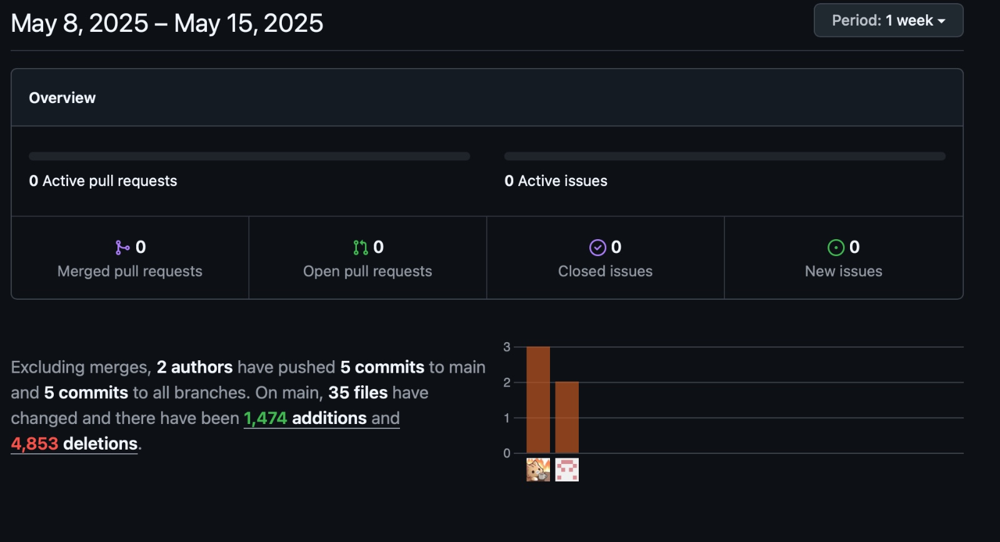

<div align="center">
  <h1> Informe del Trabajo Final </h1>
  <h3> Universidad Peruana de Ciencias Aplicadas </h3>


  <h5> Ingeniería de Software </h5>

  <h5> Desarrollo de Soluciones IOT - 15185 </h5>

  <h5> Docente: Marco Antonio Leon Baca </h5>

  <h5> Startup: LlanterosTech </h5>

  <h5> Producto: Plantita </h5>
</div>

<div align="center">
    <h3>Team Members:</h3>
</div>

<div>
     <table align="center">
        <tr>
            <th style="text-align:center;">Member</th>
            <th style="text-align:center;">Code</th>
        </tr>
        <tr>
            <td>Boronda Heidinger, Astrid Jimena</td>
            <td>U202215823</td>
        </tr>
        <tr>
            <td>Cabanillas Gora, Andrea Milagros</td>
            <td>U202211711</td>
        </tr>
        <tr>
            <td>Mallma Espiritu, Franky Oswald</td>
            <td>U20211c250</td>
        </tr>
        <tr>
            <td>Montes Figueroa. Juan Eduardo</td>
            <td>U202210775</td>
        </tr>
        <tr>
            <td>Palomino Santa Cruz, Erick Joaquin</td>
            <td>U202214843</td>
        </tr>
    </table>
</div>

<div align="center">
<h5> Ciclo 2025-01 </h5>
</div>


## Registro de versiones del informe

|**Versión**|**Fecha**|**Autor**|**Descripción de modificación**|
| :-: | :-: | :-: | :-: |
|     |     |     |     |

## Project Report Collaboration Insights


## Contenido

1. [**Capítulo I: Introducción.**](#1.) <br>
   1.1. [Startup Profile.](#1.1.) <br>
   1.1.1. [Descripción del startup.](#1.1.1.)<br>
   1.1.2.[Perfiles de los integrantes del equipo.](#1.1.2.)<br>
   1.2. [Solution Profile.](#1.2.)<br>
   1.2.1. [Antecedentes y Problemática.](#1.2.1.)<br>
   1.2.2. [Lean UX Process.](#1.2.2.)<br>
   1.2.2.1. [Lean UX Problem Statements.](#1.2.2.1.)<br>
   1.2.2.2. [Lean UX Assumptions.](#1.2.2.2.)<br>
   1.2.2.3. [Lean UX Hypothesis Statements.](#1.2.2.3.)<br>
   1.2.2.4. [Lean UX Canvas.](#1.2.2.4.)<br>
   1.3. [Segmentos objetivo.](#1.3.)<br>
2. [**Capítulo II: Requirements Elicitation & Analysis.**](#2.)<br>
   2.1. [Competidores.](#2.1.)<br>
   2.1.1. [Análisis competitivo.](#2.1.1.)<br>
   2.1.2. [Estrategias y tácticas frente a competidores.](#2.1.2.)<br>
   2.2. [Entrevistas.](#2.2.)<br>
   2.2.1. [Diseño de entrevistas.](#2.2.1.)<br>
   2.2.2. [Registro de entrevistas.](#2.2.2.)<br>
   2.2.3. [Análisis de entrevistas.](#2.2.3.)<br>
   2.3. [Needfinding.](#2.3.)<br>
   2.3.1. [User Personas.](#2.3.1.)<br>
   2.3.2. [User Task Matrix.](#2.3.2.)<br>
   2.3.3. [User Journey Mapping.](#2.3.3.)<br>
   2.3.4. [Empathy Mapping.](#2.3.4.)<br>
   2.3.5. [As-is Scenario Mapping.](#2.3.5.)<br>
3. [**Capítulo III: Requirements Specification.**](#3.)<br>
   3.1. [To-Be Scenario Mapping.](#3.1.)<br>
   3.2. [User Stories.](#3.2.)<br>
   3.3. [Impact Mapping.](#3.3.)<br>
   3.4. [Product Backlog.](#3.4.)<br>
4. [**Capítulo IV: Solution Software Design.**](#4.)<br>
   4.1. [Strategic-Level Domain-Driven Design.](#4.1.)<br>
   4.1.1. [EventStorming.](#4.1.1.)<br>
   4.1.1.1. [Candidate Context Discovery.](#4.1.1.1.)<br>
   4.1.1.2. [Domain Message Flows Modeling.](#4.1.1.2.)<br>
   4.1.1.3. [Bounded Context Canvases.](#4.1.1.3.)<br>
   4.1.2. [Context Mapping.](#4.1.2.)<br>
   4.1.3. [Software Architecture.](#4.1.3.)<br>
   4.1.3.1. [Software Architecture System Landscape Diagram.](#4.1.3.1.)<br>
   4.1.3.2. [Software Architecture Context Level Diagrams.](#4.1.3.2.)<br>
   4.1.3.3. [Software Architecture Container Level Diagrams.](#4.1.3.3.)<br>
   4.1.3.4. [Software Architecture Deployment Diagrams.](#4.1.3.4.)<br>
   4.2. [Tactical-Level Domain-Driven Design](#4.2.)<br>
   4.2.1. [Bounded Context: "PlantCare".](#4.2.1.)<br>
   4.2.1.1. [Domain Layer.](#4.2.1.1.)<br>
   4.2.1.2. [Interface Layer.](#4.2.1.2.)<br>
   4.2.1.3. [Application Layer.](#4.2.1.3.)<br>
   4.2.1.4. [Infrastructure Layer.](#4.2.1.4.)<br>
   4.2.1.5. [Bounded Context Software Architecture Component Level Diagrams.](#4.2.1.5.)<br>
   4.2.1.6. [Bounded Context Software Architecture Code Level Diagrams.](#4.2.1.6.)<br>
   4.2.1.6.1. [Bounded Context Domain Layer Class Diagrams.](#4.2.1.6.1.)<br>
   4.2.1.6.2. [Bounded Context Database Design Diagram.](#4.2.1.6.2.)<br>
5. [**Capítulo V: Solution UI/UX Design**](#5.)<br>
   5.1. [Style Guidelines.](#5.1.)<br>
   5.1.1. [General Style Guidelines.](#5.1.1.)<br>
   5.1.2. [Web Style Guidelines.](#5.1.2.)<br>
   5.2. [Information Architecture.](#5.2.)<br>
   5.2.1. [Organization Systems.](#5.2.1.)<br>
   5.2.2. [Labeling Systems.](#5.2.2.)<br>
   5.2.3. [SEO Tags and Meta Tags](#5.2.3.)<br>
   5.2.4. [Searching Systems.](#5.2.4.)<br>
   5.2.5. [Navigation Systems.](#5.2.5.)<br>
   5.3. [Landing Page UI Design.](#5.3.)<br>
   5.3.1. [Landing Page Wireframe.](#5.3.1.)<br>
   5.3.2. [Landing Page Mock-up.](#5.3.2.)<br> 
   5.4. [Applications UX/UI Design.](#5.4.)<br>
   5.4.1. [Applications Wireframes.](#5.4.1.)<br>
   5.4.2. [Applications Wireflow Diagrams.](#5.4.2.)<br>
   5.4.3. [Applications Mock-ups.](#5.4.3.)<br>
   5.4.4. [Applications User Flow Diagrams.](#5.4.4.)<br>
   5.5. [Applications Prototyping.](#5.5.)<br>
7. [**Capítulo VI: Product Implementation, Validation & Deployment**](#6.)<br>
   6.1. [Software Configuration Management.](#6.1.)<br>
   6.1.1. [Software Development Environment Configuration.](#6.1.1.)<br>
   6.1.2. [Source Code Management.](#6.1.2.)<br>
   6.1.3. [Source Code Style Guide & Conventions.](#6.1.3.)<br>
   6.1.4. [Software Deployment Configuration.](#6.1.4.)<br>
   6.2. [Landing Page, Services & Applications Implementation.](#6.2.)<br>
   6.2.1. [Sprint 1.](#6.2.1.)<br>
   6.2.1.1. [Sprint Planning 1.](#6.2.1.1.)<br>
   6.2.1.2. [Sprint Backlog 1.](#6.2.1.2.)<br>
   6.2.1.3. [Development Evidence for Sprint Review.](#6.2.1.3.)<br>
   6.2.1.4. [Testing Suite Evidence for Sprint Review.](#6.2.1.4.)<br>
   6.2.1.5. [Execution Evidence for Sprint Review.](#6.2.1.5.)<br>
   6.2.1.6. [Services Documentation Evidence for Sprint Review.](#6.2.1.6.)<br>
   6.2.1.7. [Software Deployment Evidence for Sprint Review.](#6.2.1.7.)<br>
   6.2.1.8. [Team Collaboration Insights during Sprint.](#6.2.1.8.)<br>
   6.2.2. [Sprint 2.](#6.2.2)<br>
   6.2.2.1. [Sprint Planning 2.](#6.2.2.1.)<br>
   6.2.2.2. [Sprint Backlog 2.](#6.2.2.2.)<br>
   6.2.2.3. [Development Evidence for Sprint Review.](#6.2.2.3.)<br>
   6.2.2.4. [Testing Suite Evidence for Sprint Review.](#6.2.2.4.)<br>
   6.2.2.5. [Execution Evidence for Sprint Review.](#6.2.2.5.)<br>
   6.2.2.6. [Services Documentation Evidence for Sprint Review.](#6.2.2.6.)<br>
   6.2.2.7. [Software Deployment Evidence for Sprint Review.](#6.2.2.7.)<br>
   6.2.2.8. [Team Collaboration Insights during Sprint.](#6.2.2.8.)<br>
   6.2.3. [Sprint 3.](#6.2.3)<br>
   6.2.3.1. [Sprint Planning 3.](#6.2.3.1.)<br>
   6.2.3.2. [Sprint Backlog 3.](#6.2.3.2.)<br>
   6.2.3.3. [Development Evidence for Sprint Review.](#6.2.3.3.)<br>
   6.2.3.4. [Testing Suite Evidence for Sprint Review.](#6.2.3.4.)<br>
   6.2.3.5. [Execution Evidence for Sprint Review.](#6.2.3.5.)<br>
   6.2.3.6. [Services Documentation Evidence for Sprint Review.](#6.2.3.6.)<br>
   6.2.3.7. [Software Deployment Evidence for Sprint Review.](#6.2.3.7.)<br>
   6.2.3.8. [Team Collaboration Insights during Sprint.](#6.2.3.8.)<br>
   6.2.4. [Sprint 4.](#6.2.4)<br>
   6.2.4.1. [Sprint Planning 4.](#6.2.4.1.)<br>
   6.2.4.2. [Sprint Backlog 4.](#6.2.4.2.)<br>
   6.2.4.3. [Development Evidence for Sprint Review.](#6.2.4.3.)<br>
   6.2.4.4. [Testing Suite Evidence for Sprint Review.](#6.2.4.4.)<br>
   6.2.4.5. [Execution Evidence for Sprint Review.](#6.2.4.5.)<br>
   6.2.4.6. [Services Documentation Evidence for Sprint Review.](#6.2.4.6.)<br>
   6.2.4.7. [Software Deployment Evidence for Sprint Review.](#6.2.4.7.)<br>
   6.2.4.8. [Team Collaboration Insights during Sprint.](#6.2.4.8.)<br>
   6.3. [Validation Interviews.](#6.3.)<br>
   6.3.1. [Diseño de Entrevistas.](#6.3.1)<br>
   6.3.2. [Registro de Entrevistas.](#6.3.2)<br>
   6.3.3. [Evaluaciones según heurísticas.](#6.3.3)<br>
   6.4. [Video About-the-Product.](#6.4.)<br>
8. [**Conclusiones.**](#7.)<br>
9. [**Bibliografía.**](#8.)<br>
10. [**Anexos.**](#9.)<br>


## Student Outcome

| **Criterio específico** | **Acciones realizadas** | **Conclusiones** |
|:--:|:--|:--:|
| Trabaja en equipo para proporcionar liderazgo en forma conjunta | <p><strong>Astrid Boronda:</strong></p><p><strong>TB1</strong><br>En el TB1, participé activamente en el análisis profundo de la problemática central del proyecto. Esto implicó, en colaboración con el equipo, la definición clara y concisa del problema principal, la identificación exhaustiva de los diversos segmentos de clientes a los que se dirige la solución, y la formulación de hipótesis y estrategias iniciales para abordar la problemática. Como resultado de este proceso, contribuí a la definición precisa de los segmentos objetivo específicos del proyecto, asegurando que el desarrollo se enfoque en las necesidades reales de los usuarios.</p><p><strong>Franky Mallma:</strong></p><p>Durante el TB1, participé activamente en la organización del equipo para la definición del proyecto 'Plantita'. Apoyé en la estructuración de las tareas técnicas necesarias para el diseño del sistema basado en sensores IoT, asegurando que todos los integrantes comprendieran la importancia de los datos ambientales en nuestra solución.</p><p><strong>Juan Montes:</strong></p><p>Durante el TB1, participé activamente en la organización y análisis de las necesidades del segmento inicial para el proyecto. Colaboré en la definición de los pain points principales y en el planteamiento de las hipótesis de solución, asegurándome de integrar las ideas de todos los miembros para llegar a un enfoque sólido.</p><p><strong>Andrea Cabanillas:</strong></p><p><strong>TB1</strong><br>En el TB1 participé en el Strategic-Level Domain-Driven Design, lideré la identificación de flujos de mensajes de dominio, la definición de Bounded Contexts y la elaboración de Context Map, asegurando que cada modelo reflejara una visión, promoviendo la colaboración entre los miembros del equipo y lograran comprender cómo funciona cada diagrama.</p><p><strong>Erick Palomino:</strong></p><p>Durante el desarrollo del proyecto, lideré la estructuración del escenario futuro del usuario (To-Be Scenario Map), alineando funcionalidades con etapas clave del journey. Además, organicé y prioricé las épicas y user stories del backlog, vinculándolas con objetivos del negocio. También diseñé visualmente el customer journey estratégico, asegurando la trazabilidad entre entregables, impactos y funcionalidades. Estos aportes facilitaron el entendimiento compartido del producto dentro del equipo, promoviendo la colaboración y visión sistémica del proyecto.</p> | **TB1:** Fue fundamental la capacidad del equipo para colaborar de forma eficaz para ejercer un liderazgo compartido. Cada miembro, al aportar sus habilidades y conocimientos únicos, contribuye al avance del proyecto. La toma de decisiones conjuntas, la comunicación abierta y el apoyo mutuo son esenciales para superar los desafíos y alcanzar los objetivos establecidos. |
| Crea un entorno colaborativo e inclusivo, establece metas, planifica tareas y cumple objetivos. | <p><strong>Astrid Boronda:</strong></p><p><strong>TB1</strong><br>Para el TB1 de este proyecto, me propuse comprender en profundidad la problemática central del cuidado de plantas y los diferentes segmentos de usuarios a los que nos dirigimos. Realicé una investigación exhaustiva para identificar las necesidades y desafíos de los aficionados a la jardinería. Como resultado de este proceso, pude conocer mejor al segmento objetivo y sus necesidades, lo que me permitió colaborar en la definición inicial de la aplicación 'Plantita' y sus funcionalidades, tales como el monitoreo de condiciones ambientales y la identificación de problemas en las plantas.</p><p><strong>Franky Mallma:</strong></p><p>Trabajé en promover un entorno de respeto y escucha activa en las reuniones de equipo. Propuse y ayudé a construir el capítulo 4 utilizando el contenido de capítulos anteriores definidos. Coordiné la planificación de pequeñas entregas semanales para alcanzar las metas establecidas, revisando los avances y adaptando las tareas cuando fue necesario.</p><p><strong>Juan Montes:</strong></p><p>Promoví la participación activa de todos los integrantes en las reuniones de trabajo, fomentando un ambiente de respeto y apertura para compartir ideas. Propuse un esquema de tareas semanales para asegurar el avance del proyecto, y ayudé a establecer las metas para la definición de las funcionalidades prioritarias de la aplicación.</p><p><strong>Andrea Cabanillas:</strong></p><p>Trabajé en la identificación de los Domain Message Flows y la elaboración de los Bounded Context Canvases, estableciendo metas claras para cada etapa del modelado. Además, organicé la planificación de tareas para construir los Context Maps y asegurar que se cumpliera con los objetivos de diseñar una arquitectura de software coherente y alineada al proyecto 'Plantita'.</p><p><strong>Erick Palomino:</strong></p><p>Contribuí activamente a la planificación estratégica del proyecto 'Plantita' mediante la organización del backlog priorizado y la definición visual de funcionalidades clave. Propuse un enfoque centrado en el valor para el usuario, estructurando los entregables en función de los objetivos del negocio. Además, presenté los mapas y artefactos de forma clara para facilitar la comprensión y toma de decisiones en equipo, promoviendo la integración entre diseño, desarrollo y objetivos de producto.</p> | Se demostró una fuerte capacidad para crear un entorno de trabajo colaborativo e inclusivo, tal como se evidencia en la organización de sus roles, la definición de objetivos claros y la planificación detallada de tareas. Esta estructura ha permitido cumplir con los objetivos propuestos en el desarrollo del proyecto. La colaboración, el respeto a las ideas de cada miembro y la eficiencia en la ejecución de tareas han sido pilares fundamentales para alcanzar el éxito. Este enfoque de trabajo en equipo no solo ha facilitado el desarrollo técnico del proyecto, sino que también ha fomentado un ambiente positivo y productivo, esencial para la innovación y la resolución de problemas.|


<div id='1.'><h1>1. Capítulo I: Introducción.</h1></div>

<div id='1.1.'><h2> 1.1 Startup Profile.</h2></div>

<div id='1.1.1.'><h3> 1.1.1. Descripción de la Startup.</h3></div>
<div align="justify">
LlanterosTech es una startup conformada por estudiantes de la carrera de Ingeniería de Software de la Universidad Peruana de Ciencias Aplicadas. Juntos, somos un equipo comprometido con las necesidades y problemáticas que enfrentan los entusiastas del cuidado de plantas, quienes a menudo se ven afectados por la falta de información clara y herramientas eficientes para la gestión del bienestar de sus plantas. Es así como identificamos una oportunidad para proponer una solución innovadora que mejore la eficiencia y calidad en el cuidado de las plantas.
</div>

<div id='1.1.2.'><h3> 1.1.2. Perfiles de integrantes del equipo. </h3></div>

|**Integrante**|**Perfil**|
| :-: | :-: |
| <p>**Astrid Jimena Boronda Heidinger - U202215823**<p>  | Mi nombre es Astrid Jimena Boronda Heidinger, soy estudiante de la carrera de Ingeniería de Software, tengo 19 años y me considero una persona dispuesta a ayudar en los trabajos de grupos y atenta a los detalles de los trabajos. Tengo conocimiento en C++, Java y Python. Además, tengo conocimientos en HTML, CSS, JavaScript y frameworks como Angular y Vue. Me adapto muy bien a los trabajos en equipo. |
| <p>**Andrea Milagros Cabanillas Gora-U202211711**<p>  | Me   llamo   Andrea   Cabanillas,   tengo   18   años,   estudio ingeniería   de   software,   soy   una persona sociable y siempre estoy dispuesta a escuchar nuevas ideas , además me gusta trabajar en grupo ya que siempre aprendo de  otros.  Soy buena en  lo  que es el  ámbito de diseño de  videojuegos  y siempre  estoy  al  tanto  para dar nuevas ideas para la app de algún proyecto. |
| <p>**Franky Oswald Mallma Espiritu- U20211c250**<p>  |Soy estudiante de ingeniería de software, actualmente en el octavo ciclo , tengo principales conocimientos en backend como lo son Golang y Nest.js y de mobile con Flutter , a nivel equipo soy una persona comprometida y buscador de soluciones emergentes en los proyectos. |
| <p>**Juan Eduardo Montes Figueroa- U202210775**<p>  |Mi nombre es Juan Montes, tengo 20 años, tengo conocimientos en C++, IntelliJ IDEA Ultimate, Rider, Webstorm, Android Studio, Flutter y también en diseño de imágenes tanto en aplicaciones complicadas como Photoshop hasta páginas webs que te dan funciones similares. Puedo aportar en el equipo con ideas, confianza y atención a los detalles. |
| <p>**Erick Joaquin Palomino Santa Cruz- U2022148434**<p>  |Mi nombre es Erick Palomino, tengo 19 años, tengo conocimientos en C# Android Studio, Flutter y también en diseño de imágenes y páginas web. Puedo aportar en el equipo con ideas y confianza. |

<div id='1.2.'><h2> 1.2. Solution Profile</h2></div>
<div align="justify">
En esta sección se describe el problema que el proyecto tiene como objetivo resolver. Se detalla el enunciado del problema, descripción de los puntos importantes a resolver y considerar de la solución, objetivos, restricción y aplicación del Lean UX Process describiendo el cómo se resolverá el problema mediante el uso de modelo de negocio.
</div>

<div id='1.2.1.'><h3> 1.2.1. Antecedentes y Problemática</h3></div>

<h5><b>Antecedentes:</b></h5>
<div align="justify">
El mundo de la jardinería y el cuidado de plantas presenta actualmente desafíos que requieren soluciones creativas. Uno de los principales retos es la creciente popularidad de tener plantas en casa, impulsada por el deseo de conectar con la naturaleza y mejorar nuestros espacios. Esta tendencia exige que aprendamos más sobre cómo cultivar y mantener nuestras plantas saludables, lo que a su vez nos enfrenta a desafíos como entender sus necesidades específicas y adaptarnos a diferentes entornos. Además, quienes cuidan plantas a menudo se encuentran con la dificultad de monitorear y optimizar el crecimiento de sus plantas, así como la necesidad de asegurar que estén libres de plagas y enfermedades. Estos factores combinados resaltan la importancia de desarrollar conocimientos y métodos que nos ayuden a cuidar nuestras plantas de manera eficiente y exitosa.
</div>

<h5><b>Problemática (5Ws y 2Hs):</b></h5>

##### WHAT/QUÉ 
  
En este proyecto, el problema central que abordamos es la dificultad que enfrentan las personas al cuidar plantas, especialmente aquellas que recién comienzan. Esta dificultad se manifiesta en la falta de información clara, el desconocimiento de las necesidades específicas de cada planta y la gestión ineficiente de los recursos necesarios para su cuidado, lo que puede llevar a la frustración y al abandono de esta actividad. 

##### WHERE/DÓNDE 
  
Este problema se da en los hogares de las personas aficionadas al jardín. Cualquier lugar donde las personas intentan cultivar y cuidar plantas, especialmente principiantes, pueden enfrentar estas dificultades. 

##### WHY/POR QUÉ 

Este problema surge porque cada vez más personas quieren tener plantas en casa, pero no siempre saben cómo cuidarlas correctamente. Esto puede deberse a la falta de información clara y accesible, o a que las necesidades de cada planta son diferentes y pueden ser difíciles de entender al principio. Además, a veces no contamos con el tiempo o los recursos necesarios para darles a nuestras plantas la atención que requieren 

##### WHEN/CUANDO

Este problema se manifiesta desde el momento en que decidimos traer una planta a nuestro hogar. Al inicio, no estamos seguros de cómo cuidarla y pueden surgir dificultades. También ocurre cuando las plantas experimentan cambios en su entorno, como trasplantes o cambios de estación, y no sabemos cómo adaptarnos a sus nuevas necesidades.

##### WHO/QUIÉN

Personas interesadas en el mundo de las plantas con poco conocimiento acerca del cuidado adecuado.

##### HOW/CÓMO

Las personas podrán acceder a nuestra aplicación a través de sus teléfonos móviles o computadoras. Encontrarán información clara y fácil de entender sobre el cuidado de plantas, consejos, recordatorios de riego y fertilización, e incluso la posibilidad de identificar plantas y problemas comunes.

##### HOW MUCH/CUÁNTO

“El nivel de dificultad para cuidar una planta depende de factores como humedad, iluminación, riego y control de plagas. Las exigencias pueden variar según las condiciones del hogar y las tendencias del cuidador.” (Infobae, 2024)

El problema de no saber cómo cuidar correctamente las plantas se manifiesta en la cantidad de plantas que mueren o se enferman en hogares y espacios de cultivo. Esto puede significar una pérdida económica, pero también una frustración emocional para quienes intentan mantenerlas con vida. A menudo, las personas gastan dinero en plantas y suministros sin obtener los resultados deseados, lo que lleva a un ciclo de compra y pérdida.

<div id='1.2.2.'><h3> 1.2.2. Lean UX Process.</h3></div>
<div id='1.2.2.1.'><h4> 1.2.2.1. Lean UX Problem Statements.</h4></div>

<h5><strong>Domain:</strong></h5>

Plantita se sitúa en la intersección del cuidado de plantas, enfocándose específicamente en el nicho de los aficionados a la jardinería que buscan soluciones prácticas. Este segmento combina el deseo de tener plantas saludables con la necesidad de información clara y herramientas de monitoreo.

<h5><strong>Customer Segments:</strong></h5>

**Aficionados a la jardinería:** Cuidadores novatos que luchan por optimizar el cuidado de sus plantas debido a la falta de herramientas y conocimientos.

<h5><strong>Paint Points:</strong></h5>

**Aficionados a la jardinería:** <br>
* Dificultad para identificar las necesidades de las plantas al carecer de la información necesaria para mantener sus plantas saludables y prósperas.
* Carencia de herramientas adecuadas, es decir, no disponen de los instrumentos o recursos necesarios para monitorear y gestionar eficazmente el cuidado de sus plantas.

<h5><strong>Gap:</strong></h5>

<div align="justify">
Existe una brecha entre el deseo de los aficionados a la jardinería de tener plantas saludables y la disponibilidad de herramientas y conocimientos prácticos para lograrlo. Las soluciones existentes a menudo son demasiado genéricas o carecen de la personalización y el seguimiento detallado que necesitan los cuidadores novatos.
</div>

<h5><strong>Visión/Estrategia:</strong></h5>

* Crear una aplicación con funcionalidades enfocadas en proporcionar el conocimiento y las herramientas necesarias para cultivar plantas prósperas y saludables.
* Proporcionar una solución integral que combine tecnología IoT, información personalizada y una comunidad de apoyo.
* Transformar la jardinería de una actividad intimidante a una experiencia gratificante y accesible para todos.

<h5><strong>Initial Segment:</strong></h5>

<div align="justify">
Nuestro segmento inicial se compone de aficionados a la jardinería que son relativamente nuevos en el cuidado de plantas y que han experimentado dificultades para mantenerlas con vida. Este grupo incluye personas que viven en apartamentos o espacios pequeños, aquellos que tienen poco tiempo o experiencia previa en jardinería, y quienes desean utilizar la tecnología para mejorar su experiencia de cuidado de plantas.
</div>

<div id='1.2.2.2.'><h4> 1.2.2.2. Lean UX Assumptions.</h4></div>

**Features**
- Herramientas de monitorización del crecimiento de plantas: Sensores para recopilar datos sobre condiciones ambientales, humedad del suelo, y salud de los cultivos.
- Plataforma integrada de gestión: Suite de herramientas que abarca la planificación de cultivos, gestión de la mano de obra, programación de riego, y funcionalidades de análisis de datos para identificar áreas de mejora y optimizar la eficiencia operativa en todas las etapas de crecimiento de las plantas.

**Business Outcomes**

* **Mejora de la eficiencia operativa:** Reducción de los tiempos de inactividad y los costos asociados con la gestión de cuidado y la resolución de problemas mediante la automatización y la aplicación de datos en tiempo real para la toma de decisiones.

* **Aumento de la rentabilidad:** Reducción de las pérdidas debido a enfermedades que no son detectadas, mejora de la productividad y la calidad de las plantas, lo que puede traducirse en mayores márgenes de beneficio para los cuidadores.

* **Reducción de riesgos y cumplimiento normativo:** Mayor capacidad para responder rápidamente a problemas emergentes, como brotes de enfermedades o eventos climáticos extremos, minimizando el impacto en la producción y la distribución.

**Users**

Los usuarios son personas interesadas en el cuidado de plantas.

**User Outcomes & Benefits**

* **Aficionados al jardín:** Personas que empezaron a cultivar plantas y están aprendiendo a cuidarlos.

**User assumptions**

* **¿Quién es el usuario?**
El usuario es típicamente un aficionado a la jardinería busca mejorar la eficiencia y calidad de sus plantas.

* **¿Dónde encaja nuestro producto en sus trabajos o vidas?**
Nuestra aplicación encaja perfectamente en su día a día al facilitar el cuidado de sus plantas, desde entender sus necesidades básicas hasta identificar problemas y recibir consejos personalizados, optimizando así su experiencia como amantes de las plantas.

* **¿Qué problema resuelve nuestro producto?*
Nuestro producto resuelve problemas como dificultad para monitorear el crecimiento de cultivos, mejorando la eficiencia operativa y mejorar de la calidad de la plantas

* **¿Cuándo y cómo es usado nuestro producto?**
Nuestro producto es utilizado a lo largo de todo el ciclo de vida de las plantas, desde su plantación y crecimiento, a través de una plataforma digital accesible desde dispositivos móviles o computadoras.

* **¿Qué características son importantes?**
Las características de seguimiento de la cadena de suministro en tiempo real, gestión automatizada de las necesidades de la plantas, herramientas de monitorización de cultivos y análisis de datos para la toma de decisiones informadas.

* **¿Cómo debería verse y comportarse nuestro producto?**
Nuestro producto debe ser una interfaz intuitiva y fácil de usar, con visualizaciones claras de datos y esto de las plantas. Debería ser confiable, escalable y adaptable a las necesidades específicas de cada usuario.

**Business Assumptions**
1. Creemos que nuestros clientes necesitan una solución que les permita gestionar eficientemente el cuidado de las plantas, mejorando la eficiencia y la calidad.
2. Estas necesidades pueden ser satisfechas por una plataforma digital que integre sensores. Estos sensores proporcionarían información sobre el clima, la humedad, el monitoreo de cultivos y el análisis de datos. Esto proporcionaría herramientas poderosas para la toma de decisiones informadas.
3. El valor #1 que mi cliente quiere de mi servicio es la mejora en la eficiencia y la calidad de sus plantas, lo que les permite maximizar los rendimientos.
4. El cliente obtiene beneficios al tener un mejor manejo de sus plantas ya que se detectara el estado del clima y plagas y el propio sistema sabrán cómo tratarlas.
5. Voy a adquirir la mayoría de mis clientes a través de campañas de marketing y redes sociales.
6. Haré dinero a través de modelos de suscripción mensual por el acceso a mejor información de nuestra plataforma.
7. Mi competencia principal en el mercado son otras soluciones de cuidado de plantas, tanto tradicionales como digitales.
8. Los venceremos debido a la simplicidad y facilidad de uso de nuestra plataforma, así como a su capacidad para ofrecer una solución integral y altamente personalizable que se adapte a las necesidades específicas de cada cliente.
9. El mayor riesgo es que los clientes no adopten nuestra solución debido a la resistencia al cambio o a la falta de conocimiento tecnológico.
10. Resolveremos esto a través de demostraciones y pruebas gratuitas de nuestra plataforma, y proporcionando un sólido soporte al cliente para garantizar una implementación exitosa y una experiencia positiva del usuario.

<div id='1.2.2.3.'><h4> 1.2.2.3. Lean UX Hypothesis Statements.</h4></div>

**Hipótesis 1:**
**Creemos que** al implementar un sistema que muestre las condiciones en las que se encuentran las plantas optimizará su cuidado y permitirá tomar medidas preventivas. **Sabremos que** hemos tenido éxito cuando se detecten problemas significativos que afecten a la planta y se pueda brindar un mejor cuidado.

**Hipótesis 2:**
**Creemos que** el uso de sensores en el sistema brindará información sobre las condiciones de las plantas. **Sabremos que** hemos tenido éxito cuando observemos un aumento significativo en la salud y vitalidad general de las plantas, obteniendo un mayor crecimiento.

<div id='1.2.2.4.'><h4> 1.2.2.4. Lean UX Canvas</h4></div>

<table style="width: 100%; border-collapse: collapse; font-family: Arial, sans-serif;">
  <tbody>
    <tr>
      <td colspan="2" rowspan="2" style="font-weight: bold; text-align: justify;">Lean UX Canvas</td>
      <td style="text-align: right; font-weight: bold;">Fecha: 19/04/2025</td>
    </tr>
    <tr>
      <td style="text-align: right; font-weight: bold;">Iteración 1</td>
    </tr>
    <tr>
      <td style="text-align: justify;"><strong>1. Problema de negocios:</strong><br>Los usuarios enfrentan dificultades para mantener sus plantas saludables y prósperas debido a la falta de información y herramientas adecuadas para su cuidado.</td>
      <td rowspan="2" style="text-align: justify;"><strong>5. Ideas de solución:</strong><br>Desarrollar una aplicación que integre sensores que informe sobre el estado de la planta y proporcione recomendaciones o acciones personalizadas para el cuidado óptimo de la planta.</td>
      <td rowspan="2" style="text-align: justify;"><strong>2. Resultados comerciales:</strong><br>- Mejora en la calidad de crecimiento de las plantas.<br>- Reducción de pérdidas.<br>- Aumento de la satisfacción del cliente.</td>
    </tr>
    <tr>
      <td style="text-align: justify;"><strong>3. Usuarios y Clientes:</strong><br>Personas interesadas en el cuidado de plantas.</td>
    </tr>
    <tr>
      <td rowspan="2" style="text-align: justify;"><strong>6. Hipótesis</strong><br>- Creemos que al implementar un sistema que muestre las condiciones en las que se encuentran las plantas optimizará su cuidado y permitirá tomar medidas preventivas. Sabremos que hemos tenido éxito cuando se detecten problemas significativos que afecten a la planta y se pueda brindar un mejor cuidado.<br><br>- Creemos que el uso de sensores en el sistema brindará información sobre las condiciones de las plantas. Sabremos que hemos tenido éxito cuando observemos un aumento significativo en la salud y vitalidad general de las plantas, obteniendo un mayor crecimiento.</td>
      <td rowspan="2" style="text-align: justify;"><strong>7. ¿Qué es lo más importante que debemos aprender primero?</strong><br>Lo más importante que debemos aprender primero es comprender a fondo las necesidades y desafíos específicos de nuestros usuarios y clientes. Esto incluye entender sus procesos operativos, identificar los problemas más urgentes que enfrentan en el cuidado de plantas y conocer sus expectativas y prioridades en cuanto a soluciones tecnológicas.</td>
      <td style="text-align: justify;"><strong>4. Beneficios del usuario:</strong><br>- Optimización del cuidado de las plantas a través del monitoreo y recomendaciones personalizadas.<br>- Disminución de la pérdida de plantas debido a un cuidado inadecuado y a la falta de información.</td>
    </tr>
    <tr>
      <td style="text-align: justify;"><strong>8. ¿Cuál es la menor cantidad de trabajo que necesitamos para resolver las dudas y para hacer lo siguiente más importante?</strong><br>La menor cantidad de trabajo que necesitamos para resolver las dudas y avanzar en lo siguiente es realizar una investigación inicial centrada en los usuarios y clientes potenciales. Esto puede incluir entrevistas, encuestas u otros métodos de investigación para comprender mejor sus necesidades, desafíos y expectativas.<br><br>Una vez que tengamos una comprensión sólida de las necesidades de los usuarios, podemos priorizar el desarrollo de características y funcionalidades de nuestra solución que aborden directamente esos problemas identificados. Esto nos permitirá enfocarnos en lo más importante para nuestros usuarios y garantizar que nuestra solución sea relevante y útil desde el principio.</td>
    </tr>
  </tbody>
</table>

<div id='1.3.'><h2> 1.3. Segmentos objetivo.</h2></div>

<div align="justify">
  
* **Aficionados a la jardinería que buscan mejorar sus habilidades y el éxito de sus plantas** Los usuarios utilizarán "Plantita" para acceder a información personalizada, herramientas de monitoreo y una comunidad de apoyo, con el fin de mejorar la salud y el crecimiento de sus plantas.

* **Características Demográficas:** Personas entre 20 y 50 años, que viven en áreas urbanas y suburbanas, con un interés en la jardinería y el cuidado de plantas pero con conocimientos limitados.  Posiblemente con un nivel educativo medio o superior y con acceso a dispositivos móviles y tecnología.

* **Características Geográficas:** Inicialmente enfocado en áreas urbanas y suburbanas en Perú, con potencial de expansión a otras regiones y países con un interés similar en la jardinería doméstica y el cuidado de plantas.
</div>

<div id='2.'><h1><b>2. CAPÍTULO II: Needfinding</b></h1>

<div id='2.1.'><h2> 2.1. Competidores</h2>

<div align="justify">
En el mercado al que buscamos ofrecer nuestra solución, identificamos diversos competidores que presentan propuestas similares orientadas a la gestión agrícola. A continuación, se detalla un resumen de sus soluciones de software:
  
* **Agrobit** : Es una plataforma enfocada en la gestión agrícola y ganadera, orientada a grandes empresas. Su objetivo es promover formas sustentables y rentables de producción de alimentos. Entre sus funcionalidades destacan el control de actividades, el seguimiento del desarrollo de cultivos, el monitoreo predictivo, la trazabilidad y el cálculo de la huella de carbono.
  
* **Efemis** : Esta herramienta digital para la gestión agrícola utiliza imágenes satelitales, pronósticos meteorológicos y sensores para optimizar las operaciones y reducir costos. Desarrollada por Hispatec, Efemis es su solución principal dentro de una serie de herramientas especializadas para diferentes áreas del sector agrícola.
  
* **Agri** : Es un software diseñado específicamente para el sector agrícola, que facilita la gestión de órdenes de aplicación, labores agrícolas, cosechas y sistemas de riego, entre otros. Para utilizar sus servicios, es necesario realizar una evaluación del terreno agrícola, la cual determina su clasificación por tamaño. En base a ello, se establece una tarifa mensual que varía entre 320 dólares para pequeñas empresas y 715 dólares para grandes explotaciones agrícolas.
</div>

<div id='2.1.1.'><h3> 2.1.1. Análisis Competitivo</h3>
**¿Por qué realizar este análisis?**
<p>Es fundamental realizar este análisis para comprender las áreas en las que se enfocan nuestros competidores directos. Esto nos permitirá identificar oportunidades para diferenciarnos y destacar en aspectos que capten el interés de nuestro público objetivo.</p>

|Nombre|Plantita|Agrobit|Efemis|Agri|

| Nombre | Plantita                         | Agrobit                                    | Afemis | Agri |
|--------|------------------------------|------------------------------------------------|--------|------|
| Overview   | Software de gestión agrícola centrado en la capacitación del usuario que puede adaptarse a sus necesidades | Software enfocado en la gestión de procesos agrícolas y ganaderos con ayuda de herramientas de alta gama | Software de hispatec que gestiona procesos agrícolas utilizando herramientas de alta gama | Agri es una solución de software latina que permite gestionar campos de cultivo de forma centralizada |
| Ventaja Competitiva   | Esta aplicación está entrada en el usuario y su adaptabilidad, brindándole a este una opción cómoda al alcance de sus manos | Uso de herramientas de alta gama como imágenes satelitales que son una alternativa que brinda una seguridad total | Este software modular, está diseñado para que el usuario quiera añadir más funcionalidades que se acoplen a sus necesidades | Empresa latinoamericana con la que los usuarios se sienten más cómodos |
| Mercado Objetivo   | Nos enfocaremos en los pequeños y grandes agricultores que no hayan implementado tecnología para aligerar su carga laboral | Se centra en el sector ganadero y agrícola que buscan implementar una solución tecnológica con herramientas de gama alta, como imágenes satelitales | Sector agrícola grande que busca una solución de software para agilizar procesos | Está centrado en pequeñas, medianas y grandes empresas agrícolas |
| Estrategias de Marketing   | Nos acercaremos a los empresarios agrícolas que no confían en la tecnología para que podamos demostrar la eficacia de esta | Se promociona mediante publicidad como google ads, correos,etc. | Utiliza publicidad y estrategias de marketing | Agri usa sus redes sociales como Instagram y Linkedin para poder difundir sus propuestas de valor |
| Productos y Servicios   | Ofrecemos una amplia variedad de recursos para el usuario como, control de inventario, predicciones del clima, sensores de humedad y temperatura, monitoreo de ventas, predicciones para las cosechas y un control de ventas | Cuenta con dos versiones, la ECO, una versión dedicada para una producción netamente sostenible, y la Enterprise, dedicada a conseguir el mayor beneficio económico para la empresa. Ambas opciones cuentan con planes de pago diferentes que varían, dando a las grandes empresas agrícolas más ventajas que a las más pequeñas | Efemis cuenta con un control de costos de operaciones, monitoreos de cumplimiento de normativas,gestión de actividades, tratamientos y riegos,entre otras | Agri cuenta con controles de faenas, compras y bodegaje, control de riego, entre otros. |
| Precios y Costos   | Planeamos cobrar una comisión por venta de productos, los usuarios podrán acceder a nuestros servicios sin mayor problema | Agrobit cuenta con planes mensuales que rondan los 250 hasta los 1100 dólares | Cuenta con planes principalmente desde los 300 hasta los 900 euros mensuales | Cuenta con 3 planes para los pequeños, medianos y grandes agricultores cuyos costos van desde los 320 hasta los 750 dólares |
| Fortalezas   | Contamos con un software ágil, que se verá sujetos a cambios rápidos para acomodarnos a las necesidades del usuario | Cuenta con una reputación y una clientela fiel | Es parte de una corporación grande que facilita acceso a herramientas de gama alta | Cuenta con clientes en todo latinoamérica sobre todo Chile y Perú |
| Debilidades   | Sujeta a pruebas | Está cerrada a sus clientes habituales y los clientes nuevos no parecen interesados en su producto  |No cuenta con una gran cantidad de clientes, las reseñas no son buenas y está siendo dejada de lado|No parece querer modernizarse más allá de su estado actual|
| Oportunidades   | Muchas de las gestiones agrícolas en nuestro país son deficientes y gran parte de las cosechas son desperdiciadas, por ello el Perú es un país ideal para implementar agroges  | Dadas sus herramientas presenta una estabilidad que les permitiría desarrollarse más  |Cuenta con acceso a herramientas de gama alta que permiten el recopilado de información detallada para beneficio del usuario|Cuenta con el apoyo de clientes de más de un país por ello pueden expandirse por todo latinoamérica|
| Amenazas   | La implementación de herramientas costosas por parte de la competencia | Dado que el proceso de cotización es lento, muchos clientes prefieren buscar otras opciones | Sus ventas se han visto reducidas |La creciente tecnología y el uso de la inteligencia artificial puede desplazar a muchas soluciones de software|

<div id='2.1.2.'><h3> 2.1.2. Estrategias y tácticas frente a competidores </h3>

<p>Nos dirigiremos al segmento del sector agrícola que aún no ha incorporado tecnología, ofreciendo una solución accesible y fácil de usar. El objetivo es que incluso quienes no tienen experiencia con herramientas tecnológicas puedan utilizarlas de forma eficaz para optimizar sus recursos.<br>
<br>
<b>Estrategia general:</b> Diferenciación<br>
<br>
<b>Objetivo principal:</b> Sobresalir frente a la competencia mediante un producto que responda a necesidades específicas de nuestros segmentos de mercado.<br>
<br>
<b>Estrategias clave:</b><br>
<ul>
  <li><strong>Enfoque en el usuario</strong>: Priorizar mejoras basadas en las necesidades y sugerencias de los clientes.</li>
  <li><strong>Gestión de usuarios</strong>: La aplicación contará con una red interconectada que permitirá al usuario administrador supervisar y gestionar a los trabajadores bajo su responsabilidad.</li>
</ul>
</p>
 
<div id='2.2.'><h2> 2.2. Entrevistas</h2>
<div id='2.2.1.'><h3> 2.2.1. Diseño de entrevistas</h3>
<p><strong>Segmento 1:</strong> Aficionados al jardín</p>
<p><strong>Pregunta general:</strong></p>
<ul>
  <li>¿Cuál es tu nombre, cuántos años tienes y a qué te dedicas?</li>
  <li>¿Cómo consideras que es tu personalidad (extrovertido, introvertido, racional, idealista, etc.)?</li>
</ul>

<p><strong>Preguntas:</strong></p>
<ul>
  <li>¿Qué te motivó a empezar a cuidar plantas?</li>
  <li>¿Cuáles son los mayores desafíos que enfrentas al cuidar tus plantas?</li>
  <li>¿Tienes algún problema recurrente con tus plantas? ¿Cómo saber cuándo regarlas o qué cantidad de luz necesitan?</li>
  <li>¿Actualmente usas alguna aplicación o herramienta para ayudarte a cuidar tus plantas? Si es asi, ¿Cuál es?</li>
  <li>¿Qué información te gustaría tener más clara o accesible sobre el cuidado de tus plantas?</li>
  <li>¿Te gustaría recibir notificaciones o recordatorios sobre el cuidado de tus plantas (por ejemplo, cuándo regarlas, cuándo podarlas)?</li>
  <li>Si pudieras tener una herramienta que te ayude a monitorear el estado de tus plantas, como la húmedad del suelo o la luz que reciben, ¿Te interesaría?</li>
  <li>¿Qué tan importante es para ti recibir consejos prácticos y fáciles de seguir sobre el cuidado de tus plantas?</li>
  <li>¿Qué funcionalidades te gustaría que tuviera una aplicación para facilitar el cuidado de tus plantas?</li>
  <li>¿Te sentirías cómodo utilizando sensores para monitorear las condiciones de tus plantas (por ejemplo, húmedad, temperatura, luz)?</li>
  <li>¿Qué tipo de apoyo o comunidad te gustaría encontrar dentro de una app para jardineros novatos?</li>
  <li>¿Qué tan importante es para ti que la aplicación sea fácil de usar y no requiera mucho tiempo para aprender?</li>
</ul>

<div id='2.2.2.'><h3> 2.2.2. Registro de entrevistas</h3>

### Segmento objetivo - Aficionados al jardín

### Entrevista 1:

Entrevistador: Astrid Boronda

Entrevistado: Norma Heidinger Casimiro

Datos del entrevistado:

- Edad: 55 años
- Sexo: Femenino

Link de la Entrevista: [https://drive.google.com/file/d/1QPmypxm86Kk_iFu7pJxvQDSTnDv1nRg9/view?usp=sharing](https://drive.google.com/file/d/1QPmypxm86Kk_iFu7pJxvQDSTnDv1nRg9/view?usp=sharing)

- Minuto de Inicio: 0:00 
- Minuto de Fin: 7:19


Resumen de la entrevista:

<div align="justify">
<p>Norma comenzó a cuidar plantas debido al estrés y la ansiedad, buscando un beneficio para su salud y estilo de vida, siguiendo recomendaciones sobre los efectos positivos de la jardinería. Sin embargo, se considera inexperta en el cultivo de flores y plantas frutales, lo que dificulta el proceso. Actualmente, riega y cuida las plantas basándose en su propio criterio, observando si están secas o enmontadas, y depende de consejos y opiniones de amigas y vecinas para el cuidado de sus plantas.
Ella expresa su deseo de contar con la guía de un profesional o alguien con experiencia que pueda enseñarle directamente en su jardín. Le gustaría recibir notificaciones y recordatorios sobre el cuidado de sus plantas, así como una herramienta que monitoree el estado de sus plantas, como la humedad del suelo y la luz recibida. También le interesaría que una aplicación le indique qué enfermedad tiene una planta, por qué no crece, y cómo tratar las plagas. Aunque inicialmente no entendió el concepto de sensores, se mostró abierta a la idea de usarlos para monitorear las plantas.
Para ella, es crucial que cualquier aplicación sea fácil de usar y no requiera mucho tiempo para aprender, especialmente para personas mayores de 50 años como ella. Le gustaría encontrar apoyo o una comunidad dentro de una aplicación para jardineros novatos, donde pueda aprender sobre por qué las flores tardan en florecer y los árboles frutales en dar frutos. Valora la simplicidad, la facilidad de uso y el apoyo personalizado. Está abierta a la tecnología, siempre y cuando sea accesible y le proporcione la información y el soporte que necesita para tener éxito en su jardín.</p>
</div>

### Entrevista 1:

Entrevistador: Juan Montes

Entrevistado: Jorge Rivas

Datos del entrevistado:

- Edad: 42 años
- Sexo: Masculino

Link de la Entrevista: [https://drive.google.com/file/d/1coUjDZoDrMYm9dg1AQ2Ctp4jvXZZdYMX/view?usp=sharing](https://drive.google.com/file/d/1coUjDZoDrMYm9dg1AQ2Ctp4jvXZZdYMX/view?usp=sharing)

- Minuto de Inicio: 0:00 
- Minuto de Fin: 5:35


Resumen de la entrevista:

<div align="justify">
<p>Jorge Rivas, agricultor de 42 años, se considera práctico y racional. comenzó a cuidar plantas por necesidad económica, pero desarrolló un cariño genuino al verlas crecer. Enfrenta desafíos como el cambio de clima, enfermedades de las plantas, y la dificultad para determinar la cantidad adecuada de agua y luz que puedan necesitar sus plantas, especialmente para las más delicadas. Ha probado aplicaciones para el cuidado de plantas, pero las encontró inadecuadas por estar en inglés o no ajustarse a sus necesidades. Necesita información clara sobre la cantidad de agua, tipo de tierra y cómo identificar enfermedades y plagas. Le gustaría una aplicación con notificaciones, monitoreo del estado de las plantas, consejos prácticos, calendario de tareas, avisos de riego, espacio para preguntas a otros agricultores y una comunidad para compartir experiencias. También esta abierto a la idea del uso de sensores solo si son fáciles y asequibles de usar.</p>
</div>

<div id='2.2.3.'><h3> 2.2.3. Análisis de entrevistas</h3>

**Segmento Objetivo:** Aficionados al jardín

**Características del segmento:**

* **Objetivas**

**1. Uso de tecnología**

- Norma enfatiza que no ha usaso alguna aplicación que la ayude con sus plantas, pero estaría dispuesta a probar alguna.
- Jorge señala que muchas aplicaciones actuales no están adaptadas para todo el público por la barrera del idioma y lo poco prácticos que son.
- Están dispuestos a usar sensores o aplicaciones que los ayuden al cuidado de plantas, pero con la condición de que sean accesibles, simples y funcionales.

**2. Necesidad de asistencia**

- Norma menciona que su inexperiencia con el cuidado de plantas ha afecta mucho al crecimiento de las mismas.
- Jorge enfrentan dificultades para cuidar adecuadamente sus plantas, especialmente en lo relacionado con el riego, enfermedades y condiciones del suelo o luz.

**3. Interés en aprender**

- Jorge menciona la utilidad de una sección para hacer preguntas y compartir experiencias.
- Norma valoran el aprendizaje continuo, desea el acompañamiento de un experto (como lo es su circulo cercano de amigos y vecinos) o una comunidad.
- Ambos desean una comunidad de usuarios o red de apoyo dentro de una aplicación para resolver dudas y aprender de otros.

* **Subjetivas**

**1. Experiencias**

- Norma se dedica al cuidado de plantas como una forma de aliviar el estrés y mejorar su bienestar personal.
- Jorge, aunque empezó por necesidad económica, ha desarrollado afecto al verla a sus plantas.
- Para los entrevistados, el cuidado vegetal representa algo más que una tarea práctica: es una fuente de satisfacción personal.

**2. Consideraciones**

- Norma ha buscado consejos de amigos, vecinos y cercanos, probando sus comendaciones y esperando que puedan ayudar al crecimiento de sus plantas.
- Jorge buscar ayuda externa para sentirse algo seguro en la toma de decisiones.
- No se consideran expertos y expresan dudas o limitaciones en su conocimiento, especialmente en aspectos como enfermedades, plagas o necesidades específicas de cada planta.

**3. Motivaciones**

- Norma pide una app sencilla que no requiera mucho tiempo de aprendizaje.
- Jorge quiere información clara y sin complicaciones.
- Los entrevistados desean aprender por sí mismos, pero con orientación práctica y comprensible, sin sentirse abrumados.

**Análisis por medio de herramientas estadísticas:**


<div id='2.3.'><h2> 2.3. Needfinding</h2>
<div id='2.3.1.'><h3> 2.3.1. User Personas</h3>

Los user persona que se muestran a continuación, fueron realizados a partir de la información recopilada de la sección de entrevistas. Estos nos ayudarán a describir de forma general nuestro segmento objetivo.
<br>
<br>
<b>Aficionados al jardín:</b>
<br>
<br>


<div id='2.3.2.'><h3> 2.3.2. User Task Matrix</h3>

| User Task | Frecuencia | Importancia |
|:---|:---|:---|
| Monitorear la humedad del suelo | Alta | Alta |
| Verificar condiciones de luz y temperatura | Alta | Alta |
| Recibir alertas sobre posibles plagas o enfermedades | Media | Alta |
| Consultar recomendaciones personalizadas de cuidado | Alta | Alta |
| Planificar calendario de riego y fertilización | Media | Alta |
| Revisar la evolución y crecimiento de las plantas | Alta | Alta |
| Interactuar con la comunidad de usuarios (foros, tips) | Media | Media |
| Configurar o revisar sensores IoT | Baja | Alta |

<div id='2.3.3.'><h3> 2.3.3. User Journey Mapping</h3>
<br>


<div id='2.3.4.'><h3> 2.3.4. Empathy Maping</h3>
<br>

<br>
<div id='2.3.5.'> <h3> 2.3.5. As-is Scenario Mapping</h3>


<div id='3.'><h1><b>3. Capítulo III: Requirements Specification</b></h1>

<div id='3.1.'><h2>3.1 To-Be Scenario Mapping</h2>

En esta sección se presenta el mapeo de los escenarios, realizando una tabla con la situación a mejorar del segmento objetivo, analizando que pasos se realizarán y cómo se siente.

<p><b>Para el segmento de aficionados a la jardinería que buscan mejorar sus habilidades y el éxito de sus plantas.:</b></p>


<div id='3.2.'><h2>3.2 User Stories</h2>

| Epic ID | Título                             | Descripción                                                                 | Criterios de Aceptación | Relacionado con (Epic ID) |
|--------|-------------------------------------|-----------------------------------------------------------------------------|-------------------------|---------------------------|
| EP01   | Registro y Configuración de Plantas | Como usuario quiero registrar mis plantas y configurarlas en la app para recibir ayuda personalizada sobre su cuidado. | No corresponde          | No corresponde            |
| EP02   | Monitoreo de Condiciones Ambientales| Como usuario quiero monitorear la humedad, temperatura y luz para saber si mi planta está en condiciones óptimas. | No corresponde          | No corresponde            |
| EP03   | Diagnóstico y Prevención de Problemas| Como usuario quiero identificar problemas en mis plantas (hojas, color, plagas) para solucionarlos a tiempo. | No corresponde          | No corresponde            |
| EP04   | Guías y Recomendaciones de Cuidado  | Como usuario quiero acceder a contenido educativo adaptado a mi tipo de planta para aprender a cuidarla mejor. | No corresponde          | No corresponde            |
| EP05   | Recordatorios y Notificaciones      | Como usuario quiero recibir recordatorios para regar o fertilizar mis plantas para no olvidarme de su cuidado. | No corresponde          | No corresponde            |

| User Story ID | Título                             | Descripción                                                                                   | Criterios de Aceptación                                           | Epic Relacionado |
|---------------|-------------------------------------|-----------------------------------------------------------------------------------------------|-------------------------------------------------------------------|------------------|
| US01          | Registro de Planta                 | Como usuario quiero registrar una planta indicando su especie y nombre para seguimiento.      | Buscar especie, asignar nombre, guardar en perfil.                | EP01             |
| US02          | Edición de Datos de Planta          | Como usuario quiero editar los datos de una planta registrada.                               | Modificar datos y actualizar correctamente.                      | EP01             |
| US03          | Integración de Sensor de Humedad    | Como usuario quiero conectar un sensor para saber cuándo regar.                              | Conexión vía Bluetooth/WiFi y ver nivel en tiempo real.            | EP02             |
| US04          | Alertas por Condiciones Críticas    | Como usuario quiero recibir alertas si humedad, luz o temperatura no son adecuadas.           | Notificación y recomendaciones básicas.                          | EP02             |
| US05          | Escaneo de Hojas                    | Como usuario quiero escanear hojas dañadas para diagnóstico.                                 | Subir foto y recibir diagnóstico preliminar.                     | EP03             |
| US06          | Historial de Salud de Planta        | Como usuario quiero ver el historial de problemas y tratamientos.                            | Almacena diagnósticos, permite revisión de fechas y acciones.     | EP03             |
| US07          | Recomendaciones Personalizadas     | Como usuario quiero recibir consejos personalizados.                                         | Generar sugerencias, marcar como leído o hecho.                   | EP04             |
| US08          | Biblioteca de Guías                 | Como usuario quiero consultar guías de jardinería.                                            | Organizadas por tipo, búsqueda por palabra clave.                 | EP04             |
| US09          | Recordatorios de Riego              | Como usuario quiero recibir recordatorios de riego según planta y clima.                      | Notificaciones y posibilidad de posponer o marcar como hecho.     | EP05             |
| US10          | Notificaciones de Fertilización     | Como usuario quiero saber cuándo fertilizar mis plantas.                                      | Notificaciones programadas según fase de crecimiento.             | EP05             |
| US11          | Sugerencias ante Problemas Comunes  | Como usuario quiero recibir sugerencias para plagas y enfermedades comunes.                   | Identificación de problema y soluciones propuestas.               | EP03             |
| US12          | Videos Educativos                   | Como usuario quiero ver videos educativos sobre jardinería.                                  | Clasificación por tema y guardar como favoritos.                  | EP04             |
| US13          | Guardar Plantas Favoritas           | Como usuario quiero guardar especies favoritas.                                               | Añadir a lista personal.                                           | EP04             |
| US14          | Buscar por Tipos de Planta          | Como usuario quiero buscar información por categorías.                                        | Filtrado por tipo de planta.                                       | EP04             |
| US15          | Personalización de Notificaciones   | Como usuario quiero ajustar qué notificaciones recibo.                                        | Activar/desactivar notificaciones, ajustar frecuencia.             | EP05             |
| US16          | Notificaciones por Temporada        | Como usuario quiero recibir tareas según la estación.                                          | Uso de calendario y ubicación.                                     | EP05             |
| US17          | Modo Sin Conexión                   | Como usuario quiero usar la app sin conexión.                                                  | Guarda datos localmente, sincroniza después.                      | EP06             |
| US18          | Modo Oscuro                         | Como usuario quiero activar modo oscuro.                                                       | Activable en ajustes, cambio completo de interfaz.                 | EP06             |
| US19          | Idioma de la App                    | Como usuario quiero elegir el idioma de la app.                                                 | Opción de cambiar idioma.                                          | EP06             |
| US20          | Soporte por Chat                    | Como usuario quiero chatear con soporte si tengo problemas.                                   | Acceso a chat de ayuda, horarios visibles.                        | EP06             |
| US21          | Comparar el Estado entre Plantas    | Como usuario quiero comparar la salud de mis plantas.                                          | Comparar humedad, luz y progreso.                                  | EP02             |
| US22          | Descargar Reportes Mensuales        | Como usuario quiero obtener reportes mensuales de mis plantas.                                 | Generar PDF y opción de compartir.                                 | EP06             |
| US23          | Reconocimiento Automático de Planta | Como usuario quiero identificar plantas con una foto.                                          | IA que muestra nombre, cuidados y origen.                         | EP01             |
| US24          | Progreso con Fotos                  | Como usuario quiero subir fotos para ver el progreso de mis plantas.                           | Agrupar fotos por fecha, generar animaciones.                      | EP03             |
| US25          | Añadir Comentarios por Planta       | Como usuario quiero agregar notas personales a cada planta.                                   | Campo de texto por planta.                                         | EP01             |
| US26          | Recordatorio de Poda                | Como usuario quiero recordatorios de poda.                                                     | Calendario de fechas por especie.                                  | EP05             |
| US27          | Calendario de Actividades           | Como usuario quiero ver calendario con mis tareas.                                             | Visualizar tareas, agregar eventos propios.                        | EP05             |
| US28          | Compatibilidad de Plantas           | Como usuario quiero saber si dos plantas son compatibles.                                      | Comparar necesidades y dar recomendación.                         | EP04             |
| US29          | Modo Vacaciones                     | Como usuario quiero programar cuidados en vacaciones.                                          | Activar modo vacaciones, alertas y cuidados delegados.             | EP06             |
| US30          | Sugerencias de Nuevas Plantas       | Como usuario quiero sugerencias de nuevas plantas según mi historial.                         | Mostrar recomendaciones basadas en cuidados exitosos.              | EP04             |


<div id='3.3.'><h2>3.3 Impact Mapping</h2>

En esta sección se muestra un gráfico que incluye los business goals del negocio así como tiene un impacto en nuestras user personas.

#### Segmeto de aficionados a la jardinería que buscan mejorar sus habilidades y el éxito de sus plantas:


<div id='3.4.'><h2>3.4 Product Backlog</h2>

<p>Para elaborar nuestro Product Backlog hemos utilizado la secuencia de Fibonacci (1,2,3,5,8). Aplicamos esto con el objetivo de evaluar la complejidad de las tareas.

# Product Backlog

| #Orden | User Story ID | Título                                | Descripción                                                                                                                                                      | Story Points |
|--------|----------------|----------------------------------------|------------------------------------------------------------------------------------------------------------------------------------------------------------------|---------------|
| 1      | EP01           | Registro y Configuración de Plantas   | Como usuario, quiero un sistema que registre y configure las plantas iniciales para comenzar a gestionar su cuidado y estado.                                  | 8             |
| 2      | US01           | Registro de Planta                    | Como usuario, quiero poder registrar nuevas plantas en el sistema para realizar un seguimiento adecuado de su cuidado.                                         | 5             |
| 3      | US23           | Reconocimiento Automático de Planta  | Como usuario, quiero que el sistema identifique automáticamente las plantas mediante fotos para agilizar su registro y seguimiento.                           | 13            |
| 4      | US02           | Edición de Datos de Planta            | Como usuario, quiero editar los datos de las plantas registradas para mantener la información actualizada.                                                     | 3             |
| 5      | US25           | Añadir Comentarios por Planta         | Como usuario, quiero agregar comentarios y notas personales en cada planta para hacer un seguimiento detallado de su cuidado.                                 | 2             |
| 6      | EP02           | Monitoreo de Condiciones Ambientales  | Como usuario, quiero monitorear las condiciones ambientales (humedad, luz, temperatura) de las plantas para asegurarme de que se encuentren en condiciones óptimas. | 8         |
| 7      | US03           | Integración de Sensor de Humedad      | Como usuario, quiero conectar sensores para medir la humedad de las plantas y recibir alertas si se desvían de los valores recomendados.                      | 8             |
| 8      | US04           | Alertas por Condiciones Críticas      | Como usuario, quiero recibir alertas cuando las condiciones ambientales sean críticas para poder tomar acción inmediata.                                       | 5             |
| 9      | US21           | Comparar el Estado entre Plantas      | Como usuario, quiero comparar el estado ambiental entre diferentes plantas para tomar decisiones informadas sobre su cuidado.                                 | 5             |
| 10     | EP03           | Diagnóstico y Prevención de Problemas | Como usuario, quiero que el sistema diagnostique problemas tempranos en las plantas y sugiera acciones preventivas para mantener su salud.                     | 8             |
| 11     | US05           | Escaneo de Hojas                      | Como usuario, quiero escanear las hojas de las plantas para identificar daños o plagas y recibir recomendaciones para su tratamiento.                         | 8             |
| 12     | US11           | Sugerencias ante Problemas Comunes    | Como usuario, quiero recibir sugerencias sobre cómo tratar problemas comunes como plagas o enfermedades en las plantas.                                       | 5             |
| 13     | US06           | Historial de Salud de Planta          | Como usuario, quiero tener un historial de salud para cada planta, con información sobre su evolución, tratamientos y problemas previos.                      | 5             |
| 14     | US24           | Progreso con Fotos                    | Como usuario, quiero seguir el progreso de mis plantas mediante fotos para ver su evolución a lo largo del tiempo.                                             | 5             |
| 15     | EP04           | Guías y Recomendaciones de Cuidado    | Como usuario, quiero acceder a contenido educativo sobre el cuidado de las plantas, adaptado a cada especie, para mejorar su bienestar.                       | 8             |
| 16     | US07           | Recomendaciones Personalizadas        | Como usuario, quiero recibir recomendaciones personalizadas de cuidado para cada planta según sus necesidades específicas.                                    | 5             |
| 17     | US31           | Desarrollo de Landing Page            | Como visitante o potencial usuario, quiero ver una landing page atractiva y funcional del sistema para conocer sus beneficios y registrarme fácilmente.       | 5             |
| 18     | US08           | Biblioteca de Guías                   | Como usuario, quiero una biblioteca con guías categorizadas sobre cuidado de plantas, para acceder fácilmente a la información que necesito.                  | 3             |
| 19     | US12           | Videos Educativos                     | Como usuario, quiero ver videos educativos sobre jardinería y cuidado de plantas para mejorar mis habilidades.                                                 | 3             |
| 20     | US13           | Guardar Plantas Favoritas             | Como usuario, quiero guardar mis plantas favoritas en una lista para poder acceder a ellas fácilmente cuando las necesite.                                    | 2             |
| 21     | US14           | Buscar por Tipos de Planta            | Como usuario, quiero buscar plantas por tipos para encontrar fácilmente las que mejor se adapten a mi espacio o necesidades.                                  | 3             |
| 22     | US28           | Compatibilidad de Plantas             | Como usuario, quiero recibir recomendaciones de plantas compatibles para poder crear un entorno armonioso.                                                    | 5             |
| 23     | US30           | Sugerencias de Nuevas Plantas         | Como usuario, quiero que el sistema me sugiera nuevas plantas basadas en mis preferencias y el historial de plantas que he registrado.                        | 5             |
| 24     | EP05           | Recordatorios y Notificaciones        | Como usuario, quiero recibir recordatorios y notificaciones para cuidar mis plantas de acuerdo a sus necesidades.                                              | 8             |
| 25     | US09           | Recordatorios de Riego                | Como usuario, quiero recibir recordatorios automáticos de riego para asegurarme de que mis plantas siempre reciban la cantidad de agua adecuada.             | 3             |
| 26     | US10           | Notificaciones de Fertilización       | Como usuario, quiero recibir alertas cuando sea el momento adecuado para fertilizar mis plantas.                                                              | 3             |
| 27     | US26           | Recordatorio de Poda                  | Como usuario, quiero recibir recordatorios para realizar tareas de poda a tiempo y mantener mis plantas saludables.                                           | 3             |


<br>
<div id='4.'><h1><b>4. Capítulo IV: Solution Software Design</b></h1>

<div id='4.1.'><h2><b>4.1 Strategic-Level Domain-Driven Design</b></h2>

<div id='4.1.1.'><h3><b>4.1.1. EventStorming</b></h3>

<div id='4.1.1.1.'><h4><b> 4.1.1.1. Candidate Context Discovery</b></h4>


**Link:** [https://miro.com/app/board/uXjVI7BgK1w=/](https://miro.com/app/board/uXjVI7BgK1w=/) 

<div id='4.1.1.2.'><h4><b> 4.1.1.2 Domain Message Flows Modeling</b></h4>

#	Escenarios

| #  | Escenario                                                 | Actor             | Comando                     | Evento(s) Generado(s)                                          | Contexto Afectado                    |
|----|-----------------------------------------------------------|-------------------|-----------------------------|----------------------------------------------------------------|--------------------------------------|
| 1  | El sensor mide baja humedad en una planta                | Sensor            | TransmitirMedición          | MediciónRegistrada<br>HumedadBajaDetectada                    | SensorGateway, Monitoring            |
| 2  | El sistema recomienda regar la planta                    | Sistema (PlantCare)| CrearSugerenciaDeCuidado    | SugerenciaGenerada                                             | PlantCare, Notification              |
| 3  | Usuario agrega una nueva planta a su jardín              | Usuario           | AgregarPlantaAJardín        | PlantaAgregada                                                 | UserManagement, PlantCare            |
| 4  | Usuario escanea código del sensor y lo vincula a una planta | Usuario         | AsignarSensorAPlanta        | SensorAsignadoAPlanta                                          | SensorGateway, Monitoring            |
| 5  | El sensor deja de enviar datos durante una hora          | Sistema (Watchdog)| DesconectarSensor           | SensorDesconectado<br>AlertaCríticaEmitida                    | SensorGateway, Notification          |

<div id='4.1.1.3.'><h4><b> 4.1.1.3. Bounded Context Canvases</b></h4>


| Bounded Context   | Descripción                                                                                                                   | Ubiquitous Language                        | Strategic Classification | Domain Role         |
|-------------------|-------------------------------------------------------------------------------------------------------------------------------|--------------------------------------------|---------------------------|----------------------|
| Monitoring        | Sensor gateway para recolección y enrutamiento de datos desde sensores IoT hacia los servicios internos                       | sensor, medición, humedad, temperatura     | Supporting Subdomain      | Input Layer          |
| PlantCare         | Entidades: Planta, Recordatorio<br>Servicios: Generador de alertas, recomendaciones según especie<br>Infraestructura: motor de reglas basado en condiciones ambientales y preferencias del usuario | planta, recordatorio, especie, cuidado     | Core Domain               | Decision Engine       |
| Notification      | Envío de alertas por email, notificación push o en la app<br>Registro de eventos críticos                                     | alerta, evento, notificación               | Generic Subdomain         | Delivery Mechanism   |
| UserManagement    | Registro e inicio de sesión<br>Asignación de sensores y plantas a usuarios                                                     | usuario, login, sesión, asignación         | Supporting Subdomain      | Access Control       |

<div id='4.1.2.'><h3><b>4.1.2. Context Mapping</b></h3>


**Link:** [https://miro.com/app/board/uXjVI_R99-E=/](https://miro.com/app/board/uXjVI_R99-E=/)

<div id='4.1.3.'><h3><b>4.1.3. Software Architecture</b></h3>

<div id='4.1.3.1.'><h4><b>4.1.3.1. Software Architecture System Landscape Diagram</b></h4>


<div id='4.1.3.2.'><h4><b>4.1.3.2. Software Architecture Context Level Diagrams</b></h4>


<div id='4.1.3.3.'><h4><b>4.1.3.3. Software Architecture Container Level Diagrams</b></h4>


<div id='4.1.3.4.'><h4><b>4.1.3.4. Software Architecture Deployment Diagrams</b></h4>


<div id='4.2.'><h2><b>4.2. Tactical-Level Domain-Driven Design</b></h2>

<div id='4.2.1.'><h3><b>4.2.1. Bounded Context: PlantCare</b></h3>

<div id='4.2.1.1.'><h4><b>4.2.1.1. Domain Layer</b></h4>

La capa de dominio contiene los conceptos centrales del sistema relacionados con el cuidado de plantas. Aquí se modela la entidad "Plant" como agregado raíz, encapsulando atributos clave y comportamientos relevantes para su monitoreo y mantenimiento.

| Atributo       | Tipo    | Descripción                                     |
|----------------|---------|-------------------------------------------------|
| id             | Long    | Identificador único de la planta                |
| name           | String  | Nombre asignado por el usuario                  |
| species        | String  | Especie de la planta                            |
| humidityLevel  | Double  | Nivel actual de humedad                         |
| temperature    | Double  | Temperatura ambiente                            |
| lightExposure  | Double  | Nivel de luz recibida                           |
| careTips       | String  | Consejos de cuidado relacionados a la especie   |
| userId         | Long    | ID del usuario que gestiona esta planta         |

Métodos:

updateEnvironmentData(humidity, temperature, light): actualiza datos ambientales

getStatus(): devuelve un resumen del estado de la planta

needsWatering(): determina si la planta requiere riego

<div id='4.2.1.2.'><h4><b>4.2.1.2. Interface Layer</b></h4>

Esta capa define los puntos de interacción entre el sistema y los usuarios o sistemas externos. Incluye controladores REST que permiten registrar, actualizar y consultar información sobre las plantas.

| Método | Ruta                         | Descripción                                    |
|--------|------------------------------|------------------------------------------------|
| POST   | /api/v1/plants               | Registra una nueva planta                      |
| GET    | /api/v1/plants/{id}          | Obtiene una planta por su ID                   |
| PUT    | /api/v1/plants/{id}/data     | Actualiza datos de sensores de una planta      |
| GET    | /api/v1/plants               | Lista todas las plantas del usuario            |


Controlador: PlantController

| Método | Ruta                         | Descripción                                    |
|--------|------------------------------|------------------------------------------------|
| POST   | /api/v1/plants               | Registra una nueva planta                      |
| GET    | /api/v1/plants/{id}          | Obtiene una planta por su ID                   |
| PUT    | /api/v1/plants/{id}/data     | Actualiza datos de sensores de una planta      |
| GET    | /api/v1/plants               | Lista todas las plantas del usuario            |


**Dependencias:**

- PlantCommandService
- PlantQueryService
- CreatePlantResource
- UpdateSensorDataResource

<div id='4.2.1.3.'><h4><b>4.2.1.3. Application Layer</b></h4>

Esta capa orquesta los casos de uso del sistema. Aquí se encuentran servicios que encapsulan la lógica para crear y mantener plantas, validando datos y coordinando interacciones con el dominio y la infraestructura.

Servicios:

PlantCommandServiceImpl

handle(CreatePlantCommand): valida datos y crea una planta

handle(UpdateSensorDataCommand): actualiza humedad, temperatura y luz

PlantQueryServiceImpl

handle(GetPlantByIdQuery): devuelve la planta con un ID específico

handle(GetAllPlantsByUserQuery): lista todas las plantas de un usuario

Dependencias:

PlantRepository

CreatePlantCommand, UpdateSensorDataCommand

Plant

<div id='4.2.1.4.'><h4><b>4.2.1.4. Infrastructure Layer</b></h4>

Se encarga de la persistencia de datos. La implementación del repositorio utiliza una base de datos relacional y mapea la entidad "Plant" a una tabla en la base de datos.

Repositorio: PlantRepository

|Método|Descripción|
| :- | :- |
|save(Plant plant)|Guarda o actualiza una planta|
|findById(Long id)|Busca una planta por ID|
|findAllByUserId(Long userId)|Lista plantas por usuario|


<div id='4.2.1.5.'><h4><b>4.2.1.5. Bounded Context Software Architecture Component Level Diagram</b></h4>


Este diagrama ilustra la arquitectura de componentes del contexto "PlantCare".

.png)

<div id='4.2.1.6.'><h4><b>4.2.1.6. Bounded Context Software Architecture Code Level Diagrams</b></h4>

<div id='4.2.1.6.1.'><h5><b>4.2.1.6.1. Bounded Context Domain Layer Class Diagram</b></h5>


<div id='4.2.1.6.2.'><h5><b>4.2.1.6.2. Bounded Context Database Design Diagram</b></h5>


<div id='5.'><h1><b>5. Capítulo V: Solution UI/UX Design</b></h1>

<div id='5.1.'><h2><b>5.1. Style Guidelines</b></h2>

El branding de Llanteros refleja el espíritu innovador y comprometido de una startup tecnológica enfocada en el sector agrícola. Nuestra identidad visual y comunicacional está diseñada para transmitir confianza, eficiencia y conexión con las plantas.

<div id='5.1.1.'><h3><b>5.1.1. General Style Guidelines</b></h3>

A continuación, se mostrará la paleta general de colores para la aplicación, iconos, logo y tipografía que hemos escogido para nuestra aplicación web.

### Logo:


### Paleta de colores:


### Tipografía:


### Tamaño de fuente:


Decidimos que para nuestra aplicación apliquemos una interfaz simple y fácil de entender con colores vivos que capten la atención del usuario.

<div id='5.1.2.'><h3><b>5.1.2. Web, Mobile and IoT Style Guidelines</b></h3>

<b> Principios generales de diseño </b> 

Coherencia visual: Se mantiene una identidad visual homogénea en todos los dispositivos mediante el uso de una paleta de colores, tipografía y componentes UI comunes.

Accesibilidad: Se consideran principios de accesibilidad como contraste suficiente, uso de íconos descriptivos, etiquetas claras y compatibilidad con tecnologías de asistencia.

Simplicidad y claridad: La interfaz evita la sobrecarga cognitiva, mostrando información clave de forma clara y evitando elementos decorativos innecesarios


<b> Estilo Web </b> 

Diseño responsivo: Compatible con múltiples tamaños de pantalla

Menú de navegación horizontal: Incluye secciones como “Inicio”, “Mis Plantas”, “Diagnóstico”, “Calendario” y “Ajustes”.

Componentes interactivos: Botones grandes, con íconos acompañantes.

Tipografía: Se usa una fuente legible y con buen tamaño 

Colores principales: Verde (para acciones positivas), blanco y gris claro (fondos neutros).


<b>  Estilo Mobile </b> 

Navegación inferior: Menú fijo con iconos para acceso rápido a funciones principales.

Notificaciones: Sistema de alertas push para recordatorios de riego, fertilización y monitoreo ambiental.

Modo oscuro: Opcional, con inversión de colores conservando la legibilidad.


<b> Estilo IoT </b> 

Paneles visuales simplificados: Pantallas minimalistas en dispositivos físicos (como medidores o pantallas táctiles) con íconos grandes y datos clave como humedad, temperatura y luz.

Interacción limitada: En dispositivos IoT se prioriza la visualización pasiva de datos; las acciones avanzadas se realizan desde la app móvil.

<div id='5.2.'><h2><b>5.2. Information Architecture</b></h2>

<div id='5.2.1.'><h3><b>5.2.1. Organization Systems</b></h3>

En lo referente a la disposición visual del contenido dentro de nuestro proyecto, se implementará el principio de jerarquía visual para estructurar la información en las diferentes secciones de la aplicación. Esto implica que la importancia de cada enunciado se reflejará mediante el tamaño de la fuente: los elementos más relevantes se destacarán con un tamaño de 32px (equivalente a 2rem), mientras que los de menor importancia utilizarán tamaños más reducidos. Asimismo, se adoptará un esquema de organización en forma de matriz ordenada para mostrar las características del producto, lo que permitirá una presentación clara y bien estructurada.

Respecto a la clasificación del contenido, se aplicará una categorización orientada a la audiencia, ya que el proyecto está dirigido a dos tipos de usuarios: clientes y administradores. Cada grupo tendrá acceso a secciones y funcionalidades diseñadas específicamente para sus necesidades. Además, se incorporará una organización cronológica para el manejo de registros, especialmente cuando los usuarios consulten bases de datos con información temporal. En estos casos, se dará prioridad a las entradas más recientes, mostrándolas primero para facilitar su consulta en orden temporal.

<div id='5.2.2.'><h3><b>5.2.2. Labeling Systems</b></h3>

<b> 1. Principios de etiquetado </b>

Claridad: Evitar tecnicismos; usar términos comprensibles para el usuario promedio (ej. “Regar” en vez de “Humedad de sustrato”).

Consistencia: Usar el mismo término para la misma función en toda la aplicación (por ejemplo, si se usa “Mi planta” no alternar con “Planta registrada”).

<b> 2. Tipos de etiquetas utilizadas </b>

Etiquetas de navegación: “Inicio”, “Mis plantas”, “Diagnóstico”, “Guías”, “Configuración”.

Etiquetas de funciones: “Agregar planta”, “Escanear hoja”, “Ver historial”, “Programar riego”.

Etiquetas informativas: “Humedad actual”, “Nivel de luz”, “Último riego”.

<b> 3. Convenciones lingüísticas </b>

Idioma base: Español neutro.

Tono: Amigable y orientado a principiantes.

Verbos en infinitivo o sustantivos simples: “Agregar”, “Escanear”, “Diagnóstico”.

<b> 4. Adaptabilidad </b>

Compatibilidad multilingüe (ej. posibilidad de cambiar el idioma de las etiquetas).

Inclusión de íconos junto con etiquetas para facilitar el reconocimiento visual.

<b> 5. Justificación de diseño </b>

Las etiquetas están pensadas para usuarios sin conocimientos técnicos de jardinería.

Se realizaron entrevistas para determinar qué términos son más intuitivos (por ejemplo, “hojas dañadas” en vez de “signos de clorosis”).


<div id='5.2.3.'><h3><b>5.2.3. SEO Tags and Meta Tags</b></h3>

Para mejorar la visibilidad de la plataforma “Plantita” en motores de búsqueda, se implementaron etiquetas SEO y meta tags clave:

- Título (Meta Title): Plantita 

- Descripción (Meta Description): App para cuidar plantas con sensores, recordatorios y guías personalizadas.

- Palabras clave (Meta Keywords): jardinería, plantas, sensores, app de plantas, cuidado de plantas


<div id='5.2.4.'><h3><b>5.2.4. Searching Systems</b></h3>

La plataforma “Plantita” incluye un sistema de búsqueda para facilitar el acceso rápido a información relevante.

- Botones de búsqueda: Disponible en la parte superior del menu .

- Búsqueda por palabras clave: Permite buscar plantas, guías, problemas comunes, y funciones de la app.

- Filtros: Se pueden aplicar filtros por tipo de planta (interior, exterior), nivel de cuidado, o categoría (riego, plagas, luz).

- Sugerencias automáticas: A medida que el usuario escribe, se muestran resultados sugeridos.

<div id='5.2.5.'><h3><b>5.2.5. Navigation Systems</b></h3>

- Menú principal: Incluye secciones como funciones, Registro de plantas, Diagnóstico, Guías, Calendario y Ajustes.

- Botones de acción rápida: Como “Agregar planta” o “Escanear hoja”, siempre visibles.

- Navegación por tarjetas: Cada planta registrada se muestra como una tarjeta con acceso a detalles y acciones.

<div id='5.3.'><h2><b>5.3. Landing Page UI Design</b></h2>

En esta parte, damos a conocer nuestra propuesta de diseño para la interfaz de usuario (UI) de la página de inicio. Detallamos cómo nuestras elecciones en cuanto al diseño y la estructura de la información se transforman en una experiencia visual atractiva y funcional. La página de inicio representa la primera impresión de nuestro sitio web, por lo que es fundamental que proyecte nuestra identidad de marca, comunique de manera clara los mensajes principales y oriente a los usuarios hacia las acciones que buscamos. Asimismo, resaltaremos los principios de diseño y los enfoques estratégicos que guiaron la creación de una experiencia de usuario eficaz y memorable.

<div id='5.3.1.'><h3><b>5.3.1. Landing Page Wireframe</b></h3>

https://www.figma.com/design/43rOS1ADEUThlJXkrNxqQQ/Wireframe-landing-IOT?node-id=0-1&t=YtFMl95aoZ6wJgbk-1

A continuación, elaboramos el diseño del wireframe de nuestra página de inicio utilizando la herramienta Figma.


<div id='5.3.2.'><h3><b>5.3.2. Landing Page Mock-up</b></h3>

https://www.figma.com/design/43rOS1ADEUThlJXkrNxqQQ/Wireframe-landing-IOT?node-id=0-1&t=YtFMl95aoZ6wJgbk-1


<div id='5.4.'><h2><b>5.4. Applications UX/UI Design</b></h2>

<div id='5.4.1.'><h3><b>5.4.1. Applications Wireframes</b></h3>

Menú principal: Incluye secciones como funciones, Registro de plantas, Diagnóstico, Guías, Calendario y Ajustes.

Botones de acción rápida: Como “Agregar planta” o “Escanear hoja”, siempre visibles.

Navegación por tarjetas: Cada planta registrada se muestra como una tarjeta con acceso a detalles y acciones.


<div id='5.4.2.'><h3><b>5.4.2. Applications Wireflow Diagrams</b></h3>
El wireflow muestra el recorrido completo del usuario dentro de la app, incluyendo pantallas de registro, inicio de sesión, recuperación de contraseña, bienvenida, selección y registro de plantas, escaneo y reconocimiento de plantas, cronogramas de cuidado, seguimiento del progreso con fotos, monitoreo de condiciones ambientales, integración de sensores, edición de datos y perfil de usuario. Presenta una estructura clara de navegación que abarca tanto funciones básicas como avanzadas.

https://www.figma.com/design/9P1UhGBP4ANiAl7ScpFSNj/wireflow?node-id=0-1&t=8fEeshhCXpyFgKIP-1
  

<div id='5.4.3.'><h3><b>5.4.3. Applications Mock-ups</b></h3>


https://www.figma.com/design/h4H5bIZ22u1xrqhN0pGTsY/Untitled?node-id=0-1&p=f&t=TkmWs9iKVckTPA0v-0

<div id='5.4.4.'><h3><b>5.4.4. Applications User Flow Diagrams</b></h3>

Este userflow diagram muestra una vista detallada del recorrido del usuario en una aplicación de gestión y monitoreo de plantas. Incluye pantallas para el registro e inicio de sesión, escaneo de hojas y fotos, reconocimiento automático de plantas, monitoreo de condiciones ambientales, sugerencias de nuevas plantas, comparación entre especies, y gestión de una lista de favoritos. También incorpora funciones adicionales como la integración de sensores de humedad, edición de datos de plantas, y recomendaciones personalizadas. El flujo está diseñado para ofrecer una experiencia interactiva, personalizada y completa en el cuidado de plantas.
https://www.figma.com/design/9P1UhGBP4ANiAl7ScpFSNj/wireflow?node-id=0-1&t=8fEeshhCXpyFgKIP-1


<div id='5.5.'><h2><b>5.5. Applications Prototyping</b></h2>


  


  Prototipo completo: 


https://www.figma.com/design/FSdzGLrBhZPdrn6TDVch6n/prototipo?node-id=0-1&p=f&t=A680re8dypf6NtQz-0


<div id='6.'><h1><b>6. Capítulo VI: Product Implementation, Validation & Deployment</b></h1>

<div id='6.1.'><h2><b>6.1. Software Configuration Management</b></h2>

<div id='6.1.1.'><h3><b>6.1.1. Software Development Environment Configuration</b></h3>

- Lenguajes: JavaScript (frontend), Dart (Flutter - mobile), Python (backend e IA), SQL (base de datos).

- Frameworks: React para web, Flutter para móvil, Node.js/Nest.js para el backend.

- IDE y editores: Visual Studio Code como principal entorno de codificación.

- Control de versiones: Git con GitHub, para colaboración y gestión de código fuente.

- Gestión de paquetes: npm (web), pub (Flutter), pip (Python).

- Entorno local: Docker para simular el backend y base de datos en contenedores.

- Base de datos: PostgreSQL en entorno local y en la nube.

- Integración con sensores IoT: Uso de Arduino IDE y plataformas como Blynk o MQTT para pruebas con hardware.

<div id='6.1.2.'><h3><b>6.1.2. Source Code Management</b></h3>

La gestión y organización de las diversas modificaciones del proyecto se llevaron a cabo mediante la creación de un repositorio en GitHub. La estructura adoptada para este propósito fue la siguiente:
#### Organización:
https://github.com/LlanterosTech

#### Repositorio del Backend::

https://github.com/LlanterosTech/Backend

Con el fin de optimizar el control sobre la creación de ramas y la incorporación de cambios al código fuente, se optó por emplear la metodología Gitflow.

Este enfoque estableció dos ramas principales: main y develop.

#### Ramas principales:

#### Rama main:
Contiene las versiones oficiales del proyecto, destinadas a ser desplegadas en producción.

#### Rama develop: 
Actúa como el entorno de integración de las distintas ramas de tipo feature. Una vez que su contenido esté estabilizado y validado por el equipo, se procederá a su fusión con la rama release.

<div id='6.1.3.'><h3><b>6.1.3. Source Code Style Guide & Conventions</b></h3>

Con el objetivo de asegurar la coherencia, claridad y facilidad de mantenimiento del código en nuestro backend desarrollado con Spring Boot y Java, y documentado mediante Swagger, se aplicarán las siguientes normas de estilo y convenciones:

#### Convenciones de Codificación en Java:

Nombres de clases e interfaces: Se utilizará el formato UpperCamelCase. Ejemplos: UserService, OrderController.

Nombres de métodos y variables: Se adoptará el estilo lowerCamelCase. Ejemplos: getUserById(), totalAmount.

Comentarios: Se empleará Javadoc para documentar clases, métodos y atributos públicos.

#### Estructura del Proyecto:

Separación por capas: Se mantendrá una arquitectura organizada en capas (controladores, servicios y repositorios) para promover la modularidad y facilitar el mantenimiento.

#### Buenas Prácticas de Desarrollo:

Inyección de dependencias: Se utilizará el sistema de inyección de dependencias de Spring para manejar componentes de forma eficiente y minimizar el acoplamiento entre ellos.

#### Diseño de pruebas con Gherkin:

Uso del lenguaje Gherkin: Las pruebas se redactarán siguiendo el formato Given, When, Then para cada historia de usuario.

Organización de pruebas: Se estructurarán en archivos .feature con escenarios que representen situaciones de uso reales.

#### Convenciones para los Commits:
El equipo aplicará el estándar de Conventional Commits versión 1.0.0 para asegurar una trazabilidad clara de los cambios realizados. La estructura del mensaje de commit será:


```php
<tipo>[alcance opcional]: <descripción breve>
```

tipo: Describe la naturaleza del cambio (por ejemplo: feat, fix, docs, etc.).

alcance: Especifica la parte del código afectada.

descripción: Resume de forma concisa el cambio realizado.

#### Convenciones de Versionado:
Para el control de versiones, se adoptará el esquema Semantic Versioning 2.0.0, representado como X.Y.Z:

X (versión mayor): Introduce cambios incompatibles con versiones previas. Comienza en 0 durante la fase inicial de desarrollo y cambia a 1 en el lanzamiento oficial. Al incrementarse, los valores de Y y Z se reinician a 0.

Y (versión menor): Incorpora nuevas funcionalidades compatibles con versiones anteriores, generalmente desde ramas de release. Al incrementarse, Z vuelve a 0.

Z (versión de parche): Incluye correcciones menores y se actualiza a partir de ramas de hotfix fusionadas con la rama principal.


<div id='6.1.4.'><h3><b>6.1.4. Software Deployment Configuration</b></h3>

- Servidor de backend: Desplegado en Render, con soporte para Node.js/Nest.js.

- Base de datos: PostgreSQL alojada en la nube.

- Frontend web: Desplegado, con integración continua desde GitHub.

- Aplicación móvil: Compilada con Java y distribuida en fase de pruebas.

- IoT (sensores): Comunicación usando servidores y con conexión a la nube 

- Variables de entorno: Configuradas en archivos .env para cada entorno (desarrollo y producción), sin exponer credenciales.

<div id='6.2.'><h2><b>6.2. Landing Page, Services & Applications Implementation</b></h2>

Convenciones para los Commits:

El equipo aplicará el estándar de Conventional Commits versión 1.0.0 para asegurar una trazabilidad clara de los cambios realizados. La estructura del mensaje de commit será:
<tipo>[alcance opcional]: <descripción breve>
tipo: Describe la naturaleza del cambio (por ejemplo: feat, fix, docs, etc.).
alcance: Especifica la parte del código afectada.
descripción: Resume de forma concisa el cambio realizado.

Convenciones de Versionado:
Para el control de versiones, se adoptará el esquema Semantic Versioning 2.0.0, representado como X.Y.Z:
X (versión mayor): Introduce cambios incompatibles con versiones previas. Comienza en 0 durante la fase inicial de desarrollo y cambia a 1 en el lanzamiento oficial. Al incrementarse, los valores de Y y Z se reinician a 0.
Y (versión menor): Incorpora nuevas funcionalidades compatibles con versiones anteriores, generalmente desde ramas de release. Al incrementarse, Z vuelve a 0.
Z (versión de parche): Incluye correcciones menores y se actualiza a partir de ramas de hotfix fusionadas con la rama principal.


<div id='6.2.1.'><h3><b>6.2.1. Sprint 1</b></h3>

<div id='6.2.1.1.'><h4><b>6.2.1.1. Sprint Planning 1</b></h4>

En este sprint planning 1 se presenta la evidencia de la planificación y desarrollo de la RESTful Web Services (backend), landing page y versión web y móvil de la aplicacion. Además, se evidenciaron los avances del proyecto e insights de colaboración en el equipo a través de GitHub.

|**Sprint #**|Sprint 1|
| :- | :- |
|**Sprint Planning Background**||
|**Date**|10 de mayo de 2025|
|**Time**|22:00 horas (GMT-5)|
|**Location**|Modalidad remota|
|**Prepared By**|LlantaTech|
|**Attendees (to planning meeting)**|Todos los miembros de LlantaTech|
|**Sprint 0 Review Summary**|Debido a que es el primer sprint, no hay review summary de un sprint anterior|
|**Sprint 1 Retrospective Summary**|En este Sprint 1, se iniciará el desarrollo de la mayor parte del backend de la aplicación, una primera versión de la landing page y la aplicación web y  movil. Las actividades planificadas incluyen comenzar con la construcción de la API utilizando C# con .NET, implementar un CRUD básico por cada entidad para gestionar los datos de la aplicación y mejorar algunas características mediante el uso de parámetros y consultas. Asimismo se continuo con el desarrollo frontend con Vue.js y javascript y el desarrollo de la aplicación móvil con flutter y dart.|
|**Sprint Goal & User Stories**||
|**Sprint Goal 1**|El goal de este sprint se basa  en el desarrollo backend, primera versión de landing page, desarrollo aplicación web y movil.|
|**Sprint Velocity 1**|8|
|**Sum of Story Points**|35|

<div id='6.2.1.2.'><h4><b>6.2.1.2. Aspect Leaders and Collaborators</b></h4>

La colaboración del equipo en este sprint se estructuró de la siguiente manera:

| Aspecto                   | Líder del Aspecto | Colaboradores                |
|---------------------------|-------------------|------------------------------|
| Planificación del Sprint  | Franky            | Erick, Luis, Astrid, Andrea  |
| Desarrollo del Backend    | Erick             | Andrea, Franky               |
| Desarrollo del Frontend   | Luis              | Astrid, Erick                |
| Desarrollo de App         | Astrid            | Luis, Erick                  |
| Documentación             | Andrea            | Franky, Erick, Luis, Astrid  |

<div id='6.2.1.3.'><h4><b>6.2.1.3. Sprint Backlog 1</b></h4>

En esta parte mostramos las tareas que se realizaron en este sprint.
Link del Trello: https://trello.com/b/4BqoJyJj  
Vista del Sprint Backlog en Trello:


Sprint #1

| User Story ID | Work-item / Task ID | Título                               | Descripción                                                                                                                                     | Estimado horas | Asignado a              | Estado     |
|---------------|---------------------|--------------------------------------|-------------------------------------------------------------------------------------------------------------------------------------------------|----------------|--------------------------|------------|
| EP01          | T1                  | Registro y Configuración de Plantas | Como usuario, quiero un sistema que registre y configure las plantas iniciales para comenzar a gestionar su cuidado y estado.                  | 8              | Erick, Andrea            | Terminado  |
| US01          | T2                  | Registro de Planta                   | Como usuario, quiero poder registrar nuevas plantas en el sistema para realizar un seguimiento adecuado de su cuidado.                         | 5              | Erick                   | Terminado  |
| US02          | T3                  | Edición de Datos de Planta           | Como usuario, quiero editar los datos de las plantas registradas para mantener la información actualizada.                                     | 3              | Erick                   | Terminado  |
| US25          | T4                  | Añadir Comentarios por Planta        | Como usuario, quiero agregar comentarios y notas personales en cada planta para hacer un seguimiento detallado de su cuidado.                  | 2              | Astrid                  | Terminado  |
| US11          | T5                  | Sugerencias ante Problemas Comunes  | Como usuario, quiero recibir sugerencias sobre cómo tratar problemas comunes como plagas o enfermedades en las plantas.                        | 5              | Andrea, Franky           | Terminado  |
| US06          | T6                  | Historial de Salud de Planta         | Como usuario, quiero tener un historial de salud para cada planta, con información sobre su evolución, tratamientos y problemas previos.       | 5              | Erick, Andrea            | Terminado  |
| US24          | T7                  | Progreso con Fotos                   | Como usuario, quiero seguir el progreso de mis plantas mediante fotos para ver su evolución a lo largo del tiempo.                             | 5              | Luis, Astrid            | Terminado  |
| EP04          | T8                  | Guías y Recomendaciones de Cuidado  | Como usuario, quiero acceder a contenido educativo sobre el cuidado de las plantas, adaptado a cada especie, para mejorar su bienestar.        | 8              | Andrea, Franky           | Terminado  |
| US13          | T9                  | Guardar Plantas Favoritas            | Como usuario, quiero guardar mis plantas favoritas en una lista para poder acceder a ellas fácilmente cuando las necesite.                     | 2              | Luis                    | Terminado  |
| US09          | T10                 | Recordatorios de Riego               | Como usuario, quiero recibir recordatorios automáticos de riego para asegurarme de que mis plantas siempre reciban la cantidad de agua adecuada.| 3              | Franky, Luis             | Terminado  |
| US31          | T11                 | Desarrollo de Landing Page           | Como visitante o potencial usuario, quiero ver una landing page atractiva y funcional del sistema para conocer sus beneficios y registrarme fácilmente. | 5         | Franky                  | Terminado  |

<div id='6.2.1.4.'><h4><b>6.2.1.4. Development Evidence for Sprint Review</b></h4>
En esta parte, se muestran los commits efectuados en el repositorio de GitHub correspondientes a la landing page y la aplicación móvil. Estos registros evidencian el avance y las mejoras incorporadas a lo largo del sprint, ofreciendo una visión clara del trabajo realizado y las aportaciones del equipo de desarrollo.

Nuestro repositorio:
-https://github.com/LlanterosTech/Frontend
-https://github.com/LlanterosTech/BackendC-
-https://github.com/LlanterosTech/Landing-Page
-https://github.com/LlanterosTech/Fronted-MobileApp


| Repository     | Branch | Commit ID                                | Commit Message                                    | Commit Message Body | Committed on    |
|----------------|--------|------------------------------------------|--------------------------------------------------|---------------------|-----------------|
| **Frontend**   | main   | b9b7985e950ecbdbc2ddcc4f11bc389a7f895203 | First commit                                     | -                   | 15 may, 2025    |
|                | main   | ac4f74da7a77e95225b1f871af34452d0b0754cb | fix: improvement of the pages login and register | -                   | 15 may, 2025    |
|                | main   | c21944807bf78d40762639d2c32ba1cc355d48b9 | feat: improvement of the initPage                | -                   | 15 may, 2025    |
|                | main   | 50180519011f0b3aaf8011b0c7aab877f51bb245 | Update BuscarEstimacion.vue                      | -                   | 09 mar, 2025    |
| **Backend**    | main   | f129235c32fccf3d7f81c6a2bffc8dcbdfd71475 | feat: File order                                 | -                   | 11 may, 2025    |
|                | main   | c28dfba268775e9df1d2bcbce01fb775df3827c3 | feat: edit                                       | -                   | 13 may, 2025    |
|                | main   | 387aabd07d5c2e37c0b52ba35a711e0ebe16b794 | feat: Implement post of Myplant                  | -                   | 15 may, 2025    |
| **Landing Page** | main | f129235c32fccf3d7f81c6a2bffc8dcbdfd71475 | feat: Add header, body and footer content by landing page | -           | 14 may, 2025    |
| **Mobile**     | main   | 462cb88809fa4e65ff84bec6a606d4bbc76be241 | feat: Add functionality by plantita              | -                   | 10 may, 2025    |


<div id='6.2.1.5.'><h4><b>6.2.1.5. Testing Suite Evidence for Sprint Review</b></h4>


<div id='6.2.1.6.'><h4><b>6.2.1.6. Execution Evidence for Sprint Review</b></h4>

Durante este sprint, completamos la primera fase de nuestro producto final, desarrollando la landing page con HTML y CSS. También se consideró el diseño responsive para garantizar su correcta visualización en dispositivos Android, y se realizó el despliegue correspondiente en Netlify.


<div id='6.2.1.7.'><h4><b>6.2.1.7. Services Documentation Evidence for Sprint Review</b></h4>


<div id='6.2.1.8.'><h4><b>6.2.1.8. Software Deployment Evidence for Sprint</b></h4>

Para este proyecto, se utilizo Netlify para subir el proyecto, donde fue necesario el registro a una cuenta github para el acceso al repositorio donde se encuentra el proyecto. Luego de elegirlo, fue necesario rellenar las especificaciones como la ruta del archivo, las dependencias y el nombre que se le asignaría. Después de seleccionarlo se espero a que todo los archivos correspondientes carguen por completo. Finalmente, se genera la url de la aplicación.

**Enlace del Deploy:** [ https://plantita-web.netlify.app](https://plantita-landing.netlify.app/)


**Enlace del Deploy:** [ https://plantita-web.netlify.app](https://app.netlify.com/projects/plantita-web/configuration/general)

<div id='6.2.1.9'><h4><b>6.2.1.9. Team Collaboration Insights during Sprint</b></h4>
  



<div id='6.2.1.'><h3><b>6.2.2. Sprint 2</b></h3>

<div id='6.2.1.1.'><h4><b>6.2.2.1. Sprint Planning 2</b></h4>

Este Sprint Planning corresponde al Sprint #2 del proyecto, donde se definen los objetivos, participantes y metas a alcanzar durante el ciclo de trabajo. Se detallan los aprendizajes del Sprint anterior y se establecen las funcionalidades prioritarias que el equipo desarrollará, con el fin de seguir avanzando en la construcción del sistema de monitoreo y cuidado de plantas.

| Elemento                           | Detalle                                                                                                                                                     |
|-----------------------------------|-------------------------------------------------------------------------------------------------------------------------------------------------------------|
| **Sprint #**                      | Sprint 2                                                                                                                                                    |
| **Date**                          | 17 de junio de 2025                                                                                                                                         |
| **Time**                          | 23:00 horas (GMT-5)                                                                                                                                         |
| **Location**                      | Modalidad remota                                                                                                                                            |
| **Prepared By**                   | LlantaTech                                                                                                                                                  |
| **Attendees (to planning meeting)** | Todos los miembros de LlantaTech                                                                                                                             |
| **Sprint 0 Review Summary**       | Se definieron los lineamientos iniciales del proyecto, así como el Product Backlog general y la arquitectura base del sistema. Se instalaron las herramientas necesarias para el desarrollo colaborativo y la gestión de versiones. |
| **Sprint 1 Retrospective Summary**| Durante el Sprint 1 se lograron completar exitosamente tareas clave para el registro y seguimiento de plantas. El equipo tuvo buena colaboración, aunque se identificó la necesidad de mejorar la estimación de tiempos. Se propuso reforzar la comunicación diaria para asegurar sincronización entre los desarrolladores. |
| **Sprint Goal 2**                 | Implementar funcionalidades esenciales de monitoreo ambiental y contenido educativo adicional, que ayuden a los usuarios a tomar decisiones informadas para el cuidado de sus plantas. |
| **Sprint Velocity 2**             | 13                                                                                                                                                          |
| **Sum of Story Points**           | 24                                                                                                                                                          |


<div id='6.2.1.2.'><h4><b>6.2.1.2. Aspect Leaders and Collaborators</b></h4>

La colaboración del equipo en este sprint se estructuró de la siguiente manera:

| Aspecto                   | Líder del Aspecto | Colaboradores                |
|---------------------------|-------------------|------------------------------|
| Planificación del Sprint  | Franky            | Erick, Luis, Astrid, Andrea  |
| Desarrollo del Backend    | Erick             | Andrea, Franky               |
| Desarrollo del Frontend   | Luis              | Astrid, Erick                |
| Desarrollo de App         | Astrid            | Luis, Erick                  |
| Documentación             | Andrea            | Franky, Erick, Luis, Astrid  |

<div id='6.2.1.3.'><h4><b>6.2.2.3. Sprint Backlog 2</b></h4>

En esta parte mostramos las tareas que se realizaron en este sprint.
Link del Trello: https://trello.com/b/EI5qcpdU  
Vista del Sprint Backlog en Trello:


Sprint #2

| User Story ID | Work-item / Task ID | Título                              | Descripción                                                                                                                                  | Estimado horas | Asignado a             | Estado     |
|---------------|---------------------|-------------------------------------|----------------------------------------------------------------------------------------------------------------------------------------------|----------------|-------------------------|------------|
| US03          | T12                 | Integración de Sensor de Humedad    | Como usuario, quiero conectar sensores para medir la humedad de las plantas y recibir alertas si se desvían de los valores recomendados.   | 8              | Andrea, Erick           | Terminado  |
| US04          | T13                 | Alertas por Condiciones Críticas    | Como usuario, quiero recibir alertas cuando las condiciones ambientales sean críticas para poder tomar acción inmediata.                    | 5              | Franky                  | Terminado  |
| US21          | T14                 | Comparar el Estado entre Plantas    | Como usuario, quiero comparar el estado ambiental entre diferentes plantas para tomar decisiones informadas sobre su cuidado.              | 5              | Astrid, Luis            | Terminado  |
| US08          | T15                 | Biblioteca de Guías                 | Como usuario, quiero una biblioteca con guías categorizadas sobre cuidado de plantas.                                                       | 3              | Erick                   | Terminado  |
| US14          | T16                 | Buscar por Tipos de Planta          | Como usuario, quiero buscar plantas por tipos para encontrar fácilmente las que mejor se adapten a mi espacio o necesidades.               | 3              | Andrea                  | Terminado  |


<div id='6.2.2.4.'><h4><b>6.2.2.4. Development Evidence for Sprint Review</b></h4>

Nuestro repositorio:
-https://github.com/LlanterosTech/Frontend
-https://github.com/LlanterosTech/BackendC-
-https://github.com/LlanterosTech/Landing-Page
-https://github.com/LlanterosTech/Fronted-MobileApp


<div id='6.2.2.5.'><h4><b>6.2.2.5. Testing Suite Evidence for Sprint Review</b></h4>


<div id='6.2.2.6.'><h4><b>6.2.2.6. Execution Evidence for Sprint Review</b></h4>


<div id='6.2.1.7.'><h4><b>6.2.2.7. Services Documentation Evidence for Sprint Review</b></h4>


<div id='6.2.1.8.'><h4><b>6.2.2.8. Software Deployment Evidence for Sprint</b></h4>

En este proyecto se utilizó Netlify como plataforma de despliegue. Para ello, fue necesario iniciar sesión con una cuenta de GitHub que tuviera acceso al repositorio del proyecto. Tras seleccionar el repositorio, se completaron las configuraciones requeridas, como la ruta del archivo principal, las dependencias necesarias y el nombre de la aplicación. Una vez realizado esto, se esperó a que todos los archivos se cargaran correctamente. Finalmente, Netlify generó la URL pública de la aplicación.


**Enlace del Deploy:** [ https://plantita-web.netlify.app](https://app.netlify.com/projects/plantita-web/configuration/general)

<div id='6.2.1.9.'><h4><b>6.2.2.9. Team Collaboration Insights during Sprint</b></h4>


<div id='6.3'><h4><b>6.3 Validation Interviews</b></h4>

<div id='6.3.1'><h4><b>6.3.1 Diseño de Entrevistas</b></h4>

1.¿Qué fue lo primero que pensaste al ver la app?

2.¿Qué parte te pareció más útil o interesante? ¿Por qué?

3.¿Qué parte te pareció confusa o poco útil?

4.¿Crees que esta app te ayudaría a cuidar mejor tus plantas? ¿En qué sentido?

5.¿Hay alguna funcionalidad que crees que falta o mejorarías?

6.¿Crees que esta app te ayudaría a cuidar mejor tus plantas? ¿En qué sentido?

7.¿Usarías esta app con frecuencia? ¿En qué momentos del día o de la semana?

8.¿Te resultaría útil recibir notificaciones o recordatorios de riego, fertilización, etc.?


<div id='6.3.2'><h4><b>6.3.2 Registro de Entrevistas</b></h4> 

Entrevista 1:

https://upcedupe-my.sharepoint.com/:v:/g/personal/u202211711_upc_edu_pe/EdCwFJyhcutGoUnepkaMRREB9RvKKsxDJinFbtzFIYXPqg?e=sAWhgo&nav=eyJyZWZlcnJhbEluZm8iOnsicmVmZXJyYWxBcHAiOiJTdHJlYW1XZWJBcHAiLCJyZWZlcnJhbFZpZXciOiJTaGFyZURpYWxvZy1MaW5rIiwicmVmZXJyYWxBcHBQbGF0Zm9ybSI6IldlYiIsInJlZmVycmFsTW9kZSI6InZpZXcifSwicGxheWJhY2tPcHRpb25zIjp7InN0YXJ0VGltZUluU2Vjb25kcyI6MTEuNDN9fQ%3D%3D


Entrevista 2:


Entrevista 3:


<div id='6.3.3'><h4><b>6.3.3 Evaluaciones según heurísticas</b></h4>


<div id='6.4'><h4><b>6.4 Video About-the-Product</b></h4>


**Conclusiones**

Nos enfocándose en las necesidades de los entusiastas y aficionados a la jardinería. A lo largo del proyecto, enfrentamos desafíos significativos al integrar tecnología en un área que a menudo se maneja de manera tradicional. No obstante, a través de la dedicación y el compromiso, hemos logrado identificar la problemática y las necesidades principales, como proporcionar información valiosa y personalizada sobre el cuidado de las plantas, también facilitar el seguimiento y monitoreo de su salud. Nuestra plataforma busca mejorar la experiencia de los cuidadores, especialmente aquellos con menos experiencia, brindándoles las herramientas y el conocimiento necesarios para tener éxito en su jardinería. Al superar los obstáculos técnicos y adaptar nuestra solución a las necesidades específicas de los usuarios, hemos dado un paso importante hacia un futuro donde el cuidado de las plantas es más accesible y gratificante para todos.

**Referencias:**

- Martignoni, D. (2024, noviembre 19). *Las plantas de interior más difíciles de cuidar*. Infobae. <https://www.infobae.com/tendencias/2024/11/19/las-plantas-de-interior-mas-dificiles-de-cuidar/>
